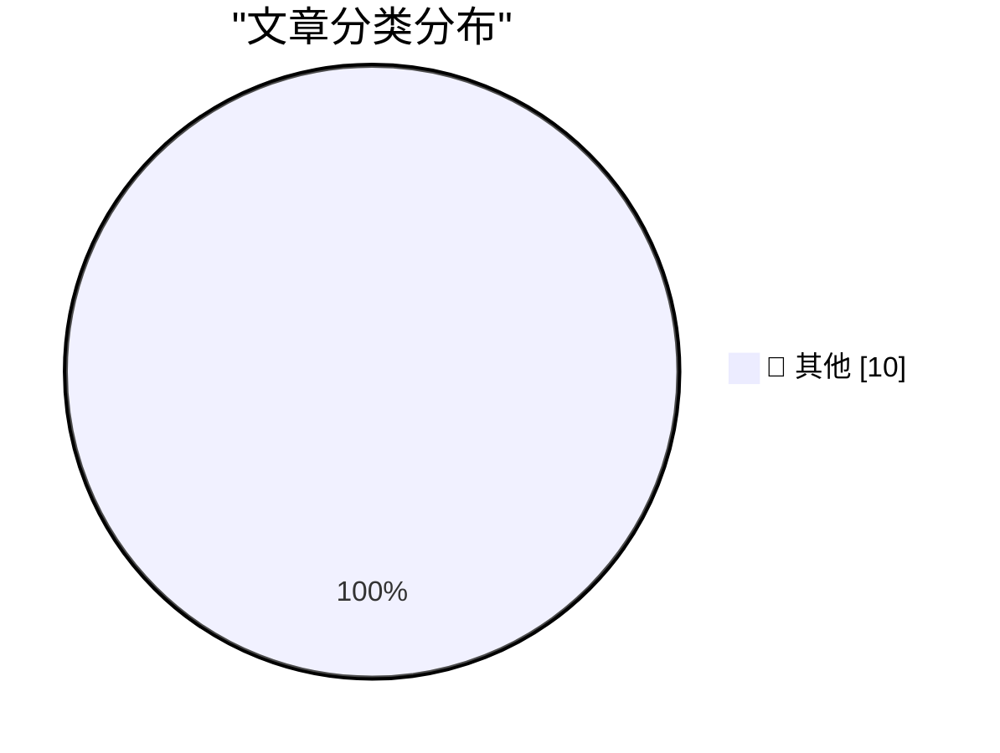

# 📰 AI 博客每日精选 — 2026-06-13

> 来自 Karpathy 推荐的 92 个顶级技术博客，AI 精选 Top 10

## 🏆 今日必读

🥇 **Making glass-to-metal seals for homemade vacuum tubes.**

[Making glass-to-metal seals for homemade vacuum tubes.](https://maurycyz.com/projects/glass/1/) — maurycyz.com · 2026-06-13 · 📝 其他

> Making glass-to-metal seals for homemade vacuum tubes. 2026-06-13 ( Electronics ) This page discusses sealing metal through borosilicate/lab glass: other chemistries behave quite differently. When mak

🥈 **Dangerous Technology For Americans Only**

[Dangerous Technology For Americans Only](https://lucumr.pocoo.org/2026/6/13/americans-only/) — lucumr.pocoo.org · 2026-06-13 · 📝 其他

> Armin Ronacher 's Thoughts and Writings blog archive projects travel talks about Dangerous Technology For Americans Only written on June 13, 2026 There is a bit of schadenfreude on Twitter right now a

🥉 **Human Routers of Machine Words**

[Human Routers of Machine Words](https://borretti.me/article/human-routers-of-machine-words) — borretti.me · 2026-06-13 · 📝 其他

> Human Routers of Machine Words When I open a link, say on Hacker News, and I see a blog post or a GitHub README obviously written by AI, I feel a few things. I feel offended, because it’s like I’ve be

---

## 📊 数据概览

| 扫描源 | 抓取文章 | 时间范围 | 精选 |
|:---:|:---:|:---:|:---:|
| 87/92 | 2564 篇 → 21 篇 | 24h | **10 篇** |

### 分类分布

---

## 📝 其他

### 1. Making glass-to-metal seals for homemade vacuum tubes.

[Making glass-to-metal seals for homemade vacuum tubes.](https://maurycyz.com/projects/glass/1/) — **maurycyz.com** · 2026-06-13 · ⭐ 15/30

> Making glass-to-metal seals for homemade vacuum tubes. 2026-06-13 ( Electronics ) This page discusses sealing metal through borosilicate/lab glass: other chemistries behave quite differently. When mak

---

### 2. Dangerous Technology For Americans Only

[Dangerous Technology For Americans Only](https://lucumr.pocoo.org/2026/6/13/americans-only/) — **lucumr.pocoo.org** · 2026-06-13 · ⭐ 15/30

> Armin Ronacher 's Thoughts and Writings blog archive projects travel talks about Dangerous Technology For Americans Only written on June 13, 2026 There is a bit of schadenfreude on Twitter right now a

---

### 3. Human Routers of Machine Words

[Human Routers of Machine Words](https://borretti.me/article/human-routers-of-machine-words) — **borretti.me** · 2026-06-13 · ⭐ 15/30

> Human Routers of Machine Words When I open a link, say on Hacker News, and I see a blog post or a GitHub README obviously written by AI, I feel a few things. I feel offended, because it’s like I’ve be

---

### 4. OpenAI WebRTC Audio Session, now with document context

[OpenAI WebRTC Audio Session, now with document context](https://simonwillison.net/2026/Jun/12/openai-webrtc/#atom-everything) — **simonwillison.net** · 刚刚 · ⭐ 15/30

> OpenAI WebRTC Audio Session, now with document context . I built the first version of this tool in December 2024 to try out the then-new OpenAI WebRTC API for interacting with their realtime audio mod

---

### 5. ★ The Talk Show: Live From WWDC 2026

[★ The Talk Show: Live From WWDC 2026](https://daringfireball.net/2026/06/the_talk_show_live_from_wwdc_2026) — **daringfireball.net** · 刚刚 · ⭐ 15/30

> By John Gruber Archive The Talk Show Dithering Projects Contact Colophon Feeds / Social Twitter --> Sponsorship Mux — Video for developers The Talk Show: Live From WWDC 2026 Friday, 12 June 2026 Recor

---

### 6. Pluralistic: Google's new remote attestation scheme is every bit as terrible as its old remote attestation scheme (12 Jun 2026)

[Pluralistic: Google's new remote attestation scheme is every bit as terrible as its old remote attestation scheme (12 Jun 2026)](https://pluralistic.net/2026/06/12/compelled-speech/) — **pluralistic.net** · 2 小时前 · ⭐ 15/30

> ->->->->->->->->->->->->->->->->->->->->->->->->->->->->-> Top Sources: None --> Today's links Google's new remote attestation scheme is every bit as terrible as its old remote attestation scheme : No

---

### 7. Quoting Andrew Singleton

[Quoting Andrew Singleton](https://simonwillison.net/2026/Jun/12/andrew-singleton/#atom-everything) — **simonwillison.net** · 4 小时前 · ⭐ 15/30

> Simon Willison’s Weblog Subscribe Sponsored by: Teleport &mdash; Prevent access bottlenecks. Unify identity. Teleport replaces fragmented identity and access tooling with a single identity layer that 

---

### 8. Premium: The Silicon Valley Bubble (Part 1)

[Premium: The Silicon Valley Bubble (Part 1)](https://www.wheresyoured.at/premium-the-silicon-valley-bubble-part-1/) — **wheresyoured.at** · 5 小时前 · ⭐ 15/30

> Premium: The Silicon Valley Bubble (Part 1) Ed Zitron Jun 12, 2026 44 min read Table of Contents Friends, I believe we’re approaching the end of this era. Both OpenAI and Anthropic have filed the pape

---

### 9. This Week on The Analog Antiquarian

[This Week on The Analog Antiquarian](https://www.filfre.net/2026/06/this-week-on-the-analog-antiquarian/) — **filfre.net** · 6 小时前 · ⭐ 15/30

> The Digital Antiquarian A history of computer entertainment and digital culture by Jimmy Maher Home About Me Ebooks Hall of Fame Table of Contents RSS &larr; Planescape: Torment, Part 2: …to the Deskt

---

### 10. You can finally power on a Mac remotely

[You can finally power on a Mac remotely](https://www.jeffgeerling.com/blog/2026/power-on-your-mac-remotely/) — **jeffgeerling.com** · 9 小时前 · ⭐ 15/30

> You can finally power on a Mac remotely Jun 12, 2026 Apple FINALLY lets you turn on your Mac remotely , without having to press the power button. In the media, articles suggest it's a reaction to Mac 

---

*生成于 2026-06-13 07:00 | 扫描 87 源 → 获取 2564 篇 → 精选 10 篇*
*基于 [Hacker News Popularity Contest 2025](https://refactoringenglish.com/tools/hn-popularity/) RSS 源列表*
