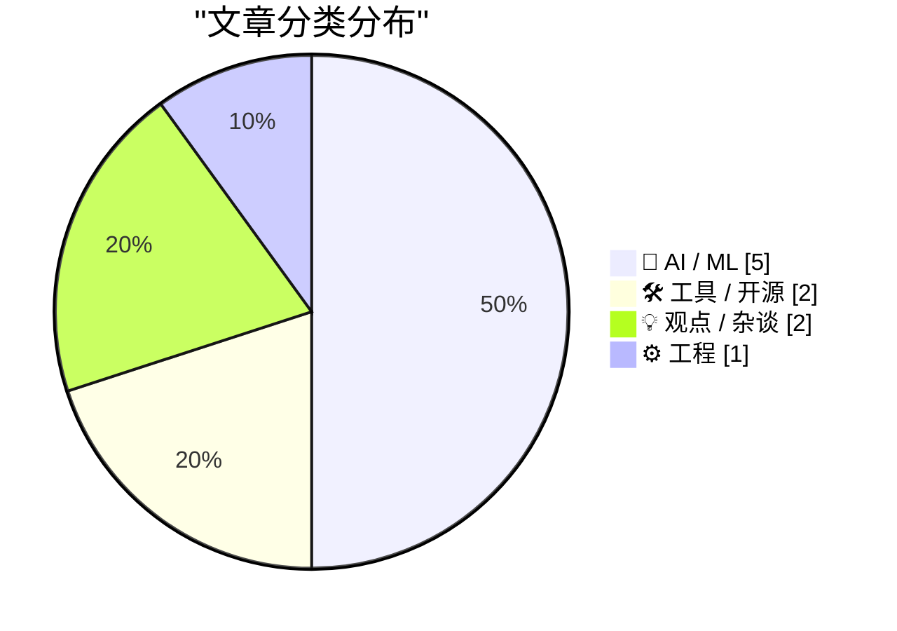
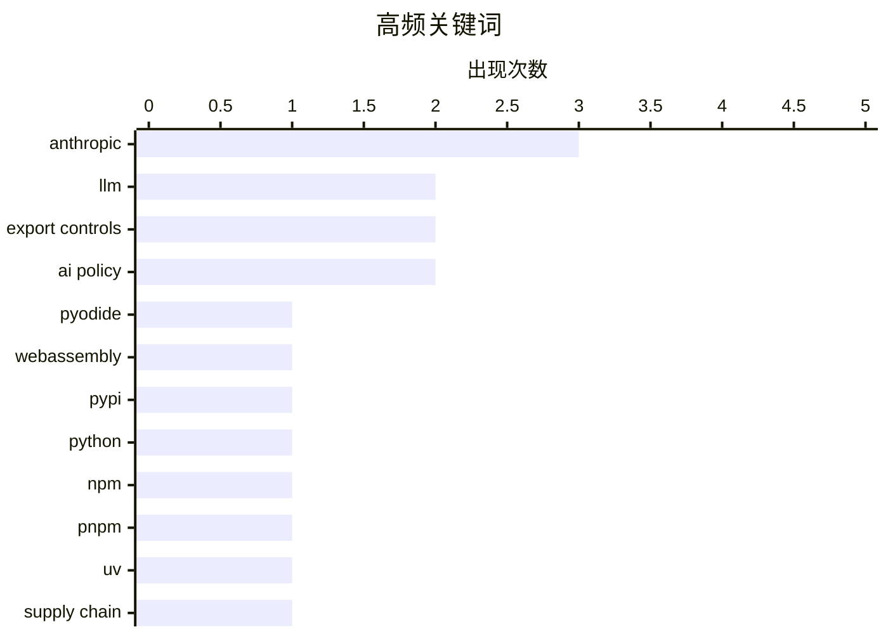

# 📰 AI 博客每日精选 — 2026-06-14

> 来自 Karpathy 推荐的 92 个顶级技术博客，AI 精选 Top 10

## 📝 今日看点

今天的技术圈，最突出的信号是 AI 正从“能力竞赛”迅速转向“权限竞赛”：美国围绕先进模型的出口管制持续收紧，甚至把模型访问权明确划入地缘政治与国家安全边界。与此同时，开发生态的另一条主线是基础设施升级与安全加固并行推进，从 Pyodide/PyPI 的 WebAssembly 包分发，到各大包管理器集中补供应链安全短板，开发平台正在变得更开放，也更强调可控。另一边，围绕 AI 写作、云端私有算力开放限制等讨论也表明，行业不只在争论“能不能做”，更在追问“谁能用、怎么用、该不该用”。

---

## 🏆 今日必读

🥇 **将用于 Pyodide 的 WASM wheel 发布到 PyPI**

[Publishing WASM wheels to PyPI for use with Pyodide](https://simonwillison.net/2026/Jun/13/publishing-wasm-wheels/#atom-everything) — simonwillison.net · 刚刚 · 🛠 工具 / 开源

> Pyodide 314.0 宣布支持将面向 Pyodide、以及兼容 PEP 783 所定义 PyEmscripten 平台的 Python 包直接发布到 PyPI，并在运行时安装。此前，Pyodide 维护者需要自行维护、构建并托管 300 多个包，每个新包还需要人工审核，给维护和社区扩展带来明显瓶颈。现在，包维护者可以像发布 Linux、macOS 或 Windows 原生 wheel 一样发布 Pyodide wheel；PyPI 对这一能力的支持已在 4 月 21 日合入。作者以 `luau-wasm` 为例完成了打包实践：这个新包发布了一个 276KB 的 `cp314-cp314-pyemscripten_2026_0_wasm32.whl`，可通过 `micropip.install("luau-wasm")` 在 Pyodide 中安装并调用。作者还用 BigQuery 查询了 PyPI 公开数据集，按查询结果当前已有 28 个 PyPI 包在使用这一平台发布 wheel。

💡 **为什么值得读**: 值得读，因为它把 Pyodide 生态里“WASM 扩展如何分发”这个长期痛点讲清楚了，还给出了从发布能力落地到真实包示例的完整线索。

🏷️ Pyodide, WebAssembly, PyPI, Python

🥈 **本周包管理动态：2026 年 6 月 13 日**

[This Week in Package Management: 13 June 2026](https://nesbitt.io/2026/06/13/this-week-in-package-management.html) — nesbitt.io · 13 小时前 · 🛠 工具 / 开源

> 这一期聚焦多个包管理生态在供应链安全上的最新变化，覆盖 npm、uv、pnpm、Composer、AUR、Podman、RubyGems 和 Bundler。npm 预计在 7 月发布的 v12 将默认阻止依赖生命周期脚本、隐式 `node-gyp` 构建、Git 依赖和远程 URL tarball，相关限制已在 npm 11.16.0+ 以告警方式提前落地；uv 新增预览版 `uv audit` 用于扫描 Python 依赖漏洞，并通过 `UV_MALWARE_CHECK=1` 为 `uv add` 和 `uv sync` 提供基于 OSV 的实验性恶意包检查。pnpm 11.5.3（并回移到 10.34.2）强化了 `packageManager` 引导链路，只信任受控配置来源、校验下载二进制的 npm registry 签名，并以发布团队 PGP 密钥验证 Node.js 的 `SHASUMS256.txt`；Private Packagist 也为组织级 Composer 插件加入 allowlist，以降低安装和更新阶段执行恶意代码的风险。文章还汇总了真实安全事件与修复，包括 AUR 中 `alvr` 包被接管后植入信息窃取程序、Podman 5.8.3 修复 `CVE-2026-44517`，以及 Ruby Central 启动驻场安全工程师项目并在首次合作中发现并修复 Nokogiri CSS 查询分词器中的 ReDoS。作者传达的重点很明确：各包管理生态正在把默认拒绝、显式授权和更严格的校验机制变成供应链安全的常态。

💡 **为什么值得读**: 值得读在于它把一周内跨多个包管理器的安全变更、真实攻击案例和防护方向压缩到一处，便于快速把握供应链安全的最新基线。

🏷️ npm, pnpm, uv, supply chain

🥉 **关于美国政府要求暂停访问 Fable 5 和 Mythos 5 的声明**

[Statement on the US government directive to suspend access to Fable 5 and Mythos 5](https://simonwillison.net/2026/Jun/13/us-government-directive-to-suspend-access/#atom-everything) — simonwillison.net · 21 小时前 · 🤖 AI / ML

> 美国政府以国家安全和出口管制为由，要求 Anthropic 暂停所有外国人对 Fable 5 和 Mythos 5 的访问，包括身在美国境内外的外国用户以及外国籍员工。Anthropic 表示，这一命令的直接结果是必须立即对所有客户关闭这两个模型，而其他 Anthropic 模型不受影响。现有说明称，政府担心存在绕过或“越狱” Fable 5 的方法，但已展示的技术只识别出少量此前已知的轻微漏洞，而且 Anthropic 认为其他公开可用模型也能做到这一点，包括 OpenAI 的 GPT-5.5。文中还给出了停用过程的时间线：Anthropic 于当日美东时间 5:21pm 收到指令，Simon Willison 在美东时间 9:01pm 仍能访问，而 API 中的 `claude-fable-5` 在太平洋时间 6:59pm（美东时间 9:59pm）开始返回 404 不可用错误。作者传达出的关键信息是，这次停用来得突然，依据的安全理由尚未公开细节，而 Anthropic 认为相关能力并非 Fable 5 独有。

💡 **为什么值得读**: 值得读在于它记录了一次真实发生的模型访问中断事件，并把政府指令、Anthropic 的回应、所谓“越狱”依据和实际下线时间线放在一起，便于判断这件事的影响与争议点。

🏷️ Anthropic, export-control, LLM, jailbreak

---

## 📊 数据概览

| 扫描源 | 抓取文章 | 时间范围 | 精选 |
|:---:|:---:|:---:|:---:|
| 87/92 | 2565 篇 → 21 篇 | 24h | **10 篇** |

### 分类分布



### 高频关键词



<details>
<summary>📈 纯文本关键词图（终端友好）</summary>

```
anthropic       │ ████████████████████ 3
llm             │ █████████████░░░░░░░ 2
export controls │ █████████████░░░░░░░ 2
ai policy       │ █████████████░░░░░░░ 2
pyodide         │ ███████░░░░░░░░░░░░░ 1
webassembly     │ ███████░░░░░░░░░░░░░ 1
pypi            │ ███████░░░░░░░░░░░░░ 1
python          │ ███████░░░░░░░░░░░░░ 1
npm             │ ███████░░░░░░░░░░░░░ 1
pnpm            │ ███████░░░░░░░░░░░░░ 1
```

</details>

### 🏷️ 话题标签

**anthropic**(3) · **llm**(2) · **export controls**(2) · ai policy(2) · pyodide(1) · webassembly(1) · pypi(1) · python(1) · npm(1) · pnpm(1) · uv(1) · supply chain(1) · export-control(1) · jailbreak(1) · nationalism(1) · white house(1) · regulation(1) · governance(1) · commerce department(1) · ai regulation(1)

---

## 🤖 AI / ML

### 1. 关于美国政府要求暂停访问 Fable 5 和 Mythos 5 的声明

[Statement on the US government directive to suspend access to Fable 5 and Mythos 5](https://simonwillison.net/2026/Jun/13/us-government-directive-to-suspend-access/#atom-everything) — **simonwillison.net** · 21 小时前 · ⭐ 25/30

> 美国政府以国家安全和出口管制为由，要求 Anthropic 暂停所有外国人对 Fable 5 和 Mythos 5 的访问，包括身在美国境内外的外国用户以及外国籍员工。Anthropic 表示，这一命令的直接结果是必须立即对所有客户关闭这两个模型，而其他 Anthropic 模型不受影响。现有说明称，政府担心存在绕过或“越狱” Fable 5 的方法，但已展示的技术只识别出少量此前已知的轻微漏洞，而且 Anthropic 认为其他公开可用模型也能做到这一点，包括 OpenAI 的 GPT-5.5。文中还给出了停用过程的时间线：Anthropic 于当日美东时间 5:21pm 收到指令，Simon Willison 在美东时间 9:01pm 仍能访问，而 API 中的 `claude-fable-5` 在太平洋时间 6:59pm（美东时间 9:59pm）开始返回 404 不可用错误。作者传达出的关键信息是，这次停用来得突然，依据的安全理由尚未公开细节，而 Anthropic 认为相关能力并非 Fable 5 独有。

🏷️ Anthropic, export-control, LLM, jailbreak

---

### 2. 仅供美国人的危险技术

[Dangerous Technology For Americans Only](https://lucumr.pocoo.org/2026/6/13/americans-only/) — **lucumr.pocoo.org** · 23 小时前 · ⭐ 25/30

> 焦点不在于 Anthropic 因自身长期强调“危险技术需要严格管控”而遭遇反噬，而在于美国政府划出的边界：某些 AI 模型被视为强大到只能由美国人使用。文中提到，美国出口管制要求 Anthropic 暂停外国人访问 Fable 和 Mythos，这一限制不仅适用于美国境外的外国人，也适用于 Anthropic 内部的外籍员工。作者认为，这已经从“不要把模型卖给敌对政府”滑向了以国籍作为核心分界线，把 AI 从安全议题转向了带有民族主义和国家权力色彩的控制议题。文章还指出，欧洲技术政策长期依赖监管手段，例如 DMA，但监管无法替代技术能力；如果关键技术只掌握在美国或中国公司手中，欧洲就缺乏真正的主动权。结论是，欧洲以及所有非美国公民都应警惕这种以安全为名、实则按国籍划分技术获取权的趋势，因为这关乎权力分配而不只是风险治理。

🏷️ Anthropic, export controls, AI policy, nationalism

---

### 3. 白宫混乱不堪的 AI 政策

[The White House’s shambolic AI policy](https://garymarcus.substack.com/p/the-white-houses-shambolic-ai-policy) — **garymarcus.substack.com** · 6 小时前 · ⭐ 22/30

> 美国当前的 AI 政策被批评为混乱失序，文章重点质疑特朗普 6 月 2 日的行政命令以及随后商务部的出口管制命令。作者认可行政命令鼓励 AI 公司在发布前做测试的方向，但指出这项“预飞测试”要求是自愿性的，范围也过窄，主要集中在网络安全，无法覆盖更多可预见的风险与伤害。文中以佛罗里达州起诉 OpenAI 以及纽约州联合多州大规模传唤 OpenAI 为例，强调州政府正被迫补位，调查范围已涉及广告、用户参与和留存、消费者与健康数据、未成年人和老年人、深度学习模型、模型谄媚性以及公司政策。作者认为联邦层面的要求既没有强制公司充分评估这些风险，也缺乏足够的缓解措施，导致各州只能在伤害发生后通过诉讼追责。对于商务部最新出口管制命令，作者则认为它既是糟糕的政策也是糟糕的政治判断，甚至已导致 Fable 和 Mythos 暂时停摆，并可能引发美国 AI 产业危机。

🏷️ AI policy, White House, regulation, governance

---

### 4. 突发消息：美国商务部实际上叫停了 Anthropic 的最新模型

[Breaking news: US Commerce Department effectively shuts down Anthropic’s latest models](https://garymarcus.substack.com/p/breaking-news-us-commerce-department) — **garymarcus.substack.com** · 20 小时前 · ⭐ 22/30

> 美国商务部下达出口管制指令，要求“暂停所有外国公民访问 Fable 5 和 Mythos 5”，范围甚至包括 Anthropic 自家的外国员工。文章将这一举措描述为在长期对 AI 监管不足之后，政府突然采取的“核选项”。文中引述 Dean W. Ball 的看法，认为这要么像是专门针对 Anthropic 的法律战，要么是极端化的国家安全鹰派做法，而且显得非常夸张。作者同时表明，自己虽然一直对生成式 AI 持保留态度，但并不认同以这种方式处理问题。整体立场是：对 AI 的担忧可以成立，但这种强硬且广泛的限制路径并不合适。

🏷️ Anthropic, export controls, Commerce Department, AI regulation

---

### 5. 苹果的 Private Cloud Compute 对第三方开发者有严格限制

[Apple’s Private Cloud Compute Is Severely Limited for Third-Party Developers](https://developer.apple.com/private-cloud-compute/) — **daringfireball.net** · 5 小时前 · ⭐ 22/30

> 苹果将面向第三方开发者开放运行于 Private Cloud Compute（PCC）上的 Apple Foundation Models，但免费使用资格只提供给符合特定条件的小型开发者。申请者必须加入 App Store Small Business Program、旗下所有应用的首次 App Store 下载量合计低于 200 万次，并且账户已获得 Private Cloud Compute entitlement。符合条件的开发者只能在 Apple Intelligence 可用的地区，将 PCC 用于上架 App Store 的应用，并可通过 TestFlight 或 ad hoc 分发测试，测试安装量不计入首次下载。若任一应用后续超过 200 万首次下载，或开发者不再属于 Small Business Program，苹果会通知其在 6 个月内迁移到其他方案。PCC 的开放并非普遍可用服务，而是附带明确门槛、范围限制和退出条件的受限能力。

🏷️ Apple, Private Cloud Compute, Foundation Models, App Store

---

## 🛠 工具 / 开源

### 6. 将用于 Pyodide 的 WASM wheel 发布到 PyPI

[Publishing WASM wheels to PyPI for use with Pyodide](https://simonwillison.net/2026/Jun/13/publishing-wasm-wheels/#atom-everything) — **simonwillison.net** · 刚刚 · ⭐ 25/30

> Pyodide 314.0 宣布支持将面向 Pyodide、以及兼容 PEP 783 所定义 PyEmscripten 平台的 Python 包直接发布到 PyPI，并在运行时安装。此前，Pyodide 维护者需要自行维护、构建并托管 300 多个包，每个新包还需要人工审核，给维护和社区扩展带来明显瓶颈。现在，包维护者可以像发布 Linux、macOS 或 Windows 原生 wheel 一样发布 Pyodide wheel；PyPI 对这一能力的支持已在 4 月 21 日合入。作者以 `luau-wasm` 为例完成了打包实践：这个新包发布了一个 276KB 的 `cp314-cp314-pyemscripten_2026_0_wasm32.whl`，可通过 `micropip.install("luau-wasm")` 在 Pyodide 中安装并调用。作者还用 BigQuery 查询了 PyPI 公开数据集，按查询结果当前已有 28 个 PyPI 包在使用这一平台发布 wheel。

🏷️ Pyodide, WebAssembly, PyPI, Python

---

### 7. 本周包管理动态：2026 年 6 月 13 日

[This Week in Package Management: 13 June 2026](https://nesbitt.io/2026/06/13/this-week-in-package-management.html) — **nesbitt.io** · 13 小时前 · ⭐ 25/30

> 这一期聚焦多个包管理生态在供应链安全上的最新变化，覆盖 npm、uv、pnpm、Composer、AUR、Podman、RubyGems 和 Bundler。npm 预计在 7 月发布的 v12 将默认阻止依赖生命周期脚本、隐式 `node-gyp` 构建、Git 依赖和远程 URL tarball，相关限制已在 npm 11.16.0+ 以告警方式提前落地；uv 新增预览版 `uv audit` 用于扫描 Python 依赖漏洞，并通过 `UV_MALWARE_CHECK=1` 为 `uv add` 和 `uv sync` 提供基于 OSV 的实验性恶意包检查。pnpm 11.5.3（并回移到 10.34.2）强化了 `packageManager` 引导链路，只信任受控配置来源、校验下载二进制的 npm registry 签名，并以发布团队 PGP 密钥验证 Node.js 的 `SHASUMS256.txt`；Private Packagist 也为组织级 Composer 插件加入 allowlist，以降低安装和更新阶段执行恶意代码的风险。文章还汇总了真实安全事件与修复，包括 AUR 中 `alvr` 包被接管后植入信息窃取程序、Podman 5.8.3 修复 `CVE-2026-44517`，以及 Ruby Central 启动驻场安全工程师项目并在首次合作中发现并修复 Nokogiri CSS 查询分词器中的 ReDoS。作者传达的重点很明确：各包管理生态正在把默认拒绝、显式授权和更严格的校验机制变成供应链安全的常态。

🏷️ npm, pnpm, uv, supply chain

---

## 💡 观点 / 杂谈

### 8. 机器文字的人肉路由器

[Human Routers of Machine Words](https://borretti.me/article/human-routers-of-machine-words) — **borretti.me** · 23 小时前 · ⭐ 21/30

> 主题围绕用 AI 代写博客文章或 README 的做法，以及这种做法是否能把“想法”和“写作”分开。作者强烈反对“想法是我的，写作是 AI 的”这种辩护，认为读者真正能接触和判断的只有最终写出来的文字，而不是作者脑中不可见的抽象想法。文中进一步指出，所谓“想法”并不是现成、清晰、像逻辑命题一样的对象，而更接近混杂着记忆、直觉和感受的模糊内容。把这些内容写出来的过程本身，就是澄清假设、补足漏洞、发现矛盾、让想法变得可操作的过程。结论是，写作不是可以外包的表面包装，而是思考与形成观点本身的一部分，因此用 AI 代写会直接损害表达者自己的思考。

🏷️ AI writing, authorship, content quality, LLM

---

### 9. 股东至上与“预知未来”的 CEO

[Pluralistic: Shareholder supremacy and the precog CEO (13 Jun 2026)](https://pluralistic.net/2026/06/13/minority-shareholder-report/) — **pluralistic.net** · 5 小时前 · ⭐ 18/30

> 文章围绕“股东至上”这一企业治理原则提出质疑，追溯其源头到米尔顿·弗里德曼 55 年前那篇主张企业社会责任就是增加利润的文章。文中指出，弗里德曼不仅反对企业把资源用于所谓企业社会责任，还把“为股东创造最大价值”包装成一个清晰、可客观检验的受托责任标准。作者进一步拆解这一说法的漏洞：判断管理者是否赚到了钱相对容易，但判断其是否赚到了“尽可能多”的钱却无法被直接证实。文中还举出 Target 的 Pride 商品、BP 的“绿色”汽油营销，以及 Google 借助“don’t be evil”形象吸引工程师等例子，说明许多看似社会责任的行为同样可以被解释为利润策略。结论是，把“股东价值最大化”当成一条明晰且可验证的管理准则，并没有它宣称的那样客观稳固。

🏷️ shareholder supremacy, corporate governance, CEO, capitalism

---

## ⚙️ 工程

### 10. 为自制真空管制作玻璃—金属密封

[Making glass-to-metal seals for homemade vacuum tubes.](https://maurycyz.com/projects/glass/1/) — **maurycyz.com** · 23 小时前 · ⭐ 18/30

> 自制真空管的难点不在玻璃本体抽真空，而在于让电极穿过硼硅玻璃时仍保持气密。作者先说明玻璃管本身很容易封接并长期保持真空，甚至可通过高压交流下残余气体电离发光来验证真空程度足以用于三极管等器件。问题出在金属与玻璃的热膨胀差异：铜的红色氧化层虽能与玻璃牢固结合，但铜每降温 1 °C 收缩约 17 μm/m，而玻璃约为 3 μm/m，冷却到室温后金属尺寸比周围玻璃小约 1%，最终导致接缝开裂漏气。作者随后比较了钨、钼和钢等材料，并尝试避免让含碳钢直接接触热玻璃，再用氨存在下的电镀方法把铜镀到钢丝表面；这种方法能得到无气泡封接，但样品在冷却阶段仍然失败。结论是，玻璃—金属密封的核心约束是热膨胀匹配，单靠改善附着力或表面镀层还不足以解决封接开裂问题。

🏷️ vacuum tubes, glass, metal seals, materials

---

*生成于 2026-06-14 07:00 | 扫描 87 源 → 获取 2565 篇 → 精选 10 篇*
*基于 [Hacker News Popularity Contest 2025](https://refactoringenglish.com/tools/hn-popularity/) RSS 源列表*
