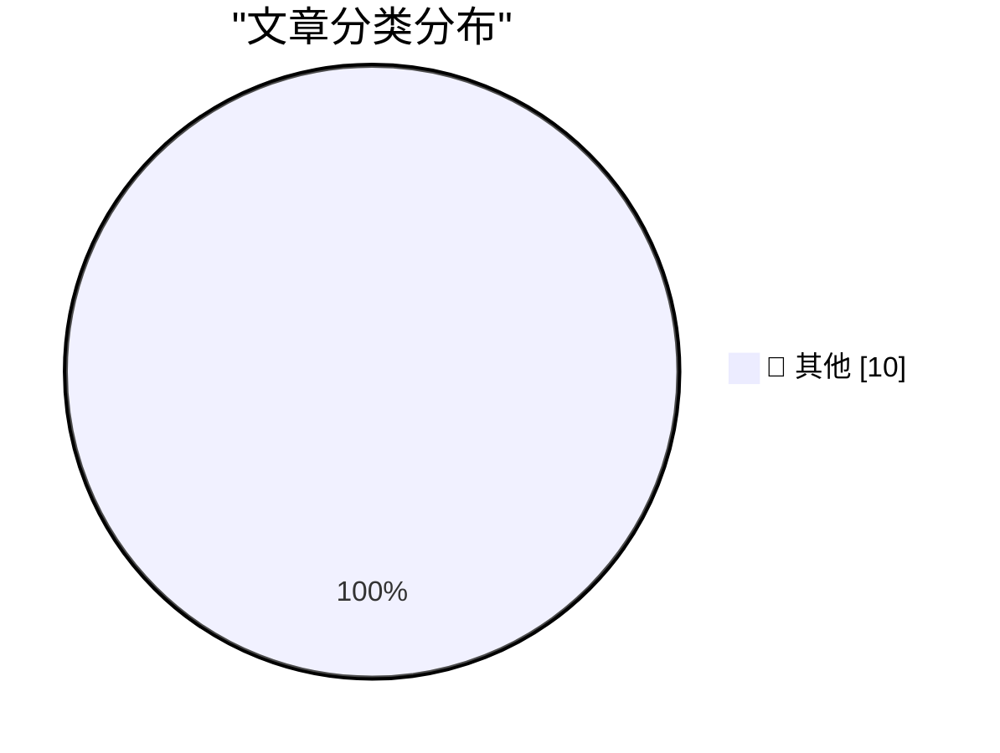

# 📰 AI 博客每日精选 — 2026-06-14

> 来自 Karpathy 推荐的 92 个顶级技术博客，AI 精选 Top 10

## 🏆 今日必读

🥇 **Arp 185:**

[Arp 185:](https://maurycyz.com/astro/arp185/) — maurycyz.com · 2026-06-14 · 📝 其他

> Arp 185: 2026-06-14 ( Astronomical Images ) North is left. 0.35"/pixel (7.7' by 20' field). FWHM = 5.5" Arp filled this under "galaxies with narrow filaments", but I don't really see why. It's a barre

🥈 **from hookswitch to grave**

[from hookswitch to grave](https://computer.rip/2026-06-14-hookswitch-to-grave.html) — computer.rip · 2026-06-14 · 📝 其他

> from hookswitch to grave 2026-06-14 Through decades of consolidation, reorganization, and divestiture, AT&T left a famously complicated corporate history. One of the greatest enterprises in American h

🥉 **Publishing WASM wheels to PyPI for use with Pyodide**

[Publishing WASM wheels to PyPI for use with Pyodide](https://simonwillison.net/2026/Jun/13/publishing-wasm-wheels/#atom-everything) — simonwillison.net · 刚刚 · 📝 其他

> Simon Willison’s Weblog Subscribe Sponsored by: Teleport &mdash; Prevent access bottlenecks. Unify identity. Teleport replaces fragmented identity and access tooling with a single identity layer that 

---

## 📊 数据概览

| 扫描源 | 抓取文章 | 时间范围 | 精选 |
|:---:|:---:|:---:|:---:|
| 86/92 | 2549 篇 → 21 篇 | 24h | **10 篇** |

### 分类分布

---

## 📝 其他

### 1. Arp 185:

[Arp 185:](https://maurycyz.com/astro/arp185/) — **maurycyz.com** · 2026-06-14 · ⭐ 15/30

> Arp 185: 2026-06-14 ( Astronomical Images ) North is left. 0.35"/pixel (7.7' by 20' field). FWHM = 5.5" Arp filled this under "galaxies with narrow filaments", but I don't really see why. It's a barre

---

### 2. from hookswitch to grave

[from hookswitch to grave](https://computer.rip/2026-06-14-hookswitch-to-grave.html) — **computer.rip** · 2026-06-14 · ⭐ 15/30

> from hookswitch to grave 2026-06-14 Through decades of consolidation, reorganization, and divestiture, AT&T left a famously complicated corporate history. One of the greatest enterprises in American h

---

### 3. Publishing WASM wheels to PyPI for use with Pyodide

[Publishing WASM wheels to PyPI for use with Pyodide](https://simonwillison.net/2026/Jun/13/publishing-wasm-wheels/#atom-everything) — **simonwillison.net** · 刚刚 · ⭐ 15/30

> Simon Willison’s Weblog Subscribe Sponsored by: Teleport &mdash; Prevent access bottlenecks. Unify identity. Teleport replaces fragmented identity and access tooling with a single identity layer that 

---

### 4. luau-wasm 0.1a0

[luau-wasm 0.1a0](https://simonwillison.net/2026/Jun/13/luau-wasm/#atom-everything) — **simonwillison.net** · 刚刚 · ⭐ 15/30

> Simon Willison’s Weblog Subscribe Sponsored by: Teleport &mdash; Prevent access bottlenecks. Unify identity. Teleport replaces fragmented identity and access tooling with a single identity layer that 

---

### 5. RSA munitions T-shirt

[RSA munitions T-shirt](https://www.johndcook.com/blog/2026/06/13/rsa-munitions-t-shirt/) — **johndcook.com** · 2 小时前 · ⭐ 15/30

> Back when the US government classified strong encryption as “munitions,” RSA public key cryptography was illegal to export. In 1995, Adam Back protested this by creating a terse, obfuscated implementa

---

### 6. Pluralistic: Shareholder supremacy and the precog CEO (13 Jun 2026)

[Pluralistic: Shareholder supremacy and the precog CEO (13 Jun 2026)](https://pluralistic.net/2026/06/13/minority-shareholder-report/) — **pluralistic.net** · 5 小时前 · ⭐ 15/30

> ->->->->->->->->->->->->->->->->->->->->->->->->->->->->-> Top Sources: None --> Today's links Shareholder supremacy and the precog CEO : A bright line test that's totally unfalsifiable. Hey look at t

---

### 7. The White House’s shambolic AI policy

[The White House’s shambolic AI policy](https://garymarcus.substack.com/p/the-white-houses-shambolic-ai-policy) — **garymarcus.substack.com** · 6 小时前 · ⭐ 15/30

> The White House’s shambolic AI policy Also , why states are taking things into their own hands, and what might be better Gary Marcus Jun 13, 2026 179 124 29 Share Credit where credit is due; ChatGPT (

---

### 8. The adder at the heart of Intel's 8087 floating-point chip

[The adder at the heart of Intel's 8087 floating-point chip](http://www.righto.com/feeds/3050107772739337632/comments/default) — **righto.com** · 7 小时前 · ⭐ 15/30

> tag:blogger.com,1999:blog-6264947694886887540.post3050107772739337632..comments 2026-06-17T02:55:38.337-07:00 Comments on Ken Shirriff's blog: The adder at the heart of Intel's 8087 floating-point chi

---

### 9. Reading List 06/13/2026

[Reading List 06/13/2026](https://www.construction-physics.com/p/reading-list-06132026) — **construction-physics.com** · 10 小时前 · ⭐ 15/30

> Reading List 06/13/2026 Homes being built on top of libraries, Patriot missile manufacturing, an effort to construct new US coal plants, a tunnel between the US and Russia, and more. Brian Potter Jun 

---

### 10. This Week in Package Management: 13 June 2026

[This Week in Package Management: 13 June 2026](https://nesbitt.io/2026/06/13/this-week-in-package-management.html) — **nesbitt.io** · 13 小时前 · ⭐ 15/30

> Week four of the roundup, built from the package manager OPML feed collection and whatever I’ve posted or boosted on Mastodon . Security GitHub announced the breaking changes coming in npm v12 , estim

---

*生成于 2026-06-14 07:00 | 扫描 86 源 → 获取 2549 篇 → 精选 10 篇*
*基于 [Hacker News Popularity Contest 2025](https://refactoringenglish.com/tools/hn-popularity/) RSS 源列表*
