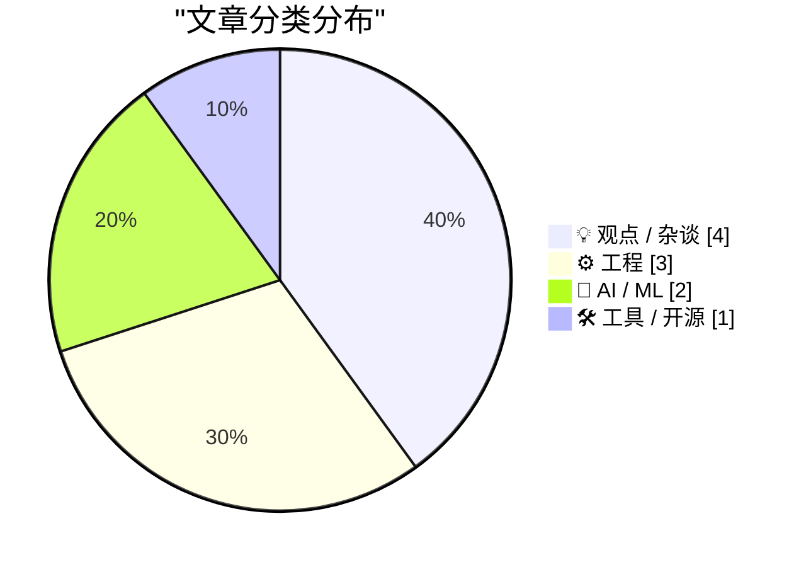
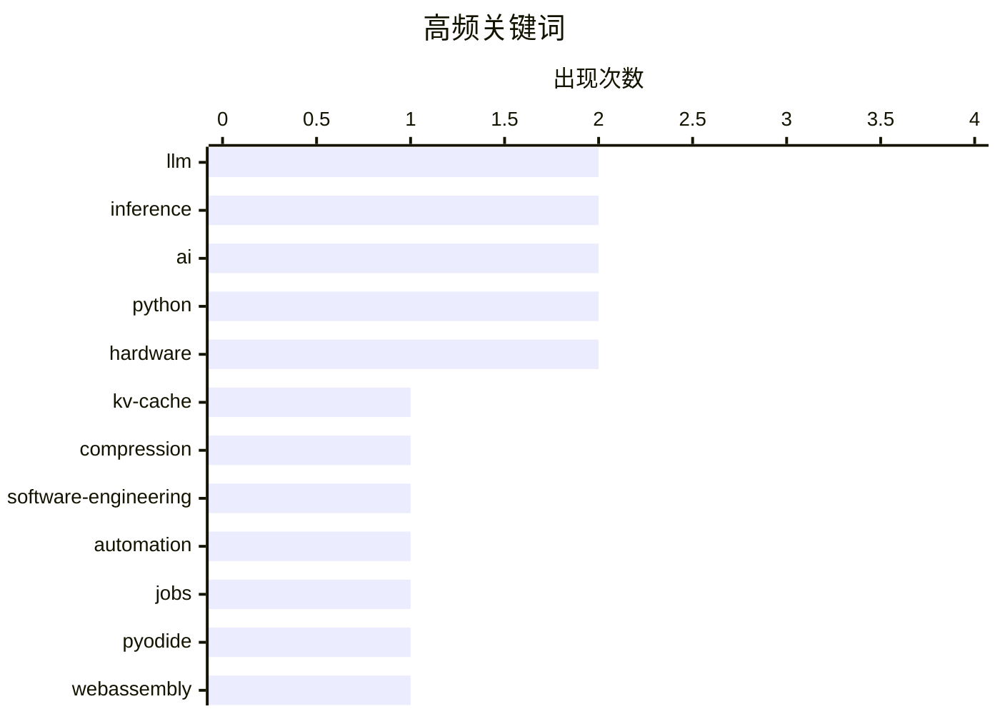

# 📰 AI 博客每日精选 — 2026-06-15

> 来自 Karpathy 推荐的 92 个顶级技术博客，AI 精选 Top 10

## 📝 今日看点

今天技术圈的主线，正在从“模型更强”转向“系统更实用”：一边是 KV Cache 压缩、GPU 生命周期延长、WASM/Pyodide 分发等底层效率议题升温，另一边是插件机制、便携控制台这类工程化实践继续强调可扩展与可落地。与此同时，围绕 AI 的社会讨论明显加深，焦点不再是“会不会取代工程师”，而是平台权力是否过度集中、监管边界如何划定、独立且负责任的 AI 生态能否形成。更值得注意的是，开源信任、知识溯源与复杂系统理解能力被反复提起，说明业界对 AI 的关注正从能力竞赛，转向效率、治理与可信度的三线并进。

---

## 🏆 今日必读

🥇 **A brief history of KV cache compression developments**

[A brief history of KV cache compression developments](https://martinalderson.com/posts/a-brief-history-of-kv-cache-compression-developments/?utm_source=rss&amp;utm_medium=rss&amp;utm_campaign=feed) — martinalderson.com · 2026-06-15 · 🤖 AI / ML

> While much is focused on the improvement of models , there's been radical improvements in the efficiency of KV cache compression. I was curious to figure out just how big the improvements are and why 

🏷️ KV-cache, LLM, inference, compression

🥈 **Why AI hasn’t replaced software engineers, and won’t**

[Why AI hasn’t replaced software engineers, and won’t](https://simonwillison.net/2026/Jun/14/why-ai-hasnt-replaced-software-engineers/#atom-everything) — simonwillison.net · 刚刚 · 💡 观点 / 杂谈

> Why AI hasn’t replaced software engineers, and won’t . Arvind Narayanan and Sayash Kappor take on the question of AI job losses through the lens of a profession that is uniquely suited to AI disruptio

🏷️ AI, software-engineering, automation, jobs

🥉 **Publishing WASM wheels to PyPI for use with Pyodide**

[Publishing WASM wheels to PyPI for use with Pyodide](https://simonwillison.net/2026/Jun/13/publishing-wasm-wheels/#atom-everything) — simonwillison.net · 23 小时前 · 🛠 工具 / 开源

> Simon Willison’s Weblog Subscribe Sponsored by: Microsoft &mdash; Agent projects stall between demo and production. Microsoft's MVP checklist closes that gap. Try it Publishing WASM wheels to PyPI for

🏷️ Pyodide, WebAssembly, PyPI, Python

---

## 📊 数据概览

| 扫描源 | 抓取文章 | 时间范围 | 精选 |
|:---:|:---:|:---:|:---:|
| 87/92 | 2565 篇 → 15 篇 | 24h | **10 篇** |

### 分类分布



### 高频关键词



<details>
<summary>📈 纯文本关键词图（终端友好）</summary>

```
llm                  │ ████████████████████ 2
inference            │ ████████████████████ 2
ai                   │ ████████████████████ 2
python               │ ████████████████████ 2
hardware             │ ████████████████████ 2
kv-cache             │ ██████████░░░░░░░░░░ 1
compression          │ ██████████░░░░░░░░░░ 1
software-engineering │ ██████████░░░░░░░░░░ 1
automation           │ ██████████░░░░░░░░░░ 1
jobs                 │ ██████████░░░░░░░░░░ 1
```

</details>

### 🏷️ 话题标签

**llm**(2) · **inference**(2) · **ai**(2) · python(2) · hardware(2) · kv-cache(1) · compression(1) · software-engineering(1) · automation(1) · jobs(1) · pyodide(1) · webassembly(1) · pypi(1) · gpu(1) · economics(1) · plugins(1) · pluggy(1) · architecture(1) · c(1) · rust(1)

---

## 💡 观点 / 杂谈

### 1. Why AI hasn’t replaced software engineers, and won’t

[Why AI hasn’t replaced software engineers, and won’t](https://simonwillison.net/2026/Jun/14/why-ai-hasnt-replaced-software-engineers/#atom-everything) — **simonwillison.net** · 刚刚 · ⭐ 25/30

> Why AI hasn’t replaced software engineers, and won’t . Arvind Narayanan and Sayash Kappor take on the question of AI job losses through the lens of a profession that is uniquely suited to AI disruptio

🏷️ AI, software-engineering, automation, jobs

---

### 2. 也许该让许多小型独立 AI 接管了

[Maybe it's time for lots of little indie AIs to take over](https://anildash.com/2026/06/15/indie-AI-takeover/) — **anildash.com** · 2026-06-15 · ⭐ 20/30

> 焦点落在 AI 产业是否必须继续由少数大型平台主导，以及是否存在更负责任的替代路径。作者明确主张，不该只寻找“ChatGPT 杀手”，而应由许多来自小型、负责任参与者的独立 AI 共同构成替代生态。文中同时指出，当前 AI 处在新的拐点：政策制定、资本利益与平台竞争彼此交织，使外界很难判断这些技术平台的真实风险与现实状况。作者还把这种局面与社交媒体相类比——许多人明知技术与自身价值观冲突，仍因平台的强制性和渗透性而被迫使用，包括对大型 AI 公司提供的 LLM 的依赖。结论是，既然人们希望获得 AI 的好处、又不愿继续受制于“大型 AI”及其相关伤害，那么由众多小型独立 AI 组成的替代方案值得认真推进。

🏷️ AI, competition, governance, community

---

### 3. 华盛顿必须做什么

[What Washington must do](https://garymarcus.substack.com/p/what-washington-must-do) — **garymarcus.substack.com** · 6 小时前 · ⭐ 20/30

> 美国政府在 AI 政策上制造了混乱局面，尤其是围绕 Mythos 之后形成的事实性许可制度，引发了规则不一致、权力边界不清和透明度不足的问题。文中援引 Dean W. Ball 的说法指出，美国实际上已经在对前沿 AI 实施一种非正式许可机制，只是缺乏明确规则、稳定程序和公开监督。作者认为白宫最近的决定显得武断，甚至带有利益输送嫌疑，因为这一决定被认为有利于 OpenAI、相关投资者以及与政府关系密切的人，同时又伴随着对 Anthropic 的公开敌意。作者也承认 Anthropic 通过过度炒作 Mythos 和疏远白宫，对局势恶化负有一定责任，但强调政府应当以国家利益为先，承担起制定稳健政策的责任。结论是，“AI 完全零监管”的主张已经站不住脚，华盛顿接下来必须用清晰、透明且不带腐败嫌疑的方式界定哪些模型需要监管与出口管制。

🏷️ AI-policy, Washington, regulation, OpenAI

---

### 4. 那些让我思考的事：开源信任关系、缺乏溯源的知识与理论构建

[Things that made me think: Open Source trust relationships, knowledge without provenance, and theory building](https://tomrenner.com/posts/ttmmt-4/) — **tomrenner.com** · 2026-06-15 · ⭐ 16/30

> 内容围绕三个彼此相关的话题展开：开源生态中的信任机制、LLM 回答的知识溯源问题，以及软件开发中“理论构建”这一视角。作者引用一则安全博客报告指出，AI 代理已经能在大型开源项目中提交 PR，并通过冷启动联系维护者；当整个行业把 GitHub 个人资料当作履历代理时，代理可以在数小时或数天内伪造出可信形象，现有声誉与信任体系因此失效。关于 LLM，作者强调没有 provenance，用户就难以追问和质疑“全知回答机”，并明确提出“引用不等于溯源”，真正关键的是训练集带来的语境，而不只是检索路径；在用户越来越依赖 AI 摘要、Google 点击率下降的背景下，这对搜索也很重要。谈到 Peter Naur 的“Programming as Theory Building”，作者认同团队真正构建的是理论而不只是代码文本，因此频繁更换工程师或团队结构会破坏最核心的资产；但在商业现实里，企业卖的是产品而不是理论，产品也不只是文本，还包括用户教育、文档和培训，这让团队目标与业务目标之间存在持续张力。

🏷️ open-source, trust, provenance, LLM

---

## ⚙️ 工程

### 5. Plugins case study: Pluggy

[Plugins case study: Pluggy](https://eli.thegreenplace.net/2026/plugins-case-study-pluggy/) — **eli.thegreenplace.net** · 19 小时前 · ⭐ 22/30

> June 13, 2026 at 20:21 Tags Plugins , Python Recently I came upon Pluggy , a Python library for developing plugin systems. It was originally developed as part of the pytest project - known for its ric

🏷️ Python, plugins, Pluggy, architecture

---

### 6. The Sword Juggling Fallacy

[The Sword Juggling Fallacy](https://hugotunius.se/2026/06/15/the-sword-juggling-fallacy.html) — **hugotunius.se** · 0 分钟前 · ⭐ 21/30

> Sword juggling is simple. I’ll prove it to you by explaining it. First, acquire three – or, if you feel ambitious, four swords. Divide the swords between your hands. Starting with one hand, the one ho

🏷️ C, Rust, memory-safety, programming-languages

---

### 7. 打造一个带串口和 VGA 的“万能控制台”

[Building a serial and VGA "everything console"](https://oldvcr.blogspot.com/feeds/7900423283602789203/comments/default) — **oldvcr.blogspot.com** · 21 小时前 · ⭐ 17/30

> 核心需求是为采用串口控制台的系统准备一套自包含、便携、重量更轻的控制台方案，替代老式 CRT 终端或占用带串口的 Mac 笔记本。作者选择自己动手，而不是购买现成的一体化设备，目标明确指向低成本和可携带性。方案的起点是一台二手、略有磨损的 IBM 1U 控制台，并给出了购入价格为 120 美元（含运费）。标题同时点出这套设备不仅覆盖串口，还包含 VGA，说明其定位是一个可服务多类设备的“everything console”。结论上，这是一篇围绕低成本 DIY 控制台搭建思路展开的项目记录开篇。

🏷️ serial, VGA, hardware, console

---

## 🤖 AI / ML

### 8. A brief history of KV cache compression developments

[A brief history of KV cache compression developments](https://martinalderson.com/posts/a-brief-history-of-kv-cache-compression-developments/?utm_source=rss&amp;utm_medium=rss&amp;utm_campaign=feed) — **martinalderson.com** · 2026-06-15 · ⭐ 25/30

> While much is focused on the improvement of models , there's been radical improvements in the efficiency of KV cache compression. I was curious to figure out just how big the improvements are and why 

🏷️ KV-cache, LLM, inference, compression

---

### 9. AI GPUs probably live longer than three years

[AI GPUs probably live longer than three years](https://seangoedecke.com/ai-gpus-live-longer-than-three-years/) — **seangoedecke.com** · 2026-06-15 · ⭐ 22/30

> AI GPUs probably live longer than three years People who think current AI use is unsustainable often rely on the claim that inference GPUs only last “three years at the most” under load 1 . The idea h

🏷️ GPU, inference, hardware, economics

---

## 🛠 工具 / 开源

### 10. Publishing WASM wheels to PyPI for use with Pyodide

[Publishing WASM wheels to PyPI for use with Pyodide](https://simonwillison.net/2026/Jun/13/publishing-wasm-wheels/#atom-everything) — **simonwillison.net** · 23 小时前 · ⭐ 25/30

> Simon Willison’s Weblog Subscribe Sponsored by: Microsoft &mdash; Agent projects stall between demo and production. Microsoft's MVP checklist closes that gap. Try it Publishing WASM wheels to PyPI for

🏷️ Pyodide, WebAssembly, PyPI, Python

---

*生成于 2026-06-15 07:00 | 扫描 87 源 → 获取 2565 篇 → 精选 10 篇*
*基于 [Hacker News Popularity Contest 2025](https://refactoringenglish.com/tools/hn-popularity/) RSS 源列表*
