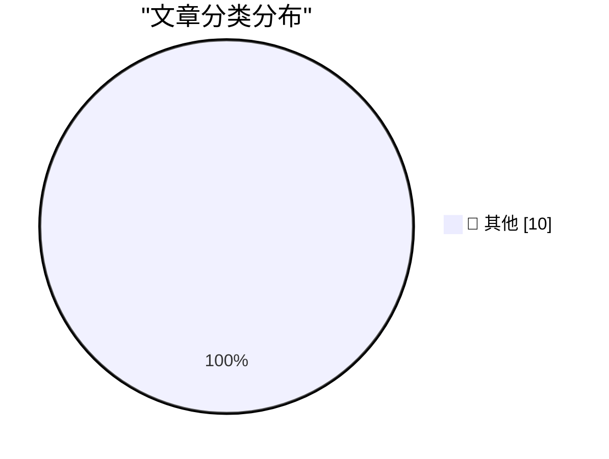

# 📰 AI 博客每日精选 — 2026-06-15

> 来自 Karpathy 推荐的 92 个顶级技术博客，AI 精选 Top 10

## 🏆 今日必读

🥇 **AI GPUs probably live longer than three years**

[AI GPUs probably live longer than three years](https://seangoedecke.com/ai-gpus-live-longer-than-three-years/) — seangoedecke.com · 2026-06-15 · 📝 其他

> AI GPUs probably live longer than three years People who think current AI use is unsustainable often rely on the claim that inference GPUs only last “three years at the most” under load 1 . The idea h

🥈 **Things that made me think: Open Source trust relationships, knowledge without provenance, and theory building**

[Things that made me think: Open Source trust relationships, knowledge without provenance, and theory building](https://tomrenner.com/posts/ttmmt-4/) — tomrenner.com · 2026-06-15 · 📝 其他

> Posts Things that made me think: Open Source trust relationships, knowledge without provenance, and theory building By Tom Renner June 15, 2026 - 3 minutes read - 505 words This series is a place to c

🥉 **A brief history of KV cache compression developments**

[A brief history of KV cache compression developments](https://martinalderson.com/posts/a-brief-history-of-kv-cache-compression-developments/?utm_source=rss&amp;utm_medium=rss&amp;utm_campaign=feed) — martinalderson.com · 2026-06-15 · 📝 其他

> While much is focused on the improvement of models , there's been radical improvements in the efficiency of KV cache compression. I was curious to figure out just how big the improvements are and why 

---

## 📊 数据概览

| 扫描源 | 抓取文章 | 时间范围 | 精选 |
|:---:|:---:|:---:|:---:|
| 87/92 | 2564 篇 → 15 篇 | 24h | **10 篇** |

### 分类分布

---

## 📝 其他

### 1. AI GPUs probably live longer than three years

[AI GPUs probably live longer than three years](https://seangoedecke.com/ai-gpus-live-longer-than-three-years/) — **seangoedecke.com** · 2026-06-15 · ⭐ 15/30

> AI GPUs probably live longer than three years People who think current AI use is unsustainable often rely on the claim that inference GPUs only last “three years at the most” under load 1 . The idea h

---

### 2. Things that made me think: Open Source trust relationships, knowledge without provenance, and theory building

[Things that made me think: Open Source trust relationships, knowledge without provenance, and theory building](https://tomrenner.com/posts/ttmmt-4/) — **tomrenner.com** · 2026-06-15 · ⭐ 15/30

> Posts Things that made me think: Open Source trust relationships, knowledge without provenance, and theory building By Tom Renner June 15, 2026 - 3 minutes read - 505 words This series is a place to c

---

### 3. A brief history of KV cache compression developments

[A brief history of KV cache compression developments](https://martinalderson.com/posts/a-brief-history-of-kv-cache-compression-developments/?utm_source=rss&amp;utm_medium=rss&amp;utm_campaign=feed) — **martinalderson.com** · 2026-06-15 · ⭐ 15/30

> While much is focused on the improvement of models , there's been radical improvements in the efficiency of KV cache compression. I was curious to figure out just how big the improvements are and why 

---

### 4. Maybe it's time for lots of little indie AIs to take over

[Maybe it's time for lots of little indie AIs to take over](https://anildash.com/2026/06/15/indie-AI-takeover/) — **anildash.com** · 2026-06-15 · ⭐ 15/30

> Maybe it's time for lots of little indie AIs to take over 15 Jun 2026 2026-06-15 2026-06-15 /images/stone-pillars.jpg AI, tech, software, community AI tech software community 2026 “[T]here can be alte

---

### 5. Why AI hasn’t replaced software engineers, and won’t

[Why AI hasn’t replaced software engineers, and won’t](https://simonwillison.net/2026/Jun/14/why-ai-hasnt-replaced-software-engineers/#atom-everything) — **simonwillison.net** · 刚刚 · ⭐ 15/30

> Why AI hasn’t replaced software engineers, and won’t . Arvind Narayanan and Sayash Kappor take on the question of AI job losses through the lens of a profession that is uniquely suited to AI disruptio

---

### 6. The Sword Juggling Fallacy

[The Sword Juggling Fallacy](https://hugotunius.se/2026/06/15/the-sword-juggling-fallacy.html) — **hugotunius.se** · 0 分钟前 · ⭐ 15/30

> Sword juggling is simple. I’ll prove it to you by explaining it. First, acquire three – or, if you feel ambitious, four swords. Divide the swords between your hands. Starting with one hand, the one ho

---

### 7. What Washington must do

[What Washington must do](https://garymarcus.substack.com/p/what-washington-must-do) — **garymarcus.substack.com** · 6 小时前 · ⭐ 15/30

> What Washington must do ”The only way out is through” Gary Marcus Jun 14, 2026 225 137 43 Share Washington has made a huge mess. Even some people on the right see this, like Dean W Ball, who helped th

---

### 8. Did Frank Sinatra really think "Something" was a Lennon/McCartney song?

[Did Frank Sinatra really think "Something" was a Lennon/McCartney song?](https://shkspr.mobi/blog/2026/06/did-frank-sinatra-really-think-something-was-a-lennon-mccartney-song/) — **shkspr.mobi** · 11 小时前 · ⭐ 15/30

> Did Frank Sinatra really think "Something" was a Lennon/McCartney song? quote yak shaving · 3 comments · 1,700 words · Viewed ~1,299 times Read enough articles about The Beatles and you'll repeatedly 

---

### 9. Plugins case study: Pluggy

[Plugins case study: Pluggy](https://eli.thegreenplace.net/2026/plugins-case-study-pluggy/) — **eli.thegreenplace.net** · 19 小时前 · ⭐ 15/30

> June 13, 2026 at 20:21 Tags Plugins , Python Recently I came upon Pluggy , a Python library for developing plugin systems. It was originally developed as part of the pytest project - known for its ric

---

### 10. Building a serial and VGA "everything console"

[Building a serial and VGA "everything console"](https://oldvcr.blogspot.com/feeds/7900423283602789203/comments/default) — **oldvcr.blogspot.com** · 21 小时前 · ⭐ 15/30

> Some of our recent (and some upcoming) projects are oriented to systems with serial consoles, but it's been getting pretty old dragging around old CRT terminals or tying up Mac laptops with a serial p

---

*生成于 2026-06-15 07:00 | 扫描 87 源 → 获取 2564 篇 → 精选 10 篇*
*基于 [Hacker News Popularity Contest 2025](https://refactoringenglish.com/tools/hn-popularity/) RSS 源列表*
