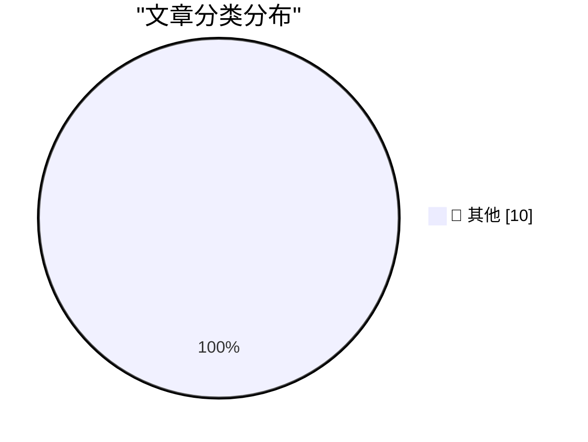

# 📰 AI 博客每日精选 — 2026-06-16

> 来自 Karpathy 推荐的 92 个顶级技术博客，AI 精选 Top 10

## 🏆 今日必读

🥇 **Testing pentagonal numbers**

[Testing pentagonal numbers](https://www.johndcook.com/blog/2026/06/15/testing-pentagonal-numbers/) — johndcook.com · 刚刚 · 📝 其他

> The n th pentagonal number P n is the number of dots in diagrams like those below with n concentric pentagons. We have the formula P n = (3 n ² − n )/2 where n is a positive integer. If n is an intege

🥈 **Lean, not backpressure**

[Lean, not backpressure](https://entropicthoughts.com/lean-not-backpressure) — entropicthoughts.com · 1 小时前 · 📝 其他

> Lean, not backpressure by kqr , published 2026-06-16 Tags: systems management organisations ai Lucas Costa has written a good article on how to build systems that can handle code-generating robots . U

🥉 **JAX: commitment issues**

[JAX: commitment issues](https://www.gilesthomas.com/2026/06/jax-commitment-issues) — gilesthomas.com · 1 小时前 · 📝 其他

> el.dataset.currentDropdown = '') }"> Giles' blog About Contact Archives Categories Blogroll June 2026 (5) May 2026 (2) April 2026 (11) March 2026 (3) February 2026 (4) January 2026 (4) December 2025 (

---

## 📊 数据概览

| 扫描源 | 抓取文章 | 时间范围 | 精选 |
|:---:|:---:|:---:|:---:|
| 86/92 | 2549 篇 → 23 篇 | 24h | **10 篇** |

### 分类分布

---

## 📝 其他

### 1. Testing pentagonal numbers

[Testing pentagonal numbers](https://www.johndcook.com/blog/2026/06/15/testing-pentagonal-numbers/) — **johndcook.com** · 刚刚 · ⭐ 15/30

> The n th pentagonal number P n is the number of dots in diagrams like those below with n concentric pentagons. We have the formula P n = (3 n ² − n )/2 where n is a positive integer. If n is an intege

---

### 2. Lean, not backpressure

[Lean, not backpressure](https://entropicthoughts.com/lean-not-backpressure) — **entropicthoughts.com** · 1 小时前 · ⭐ 15/30

> Lean, not backpressure by kqr , published 2026-06-16 Tags: systems management organisations ai Lucas Costa has written a good article on how to build systems that can handle code-generating robots . U

---

### 3. JAX: commitment issues

[JAX: commitment issues](https://www.gilesthomas.com/2026/06/jax-commitment-issues) — **gilesthomas.com** · 1 小时前 · ⭐ 15/30

> el.dataset.currentDropdown = '') }"> Giles' blog About Contact Archives Categories Blogroll June 2026 (5) May 2026 (2) April 2026 (11) March 2026 (3) February 2026 (4) January 2026 (4) December 2025 (

---

### 4. Quaternion Rotations, Claude, and Lean

[Quaternion Rotations, Claude, and Lean](https://www.johndcook.com/blog/2026/06/15/quaternions-claude-lean/) — **johndcook.com** · 3 小时前 · ⭐ 15/30

> I got an email message this afternoon reporting a typo in a blog post from about a year ago on converting between quaternions and rotation matrices [1]. The email said exactly where the typo was, but 

---

### 5. AI's Brokenomics

[AI's Brokenomics](https://www.wheresyoured.at/brokenomics/) — **wheresyoured.at** · 3 小时前 · ⭐ 15/30

> AI's Brokenomics Ed Zitron Jun 15, 2026 29 min read Table of Contents If you liked this piece, you should subscribe to my premium newsletter. It’s $70 a year, or $7 a month, and in return you get a we

---

### 6. datasette-agent 0.3a0

[datasette-agent 0.3a0](https://simonwillison.net/2026/Jun/15/datasette-agent/#atom-everything) — **simonwillison.net** · 5 小时前 · ⭐ 15/30

> Simon Willison’s Weblog Subscribe Sponsored by: Teleport &mdash; Prevent access bottlenecks. Unify identity. Teleport replaces fragmented identity and access tooling with a single identity layer that 

---

### 7. Pluralistic: AI and amateurism (15 Jun 2026)

[Pluralistic: AI and amateurism (15 Jun 2026)](https://pluralistic.net/2026/06/15/vernacular/) — **pluralistic.net** · 7 小时前 · ⭐ 15/30

> ->->->->->->->->->->->->->->->->->->->->->->->->->->->->-> Top Sources: None --> Today's links AI and amateurism : When is generative content vernacular? Hey look at this : Delights to delectate. Obje

---

### 8. "They screwed us": Personality clashes sent Anthropic's models offline

["They screwed us": Personality clashes sent Anthropic's models offline](https://simonwillison.net/2026/Jun/15/axios-clashes-anthropics/#atom-everything) — **simonwillison.net** · 8 小时前 · ⭐ 15/30

> "They screwed us": Personality clashes sent Anthropic's models offline . Lots of "source familiar with the administration's thinking" and "source close to Anthropic" in this Axios piece, which is the 

---

### 9. The time the x86 emulator team found code so bad that they fixed it during emulation

[The time the x86 emulator team found code so bad that they fixed it during emulation](https://devblogs.microsoft.com/oldnewthing/20260615-00/?p=112419) — **devblogs.microsoft.com/oldnewthing** · 9 小时前 · ⭐ 15/30

> During an exchange of war stories, a colleague of mine told one from back in the days when Windows included a processor emulator for x86-32 on systems that natively ran some other processor. (This has

---

### 10. EU & Civil Society need to progress on Digital Autonomy

[EU & Civil Society need to progress on Digital Autonomy](https://berthub.eu/articles/posts/eu-civil-society-need-progress-digital-autonomy/) — **berthub.eu** · 10 小时前 · ⭐ 15/30

> By now (happily) everyone wants to talk about digital autonomy, although some parties insist we talk about sovereignty. Fine. tl;dr: The discussions on digital autonomy are now going round in circles.

---

*生成于 2026-06-16 07:00 | 扫描 86 源 → 获取 2549 篇 → 精选 10 篇*
*基于 [Hacker News Popularity Contest 2025](https://refactoringenglish.com/tools/hn-popularity/) RSS 源列表*
