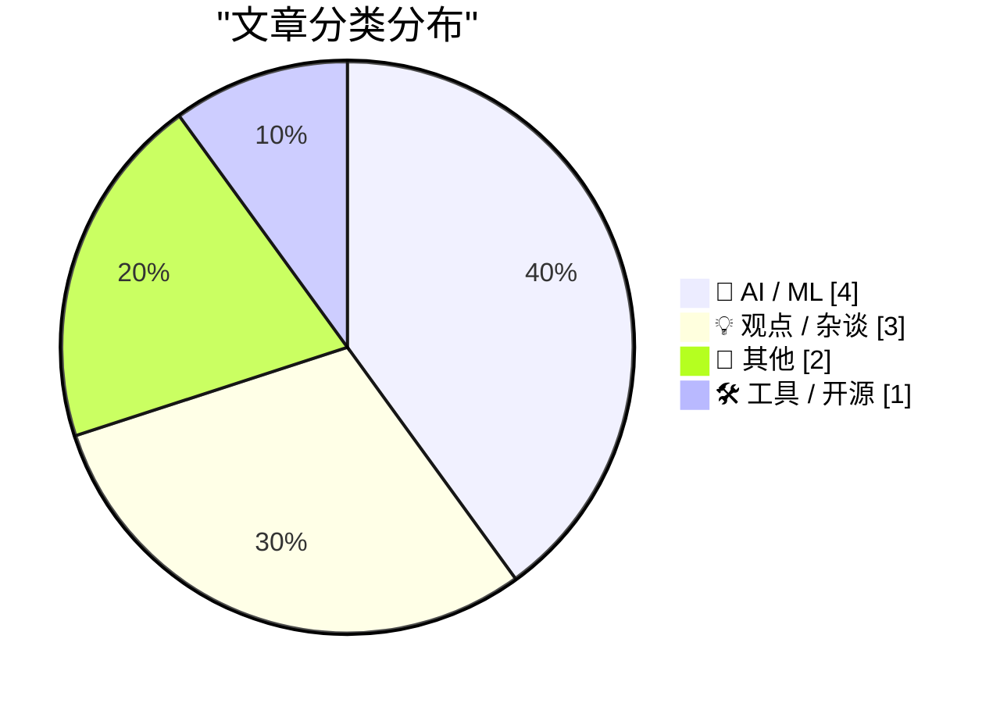
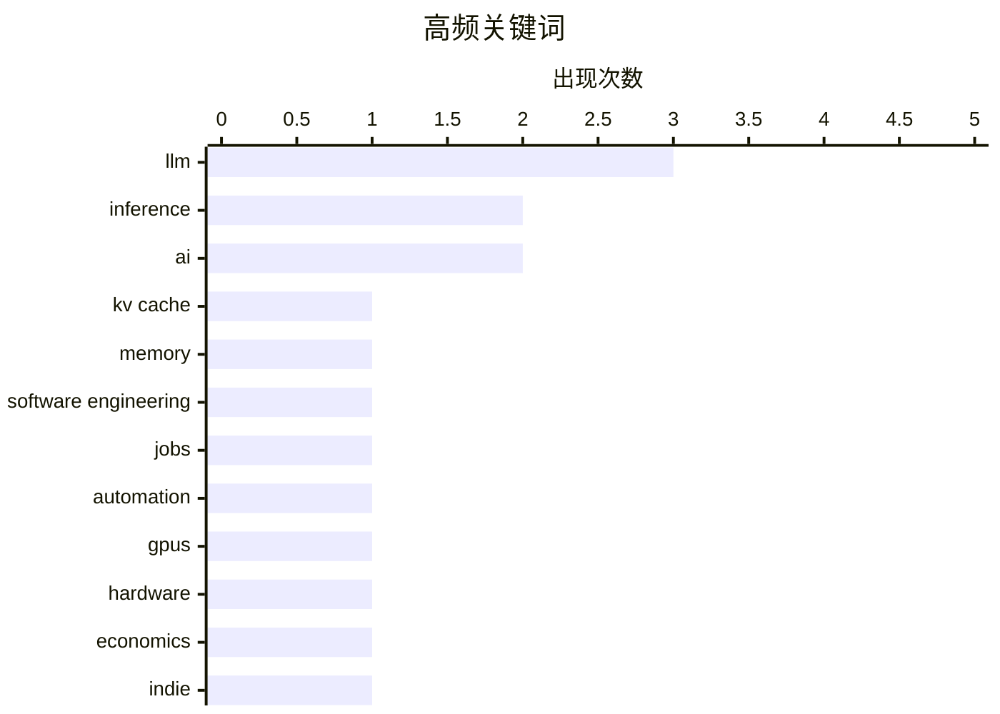

# 📰 AI 博客每日精选 — 2026-06-16

> 来自 Karpathy 推荐的 92 个顶级技术博客，AI 精选 Top 10

## 📝 今日看点

今天技术圈的主线，已经从“模型更强”转向“AI如何更高效、更可控、更能落地”：无论是 KV cache 压缩、GPU 生命周期，还是面向 Agent 的协议与工具，都指向基础设施进入精细化运营阶段。与此同时，关于“AI会不会取代工程师”的讨论也在降温，取而代之的是对人机协作边界、软件质量与生产流程重构的再认识。另一条鲜明趋势是治理与自主权升温——从大模型安全节奏到欧洲数字自主，技术竞争正越来越深地延伸到制度、产业与公共决策层面。

---

## 🏆 今日必读

🥇 **A brief history of KV cache compression developments**

[A brief history of KV cache compression developments](https://martinalderson.com/posts/a-brief-history-of-kv-cache-compression-developments/?utm_source=rss&amp;utm_medium=rss&amp;utm_campaign=feed) — martinalderson.com · 23 小时前 · 🤖 AI / ML

> While much is focused on the improvement of models , there's been radical improvements in the efficiency of KV cache compression. I was curious to figure out just how big the improvements are and why 

🏷️ KV cache, LLM, inference, memory

🥈 **Why AI hasn’t replaced software engineers, and won’t**

[Why AI hasn’t replaced software engineers, and won’t](https://simonwillison.net/2026/Jun/14/why-ai-hasnt-replaced-software-engineers/#atom-everything) — simonwillison.net · 23 小时前 · 💡 观点 / 杂谈

> Why AI hasn’t replaced software engineers, and won’t . Arvind Narayanan and Sayash Kappor take on the question of AI job losses through the lens of a profession that is uniquely suited to AI disruptio

🏷️ AI, software engineering, jobs, automation

🥉 **AI GPUs probably live longer than three years**

[AI GPUs probably live longer than three years](https://seangoedecke.com/ai-gpus-live-longer-than-three-years/) — seangoedecke.com · 23 小时前 · 🤖 AI / ML

> AI GPUs probably live longer than three years People who think current AI use is unsustainable often rely on the claim that inference GPUs only last “three years at the most” under load 1 . The idea h

🏷️ GPUs, inference, hardware, economics

---

## 📊 数据概览

| 扫描源 | 抓取文章 | 时间范围 | 精选 |
|:---:|:---:|:---:|:---:|
| 87/92 | 2565 篇 → 25 篇 | 24h | **10 篇** |

### 分类分布



### 高频关键词



<details>
<summary>📈 纯文本关键词图（终端友好）</summary>

```
llm                  │ ████████████████████ 3
inference            │ █████████████░░░░░░░ 2
ai                   │ █████████████░░░░░░░ 2
kv cache             │ ███████░░░░░░░░░░░░░ 1
memory               │ ███████░░░░░░░░░░░░░ 1
software engineering │ ███████░░░░░░░░░░░░░ 1
jobs                 │ ███████░░░░░░░░░░░░░ 1
automation           │ ███████░░░░░░░░░░░░░ 1
gpus                 │ ███████░░░░░░░░░░░░░ 1
hardware             │ ███████░░░░░░░░░░░░░ 1
```

</details>

### 🏷️ 话题标签

**llm**(3) · **inference**(2) · **ai**(2) · kv cache(1) · memory(1) · software engineering(1) · jobs(1) · automation(1) · gpus(1) · hardware(1) · economics(1) · indie(1) · competition(1) · community(1) · datasette(1) · agent(1) · sql(1) · auth.md(1) · agents(1) · authentication(1)

---

## 🤖 AI / ML

### 1. A brief history of KV cache compression developments

[A brief history of KV cache compression developments](https://martinalderson.com/posts/a-brief-history-of-kv-cache-compression-developments/?utm_source=rss&amp;utm_medium=rss&amp;utm_campaign=feed) — **martinalderson.com** · 23 小时前 · ⭐ 25/30

> While much is focused on the improvement of models , there's been radical improvements in the efficiency of KV cache compression. I was curious to figure out just how big the improvements are and why 

🏷️ KV cache, LLM, inference, memory

---

### 2. AI GPUs probably live longer than three years

[AI GPUs probably live longer than three years](https://seangoedecke.com/ai-gpus-live-longer-than-three-years/) — **seangoedecke.com** · 23 小时前 · ⭐ 22/30

> AI GPUs probably live longer than three years People who think current AI use is unsustainable often rely on the claim that inference GPUs only last “three years at the most” under load 1 . The idea h

🏷️ GPUs, inference, hardware, economics

---

### 3. datasette-agent 0.3a0

[datasette-agent 0.3a0](https://simonwillison.net/2026/Jun/15/datasette-agent/#atom-everything) — **simonwillison.net** · 5 小时前 · ⭐ 21/30

> Simon Willison’s Weblog Subscribe Sponsored by: Microsoft &mdash; Agent projects stall between demo and production. Microsoft's MVP checklist closes that gap. Try it 15th June 2026 Release datasette-a

🏷️ Datasette, agent, LLM, SQL

---

### 4. Anthropic 的安全超能力

[‘Anthropic’s Safety Superpower’](https://stratechery.com/2026/anthropics-safety-superpower/) — **daringfireball.net** · 5 小时前 · ⭐ 22/30

> 焦点集中在 Anthropic 对高能力模型的安全表述、上线节奏，以及 Fable 5 / Mythos 5 随后遭遇的政府干预。文中提到，Anthropic 两个月前称 Mythos Preview 因网络安全能力过强而不宜公开，随后又推出加入安全护栏的 Fable；作者主观体验认为 Fable 表现极强，甚至让 GPT 5.5 和 Opus 4.8 显得逊色，并猜测它可能代表新一代预训练模型的首发版本。与此同时，公开发布模型的难点在于护栏可能被越狱，而 Fable 发布后不久似乎就发生了这类情况。Anthropic 披露，美国政府依据国家安全权限下达出口管制指令，要求暂停 Fable 5 和 Mythos 5 对任何外国人的访问；公司称政府担心存在绕过 Fable 5 的方法，但其审查后认为该演示只涉及少量已知且较轻微的漏洞，且其他公开模型无需绕过限制也能发现这些问题。文章呈现出一个悬而未决的争议：Anthropic 认为政府可能误解了风险，而白宫方面则暗示公司领导层对正当安全关切不够重视。

🏷️ Anthropic, AI safety, jailbreak, LLM

---

## 💡 观点 / 杂谈

### 5. Why AI hasn’t replaced software engineers, and won’t

[Why AI hasn’t replaced software engineers, and won’t](https://simonwillison.net/2026/Jun/14/why-ai-hasnt-replaced-software-engineers/#atom-everything) — **simonwillison.net** · 23 小时前 · ⭐ 23/30

> Why AI hasn’t replaced software engineers, and won’t . Arvind Narayanan and Sayash Kappor take on the question of AI job losses through the lens of a profession that is uniquely suited to AI disruptio

🏷️ AI, software engineering, jobs, automation

---

### 6. Maybe it's time for lots of little indie AIs to take over

[Maybe it's time for lots of little indie AIs to take over](https://anildash.com/2026/06/15/indie-AI-takeover/) — **anildash.com** · 23 小时前 · ⭐ 22/30

> Maybe it's time for lots of little indie AIs to take over 15 Jun 2026 2026-06-15 2026-06-15 /images/stone-pillars.jpg AI, tech, software, community AI tech software community 2026 “[T]here can be alte

🏷️ AI, indie, competition, community

---

### 7. 欧盟与公民社会需要推进数字自主

[EU & Civil Society need to progress on Digital Autonomy](https://berthub.eu/articles/posts/eu-civil-society-need-progress-digital-autonomy/) — **berthub.eu** · 10 小时前 · ⭐ 18/30

> 围绕欧洲“数字自主/数字主权”的讨论正在原地打转，单靠反复讨论立法或泛泛而谈欧洲价值，无法真正接近目标。真正落地需要一条很长的链条同时运转：政府技术人员得到管理层支持，部委形成明确方向，采购部门愿意承受采购欧洲服务可能带来的诉讼压力，同时还要有能向政府交付服务的软件与服务供应商。作者指出，当前公民社会和智库的相关活动里，采购部门、IT 部门、供应商以及成员国政府高层普遍缺席，而这些恰恰是推进数字主权不可或缺的参与者。文中也强调了公民社会的独特作用：它不直接掌权，因此反而有空间提出尚不成熟、但在正式政治场合难以公开讨论的新政策想法。结论是，欧洲要推进数字自主，必须把视野从现有讨论扩展到更长的执行链条，并让公民社会与更多关键实务角色共同参与。

🏷️ Europe, digital sovereignty, policy, procurement

---

## 📝 其他

### 8. Testing pentagonal numbers

[Testing pentagonal numbers](https://www.johndcook.com/blog/2026/06/15/testing-pentagonal-numbers/) — **johndcook.com** · 刚刚 · ⭐ 15/30

> The n th pentagonal number P n is the number of dots in diagrams like those below with n concentric pentagons. We have the formula P n = (3 n ² − n )/2 where n is a positive integer. If n is an intege

---

### 9. 精益，而非背压

[Lean, not backpressure](https://entropicthoughts.com/lean-not-backpressure) — **entropicthoughts.com** · 1 小时前 · ⭐ 15/30

> 这篇文章质疑用“背压”来概括应对代码生成机器人的系统设计，认为该比喻偏向让上游“放慢速度”，而文中讨论的问题更接近让上游“以不同方式工作”，重点是保证下游收到的质量而非数量。作者把这种思路对应到精益制造，强调精益不只是减少浪费，也是在面对人的不稳定输入时，通过流程设计来容纳现实中的失误，而不是要求一线执行者时刻完美。文中借此提出三种具体实践：单件流让下游能在错误产出扩大前尽早拒收；自働化（jidoka）让机器在发现异常时停止继续；防错法（poka-yoke）则通过流程设计让结果天然符合要求。作者同时反对把质量问题归咎于个体执行者，指出无论是人还是代码生成机器人，都不应被假定为对结果独自负责。结论是，围绕代码生成机器人构建系统时，更合适的框架是精益哲学，而不是“背压”这个隐喻。

---

## 🛠 工具 / 开源

### 10. WorkOS Launches Auth.md — an Open Protocol for Agent Registration

[WorkOS Launches Auth.md — an Open Protocol for Agent Registration](https://workos.com/auth-md?utm_source=daringfireball&amp;utm_medium=newsletter&amp;utm_campaign=q22026) — **daringfireball.net** · 5 小时前 · ⭐ 23/30

> auth.md [ D ] Docs [ C ] Changelog [ G ] GitHub auth.md Enable agents to register users without the sign-up form. Auth.md provides secure agent registration that any app can implement. Make your app a

🏷️ auth.md, agents, authentication, protocol

---

*生成于 2026-06-16 07:00 | 扫描 87 源 → 获取 2565 篇 → 精选 10 篇*
*基于 [Hacker News Popularity Contest 2025](https://refactoringenglish.com/tools/hn-popularity/) RSS 源列表*
