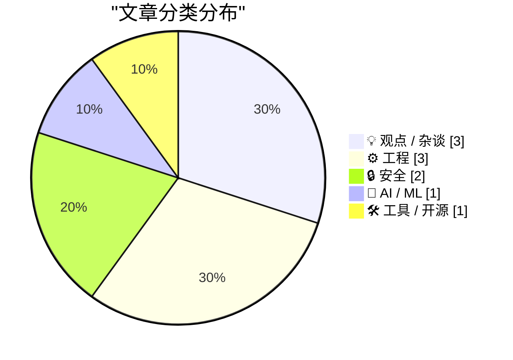
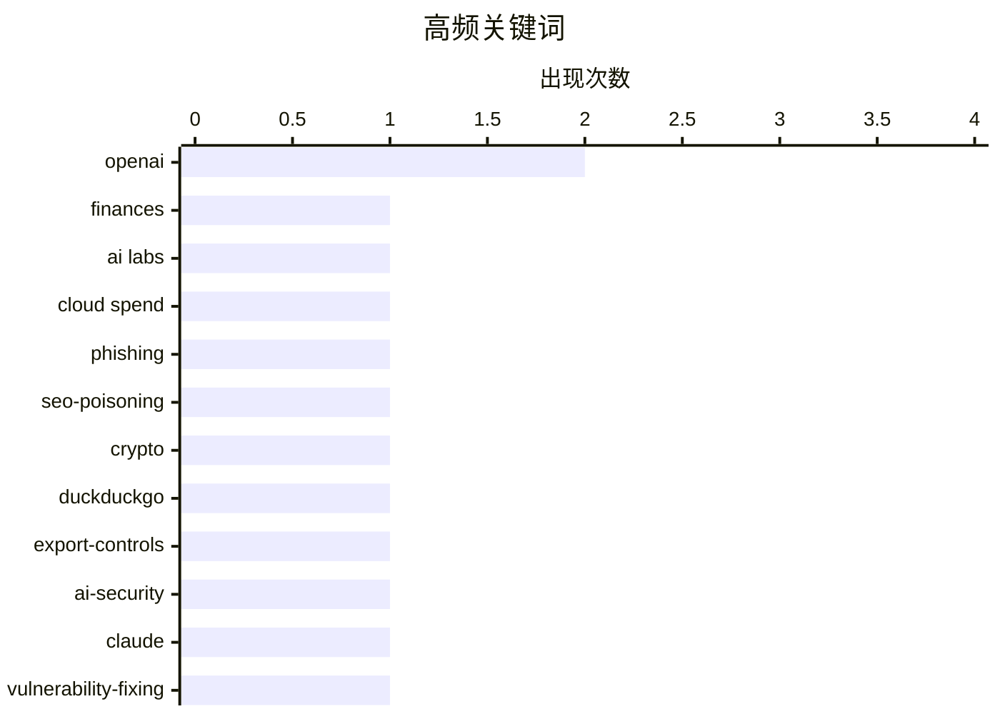

# 📰 AI 博客每日精选 — 2026-06-17

> 来自 Karpathy 推荐的 92 个顶级技术博客，AI 精选 Top 10

## 📝 今日看点

今天技术圈的焦点，正在从“模型有多强”转向“体系是否可持续”。一边是头部 AI 公司投入飙升、亏损扩大、领先优势被质疑，说明大模型竞争已进入高成本消耗战；另一边，围绕搜索投毒、出口管制与数字自主的讨论升温，安全与技术主权正重新成为产业核心议题。与此同时，工程实践也在回归基本功：从生产环境调试到输入工具和老系统兼容，开发者越来越重视可控性、韧性与对基础设施的掌握。

---

## 🏆 今日必读

🥇 **Exclusive: OpenAI Losses Increased Nearly 8X in 2025, With Spending Hitting $34 Billion**

[Exclusive: OpenAI Losses Increased Nearly 8X in 2025, With Spending Hitting $34 Billion](https://www.wheresyoured.at/exclusive-openai-financials/) — wheresyoured.at · 19 小时前 · 🤖 AI / ML

> Exclusive: OpenAI Losses Increased Nearly 8X in 2025, With Spending Hitting $34 Billion Ed Zitron Jun 15, 2026 3 min read Table of Contents Soundtrack: In Flames - Colony To further support my indepen

🏷️ OpenAI, finances, AI labs, cloud spend

🥈 **Would you like a drainer served at the very top of DuckDuckGo?**

[Would you like a drainer served at the very top of DuckDuckGo?](https://timsh.org/drainer-at-the-top-of-duckduckgo/) — timsh.org · 9 小时前 · 🔒 安全

> Would you like a drainer served at the very top of DuckDuckGo? tim 16 Jun 2026 — 14 min read Probably no, right? That would be very dangerous, especially if the phishing website serving it is an exact

🏷️ phishing, SEO-poisoning, crypto, DuckDuckGo

🥉 **The Fable 5 Export Controls Harm US Cyber Defense**

[The Fable 5 Export Controls Harm US Cyber Defense](https://simonwillison.net/2026/Jun/16/fable-5-export-controls/#atom-everything) — simonwillison.net · 17 小时前 · 🔒 安全

> The Fable 5 Export Controls Harm US Cyber Defense . I quoted The Atlantic quoting Kate Moussouris earlier, when I should have gone straight to the source. Here she is confirming that the "jailbreak" t

🏷️ export-controls, AI-security, Claude, vulnerability-fixing

---

## 📊 数据概览

| 扫描源 | 抓取文章 | 时间范围 | 精选 |
|:---:|:---:|:---:|:---:|
| 87/92 | 2565 篇 → 25 篇 | 24h | **10 篇** |

### 分类分布



### 高频关键词



<details>
<summary>📈 纯文本关键词图（终端友好）</summary>

```
openai          │ ████████████████████ 2
finances        │ ██████████░░░░░░░░░░ 1
ai labs         │ ██████████░░░░░░░░░░ 1
cloud spend     │ ██████████░░░░░░░░░░ 1
phishing        │ ██████████░░░░░░░░░░ 1
seo-poisoning   │ ██████████░░░░░░░░░░ 1
crypto          │ ██████████░░░░░░░░░░ 1
duckduckgo      │ ██████████░░░░░░░░░░ 1
export-controls │ ██████████░░░░░░░░░░ 1
ai-security     │ ██████████░░░░░░░░░░ 1
```

</details>

### 🏷️ 话题标签

**openai**(2) · **finances**(1) · **ai labs**(1) · cloud spend(1) · phishing(1) · seo-poisoning(1) · crypto(1) · duckduckgo(1) · export-controls(1) · ai-security(1) · claude(1) · vulnerability-fixing(1) · digital sovereignty(1) · europe(1) · big tech(1) · cloud(1) · open-source(1) · maintainership(1) · governance(1) · succession(1)

---

## 💡 观点 / 杂谈

### 1. Do not invite big-tech to join your digital autonomy discussion

[Do not invite big-tech to join your digital autonomy discussion](https://berthub.eu/articles/posts/do-not-invite-big-tech-to-your-digital-autonomy-discussion/) — **berthub.eu** · 7 小时前 · ⭐ 23/30

> Some time ago, I attended an event to discuss European digital autonomy and digital dependencies. I accepted the invitation without checking too carefully, and I belatedly found out that most of US bi

🏷️ digital sovereignty, Europe, big tech, cloud

---

### 2. How Open Source Projects Change Hands

[How Open Source Projects Change Hands](https://nesbitt.io/2026/06/16/how-open-source-projects-change-hands.html) — **nesbitt.io** · 13 小时前 · ⭐ 23/30

> Dumb Ways for an Open Source Project to Die listed the ways projects end up dead, and most of the entries describe a moment where maintainership should have moved to someone else and didn’t. This is t

🏷️ open-source, maintainership, governance, succession

---

### 3. OpenAI’s lead is dwindling fast

[OpenAI’s lead is dwindling fast](https://garymarcus.substack.com/p/openais-lead-is-dwindling-fast) — **garymarcus.substack.com** · 1 小时前 · ⭐ 20/30

> OpenAI’s lead is dwindling fast As James Carville might have said, “It’s the lack of a moat, stupid” Gary Marcus Jun 16, 2026 220 53 27 Share BURKOV @burkov OpenAI's market share drops below 50% for t

🏷️ OpenAI, competition, LLM, market-share

---

## ⚙️ 工程

### 4. Debugging on Prod

[Debugging on Prod](https://idiallo.com/blog/debugging-on-prod) — **idiallo.com** · 2 小时前 · ⭐ 21/30

> The worst type of bug is one that only happens on prod. And only on prod. If you checked this blog in the past few weeks, you might have encountered a big fat 500 error. I'd had the same design for 10

🏷️ production-debugging, PHP, Copilot, refactoring

---

### 5. Cloudflare CAPTCHA on at least one ampersand

[Cloudflare CAPTCHA on at least one ampersand](https://simonwillison.net/2026/Jun/16/captcha-on-at-least-one-ampersand/#atom-everything) — **simonwillison.net** · 22 小时前 · ⭐ 21/30

> Simon Willison’s Weblog Subscribe Sponsored by: Microsoft &mdash; Agent projects stall between demo and production. Microsoft's MVP checklist closes that gap. Try it 16th June 2026 TIL Cloudflare CAPT

🏷️ Cloudflare, CAPTCHA, WAF, search

---

### 6. 把 WM_COPYDATA 消息移植到 Windows 3.1

[Retrofitting the WM_COPYDATA message onto Windows 3.1](https://devblogs.microsoft.com/oldnewthing/20260616-00/?p=112430) — **devblogs.microsoft.com/oldnewthing** · 9 小时前 · ⭐ 19/30

> 重点在于解释本来诞生于 32 位 Windows 的 `WM_COPYDATA`，为什么能够在 Windows 3.1 这样的 16 位环境里被“补装”支持。16 位 Windows 中所有程序共享同一地址空间，所以一个进程里的远指针对另一个进程同样有效，窗口消息里的 `lParam` 可以直接携带指针跨进程传递。到了 32 位 Windows，各程序拥有独立地址空间，这种做法失效，于是才需要 `WM_COPYDATA` 在 32 位程序之间，以及 32 位与 16 位程序之间传递数据。之所以 Win32s 能把这个消息“移植”到 Windows 3.1，是因为当发送方和接收方都是 16 位窗口时，`COPYDATASTRUCT` 指针、其内部指针以及 `wParam` 中的窗口句柄本来就都有效，而 Windows 3.1 又恰好会在跨进程发送消息时原样传递 `wParam` 和 `lParam`。作者的结论是，`WM_COPYDATA` 在 16 位程序之间其实无需额外封送，消息设计恰好让“什么都不做”就是正确行为。

🏷️ Windows, Win32, WM_COPYDATA, IPC

---

## 🔒 安全

### 7. Would you like a drainer served at the very top of DuckDuckGo?

[Would you like a drainer served at the very top of DuckDuckGo?](https://timsh.org/drainer-at-the-top-of-duckduckgo/) — **timsh.org** · 9 小时前 · ⭐ 25/30

> Would you like a drainer served at the very top of DuckDuckGo? tim 16 Jun 2026 — 14 min read Probably no, right? That would be very dangerous, especially if the phishing website serving it is an exact

🏷️ phishing, SEO-poisoning, crypto, DuckDuckGo

---

### 8. The Fable 5 Export Controls Harm US Cyber Defense

[The Fable 5 Export Controls Harm US Cyber Defense](https://simonwillison.net/2026/Jun/16/fable-5-export-controls/#atom-everything) — **simonwillison.net** · 17 小时前 · ⭐ 24/30

> The Fable 5 Export Controls Harm US Cyber Defense . I quoted The Atlantic quoting Kate Moussouris earlier, when I should have gone straight to the source. Here she is confirming that the "jailbreak" t

🏷️ export-controls, AI-security, Claude, vulnerability-fixing

---

## 🤖 AI / ML

### 9. Exclusive: OpenAI Losses Increased Nearly 8X in 2025, With Spending Hitting $34 Billion

[Exclusive: OpenAI Losses Increased Nearly 8X in 2025, With Spending Hitting $34 Billion](https://www.wheresyoured.at/exclusive-openai-financials/) — **wheresyoured.at** · 19 小时前 · ⭐ 27/30

> Exclusive: OpenAI Losses Increased Nearly 8X in 2025, With Spending Hitting $34 Billion Ed Zitron Jun 15, 2026 3 min read Table of Contents Soundtrack: In Flames - Colony To further support my indepen

🏷️ OpenAI, finances, AI labs, cloud spend

---

## 🛠 工具 / 开源

### 10. 键在眼前

[Key, in sight](https://aresluna.org/key-in-sight) — **aresluna.org** · 4 小时前 · ⭐ 20/30

> 这是一篇面向键盘定制初学者的指南，聚焦如何从硬件到软件逐步建立更顺手、更有乐趣的人机交互方式。作者认为键盘的价值不只在效率，还在于通过大键、快捷键组合和肌肉记忆，形成对工具的掌控感、定制感与流畅反馈。文章把门槛主要归结为两类：硬件世界里选项和术语过多，软件世界里应用名称相似、界面混乱，还常伴随大量权限请求。给出的起点建议不是立刻重排现有快捷键，而是先“增加可用空间”，做法包括在现有键盘上划出尚未被占用的区域，或直接增加新的按键与小键盘，以便更轻松地实验。全文范围明确排除了 command palettes、text expansion 和用按键启动应用，软件部分也只覆盖 Mac。作者的核心态度是：把键盘定制当成一条可循序上手的实践路径，在降低复杂度的同时保留探索和玩乐的空间。

🏷️ keyboard, customization, shortcuts, productivity

---

*生成于 2026-06-17 07:00 | 扫描 87 源 → 获取 2565 篇 → 精选 10 篇*
*基于 [Hacker News Popularity Contest 2025](https://refactoringenglish.com/tools/hn-popularity/) RSS 源列表*
