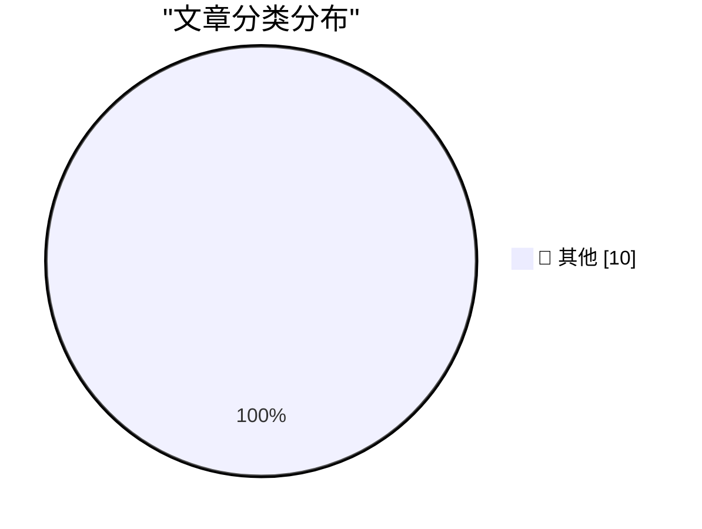

# 📰 AI 博客每日精选 — 2026-06-17

> 来自 Karpathy 推荐的 92 个顶级技术博客，AI 精选 Top 10

## 🏆 今日必读

🥇 **OpenAI’s lead is dwindling fast**

[OpenAI’s lead is dwindling fast](https://garymarcus.substack.com/p/openais-lead-is-dwindling-fast) — garymarcus.substack.com · 1 小时前 · 📝 其他

> OpenAI’s lead is dwindling fast As James Carville might have said, “It’s the lack of a moat, stupid” Gary Marcus Jun 16, 2026 196 47 22 Share BURKOV @burkov OpenAI's market share drops below 50% for t

🥈 **datasette 1.0a34**

[datasette 1.0a34](https://simonwillison.net/2026/Jun/16/datasette/#atom-everything) — simonwillison.net · 1 小时前 · 📝 其他

> Simon Willison’s Weblog Subscribe Sponsored by: Teleport &mdash; Prevent access bottlenecks. Unify identity. Teleport replaces fragmented identity and access tooling with a single identity layer that 

🥉 **Debugging on Prod**

[Debugging on Prod](https://idiallo.com/blog/debugging-on-prod) — idiallo.com · 2 小时前 · 📝 其他

> The worst type of bug is one that only happens on prod. And only on prod. If you checked this blog in the past few weeks, you might have encountered a big fat 500 error. I'd had the same design for 10

---

## 📊 数据概览

| 扫描源 | 抓取文章 | 时间范围 | 精选 |
|:---:|:---:|:---:|:---:|
| 86/92 | 2549 篇 → 25 篇 | 24h | **10 篇** |

### 分类分布

---

## 📝 其他

### 1. OpenAI’s lead is dwindling fast

[OpenAI’s lead is dwindling fast](https://garymarcus.substack.com/p/openais-lead-is-dwindling-fast) — **garymarcus.substack.com** · 1 小时前 · ⭐ 15/30

> OpenAI’s lead is dwindling fast As James Carville might have said, “It’s the lack of a moat, stupid” Gary Marcus Jun 16, 2026 196 47 22 Share BURKOV @burkov OpenAI's market share drops below 50% for t

---

### 2. datasette 1.0a34

[datasette 1.0a34](https://simonwillison.net/2026/Jun/16/datasette/#atom-everything) — **simonwillison.net** · 1 小时前 · ⭐ 15/30

> Simon Willison’s Weblog Subscribe Sponsored by: Teleport &mdash; Prevent access bottlenecks. Unify identity. Teleport replaces fragmented identity and access tooling with a single identity layer that 

---

### 3. Debugging on Prod

[Debugging on Prod](https://idiallo.com/blog/debugging-on-prod) — **idiallo.com** · 2 小时前 · ⭐ 15/30

> The worst type of bug is one that only happens on prod. And only on prod. If you checked this blog in the past few weeks, you might have encountered a big fat 500 error. I'd had the same design for 10

---

### 4. Key, in sight

[Key, in sight](https://aresluna.org/key-in-sight) — **aresluna.org** · 4 小时前 · ⭐ 15/30

> Marcin Wichary 12 May 2026 / 9,400 words, but don’t even worry about it Key, in sight A guide, of sorts, to keyboard customization I like keyboards because they’re the most effective human-computer in

---

### 5. 10Gb/s Ethernet: switching to a Broadcom SFP+ module

[10Gb/s Ethernet: switching to a Broadcom SFP+ module](https://www.gilesthomas.com/2026/06/10g-ethernet-switching-to-broadcom-sfp-plus) — **gilesthomas.com** · 4 小时前 · ⭐ 15/30

> el.dataset.currentDropdown = '') }"> Giles' blog About Contact Archives Categories Blogroll June 2026 (5) May 2026 (2) April 2026 (11) March 2026 (3) February 2026 (4) January 2026 (4) December 2025 (

---

### 6. Partial fraction decomposition

[Partial fraction decomposition](https://www.johndcook.com/blog/2026/06/16/partial-fraction-decomposition/) — **johndcook.com** · 5 小时前 · ⭐ 15/30

> Nearly everyone who has seen partial fraction decomposition was introduced to it as a way to compute integrals. If P ( x ) and Q ( x ) are polynomials, then you can break their ratio P ( x )/ Q ( x ) 

---

### 7. Ada Palmer – Machiavelli is the most misunderstood thinker of all time

[Ada Palmer – Machiavelli is the most misunderstood thinker of all time](https://www.dwarkesh.com/p/ada-palmer-2) — **dwarkesh.com** · 5 小时前 · ⭐ 15/30

> Playback speed × Share post Share post at current time Share from 0:00 0:00 / Transcript 36 3 1 Ada Palmer – Machiavelli is the most misunderstood thinker of all time "He begged to work for the regime

---

### 8. datasette-tailscale 0.1a0

[datasette-tailscale 0.1a0](https://simonwillison.net/2026/Jun/16/datasette-tailscale/#atom-everything) — **simonwillison.net** · 6 小时前 · ⭐ 15/30

> Simon Willison’s Weblog Subscribe Sponsored by: Teleport &mdash; Prevent access bottlenecks. Unify identity. Teleport replaces fragmented identity and access tooling with a single identity layer that 

---

### 9. Do not invite big-tech to join your digital autonomy discussion

[Do not invite big-tech to join your digital autonomy discussion](https://berthub.eu/articles/posts/do-not-invite-big-tech-to-your-digital-autonomy-discussion/) — **berthub.eu** · 7 小时前 · ⭐ 15/30

> Some time ago, I attended an event to discuss European digital autonomy and digital dependencies. I accepted the invitation without checking too carefully, and I belatedly found out that most of US bi

---

### 10. Retrofitting the WM_COPYDATA message onto Windows 3.1

[Retrofitting the WM_COPYDATA message onto Windows 3.1](https://devblogs.microsoft.com/oldnewthing/20260616-00/?p=112430) — **devblogs.microsoft.com/oldnewthing** · 9 小时前 · ⭐ 15/30

> Some time ago, I talked about how to return results back from the WM_COPYDATA message . Which reminded me of a clever bit of history. The WM_COPYDATA message was introduced in 32-bit Windows. There wa

---

*生成于 2026-06-17 07:00 | 扫描 86 源 → 获取 2549 篇 → 精选 10 篇*
*基于 [Hacker News Popularity Contest 2025](https://refactoringenglish.com/tools/hn-popularity/) RSS 源列表*
