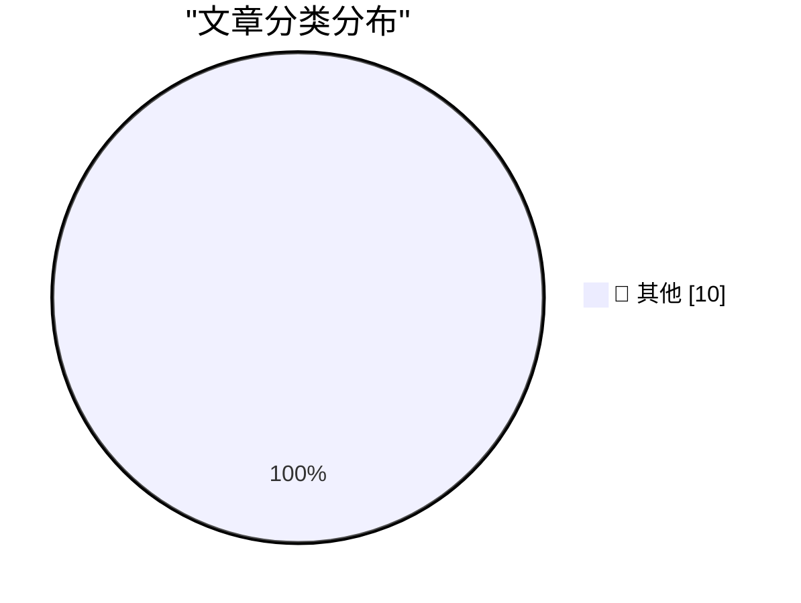

# 📰 AI 博客每日精选 — 2026-06-18

> 来自 Karpathy 推荐的 92 个顶级技术博客，AI 精选 Top 10

## 🏆 今日必读

🥇 **Pluralistic: The (real) dead economy theory (17 Jun 2026)**

[Pluralistic: The (real) dead economy theory (17 Jun 2026)](https://pluralistic.net/2026/06/17/its-the-stupid-economy-stupid/) — pluralistic.net · 4 小时前 · 📝 其他

> ->->->->->->->->->->->->->->->->->->->->->->->->->->->->-> Top Sources: None --> Today's links The (real) dead economy theory : Vibes and memestocks, all the way down. Hey look at this : Delights to d

🥈 **Breaking: Trump asks the impossible of Anthropic**

[Breaking: Trump asks the impossible of Anthropic](https://garymarcus.substack.com/p/breaking-trump-asks-the-impossible) — garymarcus.substack.com · 4 小时前 · 📝 其他

> Breaking: Trump asks the impossible of Anthropic Where do we go from here? Gary Marcus Jun 17, 2026 130 72 15 Share In January 2024, I warned that the politics and inadequacy of guardrails would becom

🥉 **You Got Faster. Your Company Didn’t.**

[You Got Faster. Your Company Didn’t.](https://terriblesoftware.org/2026/06/17/you-got-faster-your-company-didnt/) — terriblesoftware.org · 5 小时前 · 📝 其他

> “I would have written a shorter letter, but I did not have the time.” — Blaise Pascal Because of AI, everyone on your team is more productive than they were a year ago, just ask them. So why isn’t the

---

## 📊 数据概览

| 扫描源 | 抓取文章 | 时间范围 | 精选 |
|:---:|:---:|:---:|:---:|
| 87/92 | 2564 篇 → 14 篇 | 24h | **10 篇** |

### 分类分布

---

## 📝 其他

### 1. Pluralistic: The (real) dead economy theory (17 Jun 2026)

[Pluralistic: The (real) dead economy theory (17 Jun 2026)](https://pluralistic.net/2026/06/17/its-the-stupid-economy-stupid/) — **pluralistic.net** · 4 小时前 · ⭐ 15/30

> ->->->->->->->->->->->->->->->->->->->->->->->->->->->->-> Top Sources: None --> Today's links The (real) dead economy theory : Vibes and memestocks, all the way down. Hey look at this : Delights to d

---

### 2. Breaking: Trump asks the impossible of Anthropic

[Breaking: Trump asks the impossible of Anthropic](https://garymarcus.substack.com/p/breaking-trump-asks-the-impossible) — **garymarcus.substack.com** · 4 小时前 · ⭐ 15/30

> Breaking: Trump asks the impossible of Anthropic Where do we go from here? Gary Marcus Jun 17, 2026 130 72 15 Share In January 2024, I warned that the politics and inadequacy of guardrails would becom

---

### 3. You Got Faster. Your Company Didn’t.

[You Got Faster. Your Company Didn’t.](https://terriblesoftware.org/2026/06/17/you-got-faster-your-company-didnt/) — **terriblesoftware.org** · 5 小时前 · ⭐ 15/30

> “I would have written a shorter letter, but I did not have the time.” — Blaise Pascal Because of AI, everyone on your team is more productive than they were a year ago, just ask them. So why isn’t the

---

### 4. Quoting Charity Majors

[Quoting Charity Majors](https://simonwillison.net/2026/Jun/17/charity-majors/#atom-everything) — **simonwillison.net** · 5 小时前 · ⭐ 15/30

> Simon Willison’s Weblog Subscribe Sponsored by: Teleport &mdash; Prevent access bottlenecks. Unify identity. Teleport replaces fragmented identity and access tooling with a single identity layer that 

---

### 5. Logic for Programmers v0.15, Livecoding

[Logic for Programmers v0.15, Livecoding](https://buttondown.com/hillelwayne/archive/logic-for-programmers-v015-livecoding/) — **buttondown.com/hillelwayne** · 6 小时前 · ⭐ 15/30

> June 17, 2026 Logic for Programmers v0.15, Livecoding There's a new release of Logic for Programmers ! This one, version 0.15, is the first true release candidate. There's a couple of minor touch-ups 

---

### 6. Formalizing a ring theorem with Lean 4 and Claude

[Formalizing a ring theorem with Lean 4 and Claude](https://www.johndcook.com/blog/2026/06/17/rings-with-lean-claude/) — **johndcook.com** · 8 小时前 · ⭐ 15/30

> I’ve been testing Claude’s ability to generate Lean 4 code to prove theorems. I’ve written about a couple experiments that verified calculations. I did not write about my failed attempt to get Claude 

---

### 7. How a Microsoft product from June 1979 led to the IBM PC

[How a Microsoft product from June 1979 led to the IBM PC](https://dfarq.homeip.net/how-a-microsoft-product-from-june-1979-led-to-the-ibm-pc/?utm_source=rss&#038;utm_medium=rss&#038;utm_campaign=how-a-microsoft-product-from-june-1979-led-to-the-ibm-pc) — **dfarq.homeip.net** · 12 小时前 · ⭐ 15/30

> June 1979 is a significant month in history for Microsoft for two reasons. That month, they crossed the threshold of an installed base of 200,000 on its flagship 8080 Basic. And on June 18, 1979, Micr

---

### 8. Summoning the Demon

[Summoning the Demon](https://geohot.github.io//blog/jekyll/update/2026/06/17/summoning-the-demon.html) — **geohot.github.io** · 16 小时前 · ⭐ 15/30

> Watch you hit the stage like a willing bomb Strapped to crippled children It’s hard to watch you whore out your damaged pride I spit on what you’re building – The Stephen Hawking The title is a 2014 E

---

### 9. — a still that plays

[— a still that plays](https://simonwillison.net/2026/Jun/17/click-to-play-component/#atom-everything) — **simonwillison.net** · 19 小时前 · ⭐ 15/30

> Simon Willison’s Weblog Subscribe Sponsored by: Teleport &mdash; Prevent access bottlenecks. Unify identity. Teleport replaces fragmented identity and access tooling with a single identity layer that 

---

### 10. Flax debugging: making a hash of things

[Flax debugging: making a hash of things](https://www.gilesthomas.com/2026/06/hashing-jax-parameters) — **gilesthomas.com** · 20 小时前 · ⭐ 15/30

> el.dataset.currentDropdown = '') }"> Giles' blog About Contact Archives Categories Blogroll June 2026 (5) May 2026 (2) April 2026 (11) March 2026 (3) February 2026 (4) January 2026 (4) December 2025 (

---

*生成于 2026-06-18 07:01 | 扫描 87 源 → 获取 2564 篇 → 精选 10 篇*
*基于 [Hacker News Popularity Contest 2025](https://refactoringenglish.com/tools/hn-popularity/) RSS 源列表*
