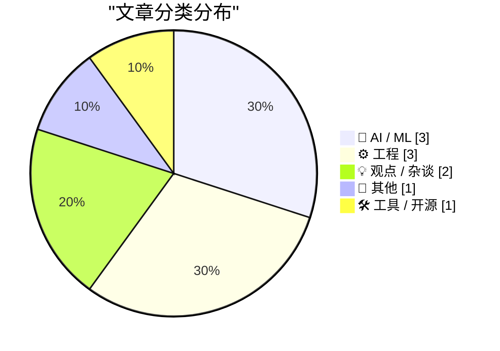
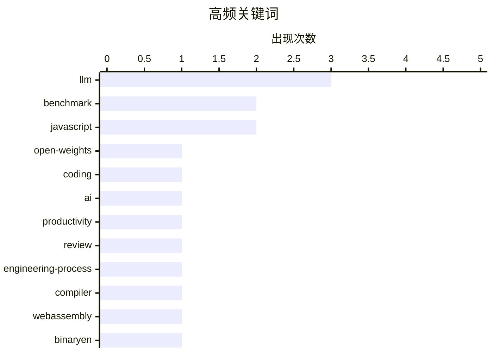

# 📰 AI 博客每日精选 — 2026-06-18

> 来自 Karpathy 推荐的 92 个顶级技术博客，AI 精选 Top 10

## 📝 今日看点

今天技术圈最醒目的主线，仍然是大模型能力继续上探，但讨论焦点已从“能不能做”转向“能否真正落地”：一边是开源文本模型和代码/数学辅助能力不断刷新预期，另一边是企业流程、产品组织和现实约束还远远跟不上个人效率的跃升。与此同时，AI治理与产业责任感也在升温，围绕模型边界、政治诉求和公共影响的争议，说明技术突破正在更直接地撞上制度与社会问题。另一条值得注意的趋势，是工程世界重新强调底层功夫——无论是编译器、系统栈检查，还是更轻量的前端性能优化，大家都在回到“把基础设施做扎实”这件事上。

---

## 🏆 今日必读

🥇 **GLM-5.2 is probably the most powerful text-only open weights LLM**

[GLM-5.2 is probably the most powerful text-only open weights LLM](https://simonwillison.net/2026/Jun/17/glm-52/#atom-everything) — simonwillison.net · 刚刚 · 🤖 AI / ML

> Simon Willison’s Weblog Subscribe Sponsored by: Microsoft &mdash; Agent projects stall between demo and production. Microsoft's MVP checklist closes that gap. Try it GLM-5.2 is probably the most power

🏷️ LLM, open-weights, benchmark, coding

🥈 **You Got Faster. Your Company Didn’t.**

[You Got Faster. Your Company Didn’t.](https://terriblesoftware.org/2026/06/17/you-got-faster-your-company-didnt/) — terriblesoftware.org · 5 小时前 · 💡 观点 / 杂谈

> “I would have written a shorter letter, but I did not have the time.” — Blaise Pascal Because of AI, everyone on your team is more productive than they were a year ago, just ask them. So why isn’t the

🏷️ AI, productivity, review, engineering-process

🥉 **I hate compilers**

[I hate compilers](https://xeiaso.net/notes/2026/anubis-wasm-vendor-binary/) — xeiaso.net · 2026-06-18 · ⚙️ 工程

> I hate compilers Published on 2026-06-18 , 1665 words, 7 minutes to read You'd think that given the same bytes of input you'd get the same bytes of output. lol. lmao. No, you don't. It's complicated. 

🏷️ compiler, WebAssembly, JavaScript, binaryen

---

## 📊 数据概览

| 扫描源 | 抓取文章 | 时间范围 | 精选 |
|:---:|:---:|:---:|:---:|
| 87/92 | 2565 篇 → 19 篇 | 24h | **10 篇** |

### 分类分布



### 高频关键词



<details>
<summary>📈 纯文本关键词图（终端友好）</summary>

```
llm                 │ ████████████████████ 3
benchmark           │ █████████████░░░░░░░ 2
javascript          │ █████████████░░░░░░░ 2
open-weights        │ ███████░░░░░░░░░░░░░ 1
coding              │ ███████░░░░░░░░░░░░░ 1
ai                  │ ███████░░░░░░░░░░░░░ 1
productivity        │ ███████░░░░░░░░░░░░░ 1
review              │ ███████░░░░░░░░░░░░░ 1
engineering-process │ ███████░░░░░░░░░░░░░ 1
compiler            │ ███████░░░░░░░░░░░░░ 1
```

</details>

### 🏷️ 话题标签

**llm**(3) · **benchmark**(2) · **javascript**(2) · open-weights(1) · coding(1) · ai(1) · productivity(1) · review(1) · engineering-process(1) · compiler(1) · webassembly(1) · binaryen(1) · glm-5.2(1) · text-adventure(1) · guardrails(1) · anthropic(1) · jailbreak(1) · lean4(1) · formalization(1) · theorem-proving(1)

---

## 🤖 AI / ML

### 1. GLM-5.2 is probably the most powerful text-only open weights LLM

[GLM-5.2 is probably the most powerful text-only open weights LLM](https://simonwillison.net/2026/Jun/17/glm-52/#atom-everything) — **simonwillison.net** · 刚刚 · ⭐ 26/30

> Simon Willison’s Weblog Subscribe Sponsored by: Microsoft &mdash; Agent projects stall between demo and production. Microsoft's MVP checklist closes that gap. Try it GLM-5.2 is probably the most power

🏷️ LLM, open-weights, benchmark, coding

---

### 2. GLM 5.2 playing text adventures

[GLM 5.2 playing text adventures](https://entropicthoughts.com/glm-5-2-playing-text-adventures) — **entropicthoughts.com** · 1 小时前 · ⭐ 23/30

> GLM 5.2 playing text adventures by kqr , published 2026-06-18 Tags: ai I&rsquo;ve heard some buzz around the new glm 5.2 open-weights model. They say it&rsquo;s very capable! I won&rsquo;t run a full 

🏷️ GLM-5.2, LLM, benchmark, text-adventure

---

### 3. Breaking: Trump asks the impossible of Anthropic

[Breaking: Trump asks the impossible of Anthropic](https://garymarcus.substack.com/p/breaking-trump-asks-the-impossible) — **garymarcus.substack.com** · 4 小时前 · ⭐ 23/30

> Breaking: Trump asks the impossible of Anthropic Where do we go from here? Gary Marcus Jun 17, 2026 195 117 22 Share In January 2024, I warned that the politics and inadequacy of guardrails would beco

🏷️ LLM, guardrails, Anthropic, jailbreak

---

## ⚙️ 工程

### 4. I hate compilers

[I hate compilers](https://xeiaso.net/notes/2026/anubis-wasm-vendor-binary/) — **xeiaso.net** · 2026-06-18 · ⭐ 23/30

> I hate compilers Published on 2026-06-18 , 1665 words, 7 minutes to read You'd think that given the same bytes of input you'd get the same bytes of output. lol. lmao. No, you don't. It's complicated. 

🏷️ compiler, WebAssembly, JavaScript, binaryen

---

### 5. Formalizing a ring theorem with Lean 4 and Claude

[Formalizing a ring theorem with Lean 4 and Claude](https://www.johndcook.com/blog/2026/06/17/rings-with-lean-claude/) — **johndcook.com** · 8 小时前 · ⭐ 21/30

> I’ve been testing Claude’s ability to generate Lean 4 code to prove theorems. I’ve written about a couple experiments that verified calculations. I did not write about my failed attempt to get Claude 

🏷️ Lean4, formalization, theorem-proving, Claude

---

### 6. Windows stack limit checking retrospective, follow-up

[Windows stack limit checking retrospective, follow-up](https://devblogs.microsoft.com/oldnewthing/20260617-00/?p=112436) — **devblogs.microsoft.com/oldnewthing** · 9 小时前 · ⭐ 21/30

> Aaron Giles worked on porting Windows to both ARM32 and AArch64, and he noted a missing detail in my retrospective of stack limit checking on arm64 : Every once in a while Raymond Chen does an archite

🏷️ Windows, AArch64, stack, calling-convention

---

## 💡 观点 / 杂谈

### 7. You Got Faster. Your Company Didn’t.

[You Got Faster. Your Company Didn’t.](https://terriblesoftware.org/2026/06/17/you-got-faster-your-company-didnt/) — **terriblesoftware.org** · 5 小时前 · ⭐ 24/30

> “I would have written a shorter letter, but I did not have the time.” — Blaise Pascal Because of AI, everyone on your team is more productive than they were a year ago, just ask them. So why isn’t the

🏷️ AI, productivity, review, engineering-process

---

### 8. Pluralistic：真正的“死经济理论”

[Pluralistic: The (real) dead economy theory (17 Jun 2026)](https://pluralistic.net/2026/06/17/its-the-stupid-economy-stupid/) — **pluralistic.net** · 4 小时前 · ⭐ 17/30

> 文章把当下市场的问题指向资产定价机制失灵：金融市场越来越不能准确评估资产价值，原本应维持这一机制的制度结构也不再认真运作。文中以马斯克为例，称其自 2020 年后推出的 Starship、robotaxis、Cybertrucks 和 Twitter 等项目接连失利甚至“爆炸”，但名义净资产却从 2020 年的 200 亿美元升至如今的 1 万亿美元。作者援引 John Quiggin 的判断，将这种现象与比特币和加密资产的发展连在一起：它们从曾被高盛等机构排斥，变成被大银行全面接纳，而“加密货币”如今更像可交易收藏品，而非真正的货币。文章进一步把这种逻辑扩展到 AI，认为这种持续亏钱的技术却在吸走资金，甚至被拿来压倒长期医学研究，只因市场更愿意为“未来会更值钱”的叙事买单。结论是，当下市场越来越由情绪、故事和转手预期驱动，而不是由实际用途与现实产出决定价值。

🏷️ economics, Musk, finance, internet

---

## 📝 其他

### 9. Glassblowing #2: Making a tungsten lamp and (bad) vacuum diode

[Glassblowing #2: Making a tungsten lamp and (bad) vacuum diode](https://maurycyz.com/projects/glass/2/) — **maurycyz.com** · 2026-06-18 · ⭐ 17/30

> Glassblowing #2: Making a tungsten lamp and (bad) vacuum diode 2026-06-18 Now that I have a way to run electrodes through glass , it's time to do something with that. An old school lightbulb is rather

🏷️ glassblowing, vacuum, tungsten, lamp

---

## 🛠 工具 / 开源

### 10. 可播放的静态图

[— a still that plays](https://simonwillison.net/2026/Jun/17/click-to-play-component/#atom-everything) — **simonwillison.net** · 19 小时前 · ⭐ 16/30

> 这篇内容聚焦于一个用于按需加载 GIF 的 Web Component。它会把原始标记转换成带“点击播放”按钮的静态预览图，只有用户主动点击后才加载 GIF，从而避免大体积 GIF 在页面初始加载时就被下载。作者将这种方式称为“progressive enchantment”，并给出了一个与 Datasette 新行编辑工具相关的示例，说明这个组件已被用于实际页面。核心思路是用 Web Components 实现更轻量的媒体呈现方式，把动图展示从默认自动加载改为用户触发加载。结论上，这是一个面向性能与体验权衡的前端小工具，适合不希望大 GIF 默认占用带宽的场景。

🏷️ Web-Component, GIF, JavaScript, progressive-enhancement

---

*生成于 2026-06-18 07:00 | 扫描 87 源 → 获取 2565 篇 → 精选 10 篇*
*基于 [Hacker News Popularity Contest 2025](https://refactoringenglish.com/tools/hn-popularity/) RSS 源列表*
