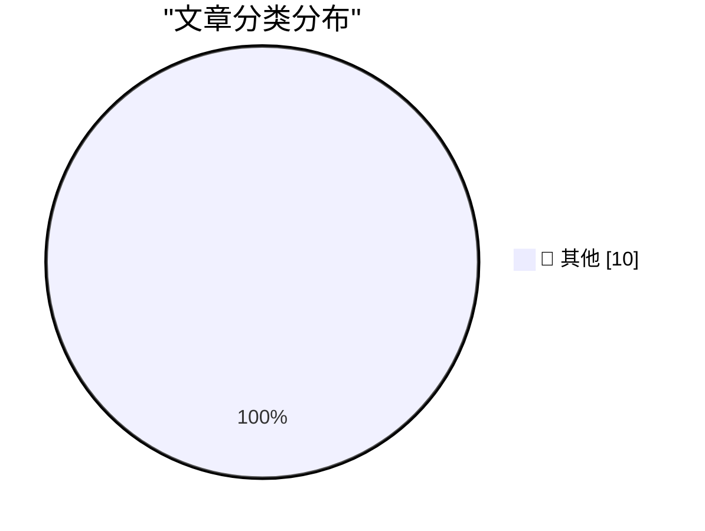

# 📰 AI 博客每日精选 — 2026-06-18

> 来自 Karpathy 推荐的 92 个顶级技术博客，AI 精选 Top 10

## 🏆 今日必读

🥇 **Quoting Charity Majors**

[Quoting Charity Majors](https://simonwillison.net/2026/Jun/17/charity-majors/#atom-everything) — simonwillison.net · 22 分钟前 · 📝 其他

> Simon Willison’s Weblog Subscribe Sponsored by: Teleport &mdash; Prevent access bottlenecks. Unify identity. Teleport replaces fragmented identity and access tooling with a single identity layer that 

🥈 **Logic for Programmers v0.15, Livecoding**

[Logic for Programmers v0.15, Livecoding](https://buttondown.com/hillelwayne/archive/logic-for-programmers-v015-livecoding/) — buttondown.com/hillelwayne · 54 分钟前 · 📝 其他

> June 17, 2026 Logic for Programmers v0.15, Livecoding There's a new release of Logic for Programmers ! This one, version 0.15, is the first true release candidate. There's a couple of minor touch-ups 

🥉 **Formalizing a ring theorem with Lean 4 and Claude**

[Formalizing a ring theorem with Lean 4 and Claude](https://www.johndcook.com/blog/2026/06/17/rings-with-lean-claude/) — johndcook.com · 3 小时前 · 📝 其他

> I’ve been testing Claude’s ability to generate Lean 4 code to prove theorems. I’ve written about a couple experiments that verified calculations. I did not write about my failed attempt to get Claude 

---

## 📊 数据概览

| 扫描源 | 抓取文章 | 时间范围 | 精选 |
|:---:|:---:|:---:|:---:|
| 87/92 | 2564 篇 → 17 篇 | 24h | **10 篇** |

### 分类分布

---

## 📝 其他

### 1. Quoting Charity Majors

[Quoting Charity Majors](https://simonwillison.net/2026/Jun/17/charity-majors/#atom-everything) — **simonwillison.net** · 22 分钟前 · ⭐ 15/30

> Simon Willison’s Weblog Subscribe Sponsored by: Teleport &mdash; Prevent access bottlenecks. Unify identity. Teleport replaces fragmented identity and access tooling with a single identity layer that 

---

### 2. Logic for Programmers v0.15, Livecoding

[Logic for Programmers v0.15, Livecoding](https://buttondown.com/hillelwayne/archive/logic-for-programmers-v015-livecoding/) — **buttondown.com/hillelwayne** · 54 分钟前 · ⭐ 15/30

> June 17, 2026 Logic for Programmers v0.15, Livecoding There's a new release of Logic for Programmers ! This one, version 0.15, is the first true release candidate. There's a couple of minor touch-ups 

---

### 3. Formalizing a ring theorem with Lean 4 and Claude

[Formalizing a ring theorem with Lean 4 and Claude](https://www.johndcook.com/blog/2026/06/17/rings-with-lean-claude/) — **johndcook.com** · 3 小时前 · ⭐ 15/30

> I’ve been testing Claude’s ability to generate Lean 4 code to prove theorems. I’ve written about a couple experiments that verified calculations. I did not write about my failed attempt to get Claude 

---

### 4. How a Microsoft product from June 1979 led to the IBM PC

[How a Microsoft product from June 1979 led to the IBM PC](https://dfarq.homeip.net/how-a-microsoft-product-from-june-1979-led-to-the-ibm-pc/?utm_source=rss&#038;utm_medium=rss&#038;utm_campaign=how-a-microsoft-product-from-june-1979-led-to-the-ibm-pc) — **dfarq.homeip.net** · 6 小时前 · ⭐ 15/30

> June 1979 is a significant month in history for Microsoft for two reasons. That month, they crossed the threshold of an installed base of 200,000 on its flagship 8080 Basic. And on June 18, 1979, Micr

---

### 5. Summoning the Demon

[Summoning the Demon](https://geohot.github.io//blog/jekyll/update/2026/06/17/summoning-the-demon.html) — **geohot.github.io** · 10 小时前 · ⭐ 15/30

> Watch you hit the stage like a willing bomb Strapped to crippled children It’s hard to watch you whore out your damaged pride I spit on what you’re building – The Stephen Hawking The title is a 2014 E

---

### 6. — a still that plays

[— a still that plays](https://simonwillison.net/2026/Jun/17/click-to-play-component/#atom-everything) — **simonwillison.net** · 13 小时前 · ⭐ 15/30

> Simon Willison’s Weblog Subscribe Sponsored by: Teleport &mdash; Prevent access bottlenecks. Unify identity. Teleport replaces fragmented identity and access tooling with a single identity layer that 

---

### 7. Flax debugging: making a hash of things

[Flax debugging: making a hash of things](https://www.gilesthomas.com/2026/06/hashing-jax-parameters) — **gilesthomas.com** · 14 小时前 · ⭐ 15/30

> el.dataset.currentDropdown = '') }"> Giles' blog About Contact Archives Categories Blogroll June 2026 (5) May 2026 (2) April 2026 (11) March 2026 (3) February 2026 (4) January 2026 (4) December 2025 (

---

### 8. Checking In on the iOS Continental Fun-Gap Drift

[Checking In on the iOS Continental Fun-Gap Drift](https://daringfireball.net/2024/09/ios_continental_drift_fun_gap) — **daringfireball.net** · 16 小时前 · ⭐ 15/30

> By John Gruber Archive The Talk Show Dithering Projects Contact Colophon Feeds / Social Twitter --> Sponsorship Mux — Video for developers The iOS Continental Fun-Gap Drift Sunday, 8 September 2024 Th

---

### 9. OpenAI’s lead is dwindling fast

[OpenAI’s lead is dwindling fast](https://garymarcus.substack.com/p/openais-lead-is-dwindling-fast) — **garymarcus.substack.com** · 19 小时前 · ⭐ 15/30

> OpenAI’s lead is dwindling fast As James Carville might have said, “It’s the lack of a moat, stupid” Gary Marcus Jun 16, 2026 196 47 22 Share BURKOV @burkov OpenAI's market share drops below 50% for t

---

### 10. Debugging on Prod

[Debugging on Prod](https://idiallo.com/blog/debugging-on-prod) — **idiallo.com** · 21 小时前 · ⭐ 15/30

> The worst type of bug is one that only happens on prod. And only on prod. If you checked this blog in the past few weeks, you might have encountered a big fat 500 error. I'd had the same design for 10

---

*生成于 2026-06-18 01:35 | 扫描 87 源 → 获取 2564 篇 → 精选 10 篇*
*基于 [Hacker News Popularity Contest 2025](https://refactoringenglish.com/tools/hn-popularity/) RSS 源列表*
