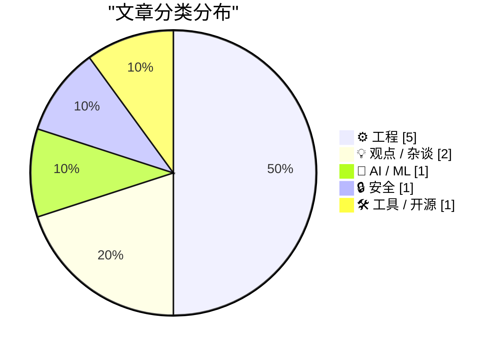
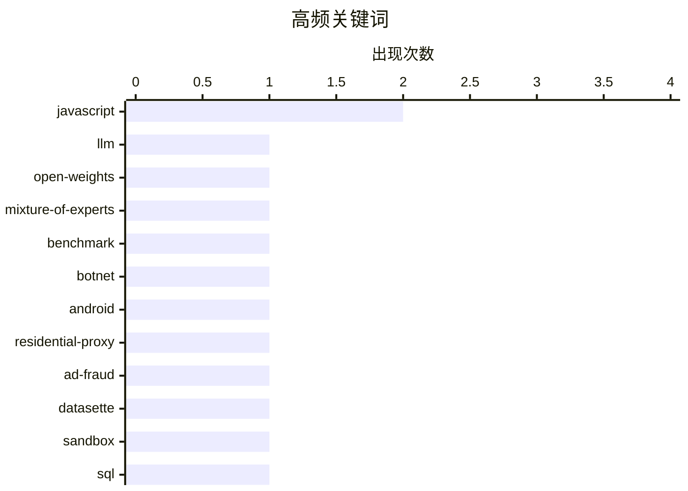

# 📰 AI 博客每日精选 — 2026-06-19

> 来自 Karpathy 推荐的 92 个顶级技术博客，AI 精选 Top 10

## 🏆 今日必读

🥇 **GLM-5.2 is probably the most powerful text-only open weights LLM**

[GLM-5.2 is probably the most powerful text-only open weights LLM](https://simonwillison.net/2026/Jun/17/glm-52/#atom-everything) — simonwillison.net · 23 小时前 · 🤖 AI / ML

> Simon Willison’s Weblog Subscribe Sponsored by: Microsoft &mdash; Agent projects stall between demo and production. Microsoft's MVP checklist closes that gap. Try it GLM-5.2 is probably the most power

🏷️ LLM, open-weights, Mixture-of-Experts, benchmark

🥈 **‘Popa’ Botnet Linked to Publicly-Traded Israeli Firm**

[‘Popa’ Botnet Linked to Publicly-Traded Israeli Firm](https://krebsonsecurity.com/2026/06/popa-botnet-linked-to-publicly-traded-israeli-firm/) — krebsonsecurity.com · 5 小时前 · 🔒 安全

> For the past four years, a sprawling Android-based botnet called Popa has forced millions of consumer TV boxes to relay Internet traffic linked to advertising fraud, account takeovers, and mass data-s

🏷️ botnet, Android, residential-proxy, ad-fraud

🥉 **Datasette Apps: Host custom HTML applications inside Datasette**

[Datasette Apps: Host custom HTML applications inside Datasette](https://simonwillison.net/2026/Jun/18/datasette-apps/#atom-everything) — simonwillison.net · 刚刚 · 🛠 工具 / 开源

> Simon Willison’s Weblog Subscribe Sponsored by: Microsoft &mdash; Agent projects stall between demo and production. Microsoft's MVP checklist closes that gap. Try it Datasette Apps: Host custom HTML a

🏷️ Datasette, sandbox, SQL, JavaScript

---

## 📊 数据概览

| 扫描源 | 抓取文章 | 时间范围 | 精选 |
|:---:|:---:|:---:|:---:|
| 87/92 | 2565 篇 → 21 篇 | 24h | **10 篇** |

### 分类分布



### 高频关键词



<details>
<summary>📈 纯文本关键词图（终端友好）</summary>

```
javascript         │ ████████████████████ 2
llm                │ ██████████░░░░░░░░░░ 1
open-weights       │ ██████████░░░░░░░░░░ 1
mixture-of-experts │ ██████████░░░░░░░░░░ 1
benchmark          │ ██████████░░░░░░░░░░ 1
botnet             │ ██████████░░░░░░░░░░ 1
android            │ ██████████░░░░░░░░░░ 1
residential-proxy  │ ██████████░░░░░░░░░░ 1
ad-fraud           │ ██████████░░░░░░░░░░ 1
datasette          │ ██████████░░░░░░░░░░ 1
```

</details>

### 🏷️ 话题标签

**javascript**(2) · **llm**(1) · **open-weights**(1) · mixture-of-experts(1) · benchmark(1) · botnet(1) · android(1) · residential-proxy(1) · ad-fraud(1) · datasette(1) · sandbox(1) · sql(1) · compiler(1) · webassembly(1) · binaryen(1) · open source(1) · economics(1) · public goods(1) · npm(1) · ai(1)

---

## ⚙️ 工程

### 1. I hate compilers

[I hate compilers](https://xeiaso.net/notes/2026/anubis-wasm-vendor-binary/) — **xeiaso.net** · 23 小时前 · ⭐ 24/30

> I hate compilers Published on 2026-06-18 , 1665 words, 7 minutes to read You'd think that given the same bytes of input you'd get the same bytes of output. lol. lmao. No, you don't. It's complicated. 

🏷️ compiler, WebAssembly, JavaScript, binaryen

---

### 2. Show your hands honor for the strange power they bring you

[Show your hands honor for the strange power they bring you](https://aresluna.org/show-your-hands-honor) — **aresluna.org** · 8 小时前 · ⭐ 20/30

> Marcin Wichary 18 June 2026 / 7,700 words / 38 playgrounds Show your hands honor for the strange power they bring you On designing finger-friendly interactions A hundred or so years ago, there was a p

🏷️ HCI, touchscreen, typing, interaction design

---

### 3. New Domain for Sign In With Apple and iCloud+ Hide My Email

[New Domain for Sign In With Apple and iCloud+ Hide My Email](https://developer.apple.com/news/?id=sus6t6ab) — **daringfireball.net** · 5 小时前 · ⭐ 23/30

> New domain for Sign in with Apple and iCloud+ Hide My Email June 15, 2026 Later this summer, Apple will unify the email domains used by Sign in with Apple and iCloud+ Hide My Email under a single, sha

🏷️ Sign in with Apple, email, private-relay, domain

---

### 4. Why doesn’t GetLastInputInfo() return info for the user I’m impersonating?

[Why doesn’t GetLastInputInfo() return info for the user I’m impersonating?](https://devblogs.microsoft.com/oldnewthing/20260618-00/?p=112444) — **devblogs.microsoft.com/oldnewthing** · 9 小时前 · ⭐ 18/30

> A customer had a Windows NT service process, and from that service process, they wanted to obtain the last input time for all signed-in users. Their strategy was to use WTSQueryUserToken() to get the 

🏷️ Windows, impersonation, session, Win32

---

### 5. NetNewsWire Status

[NetNewsWire Status](https://inessential.com/2026/06/15/netnewswire-status.html) — **daringfireball.net** · 6 小时前 · ⭐ 21/30

> 15 Jun 2026 NetNewsWire Status It’s been a year since I retired — my last working day was June 6, 2025 — and I like being able to say that I’ve spent the year adding nothing, not one penny, to shareho

🏷️ Swift, refactoring, performance, technical-debt

---

## 💡 观点 / 杂谈

### 6. Open Source vs the Invisible Hand

[Open Source vs the Invisible Hand](https://nesbitt.io/2026/06/18/open-source-vs-the-invisible-hand.html) — **nesbitt.io** · 13 小时前 · ⭐ 21/30

> If you handed an economics undergraduate a description of how open source libraries are produced, without saying what it was, and asked them to predict the outcome, they would tell you it doesn’t add 

🏷️ open source, economics, public goods, npm

---

### 7. Accenture: Then and now, and how it may signify things to come

[Accenture: Then and now, and how it may signify things to come](https://garymarcus.substack.com/p/accenture-then-and-now-and-how-it) — **garymarcus.substack.com** · 4 小时前 · ⭐ 20/30

> Accenture: Then and now, and how it may signify things to come Blip, or one more data point that is on trend? Gary Marcus Jun 18, 2026 180 42 9 Share Last September, Accenture was crowing about how AI

🏷️ AI, ROI, Accenture, productivity

---

## 🤖 AI / ML

### 8. GLM-5.2 is probably the most powerful text-only open weights LLM

[GLM-5.2 is probably the most powerful text-only open weights LLM](https://simonwillison.net/2026/Jun/17/glm-52/#atom-everything) — **simonwillison.net** · 23 小时前 · ⭐ 27/30

> Simon Willison’s Weblog Subscribe Sponsored by: Microsoft &mdash; Agent projects stall between demo and production. Microsoft's MVP checklist closes that gap. Try it GLM-5.2 is probably the most power

🏷️ LLM, open-weights, Mixture-of-Experts, benchmark

---

## 🔒 安全

### 9. ‘Popa’ Botnet Linked to Publicly-Traded Israeli Firm

[‘Popa’ Botnet Linked to Publicly-Traded Israeli Firm](https://krebsonsecurity.com/2026/06/popa-botnet-linked-to-publicly-traded-israeli-firm/) — **krebsonsecurity.com** · 5 小时前 · ⭐ 25/30

> For the past four years, a sprawling Android-based botnet called Popa has forced millions of consumer TV boxes to relay Internet traffic linked to advertising fraud, account takeovers, and mass data-s

🏷️ botnet, Android, residential-proxy, ad-fraud

---

## 🛠 工具 / 开源

### 10. Datasette Apps: Host custom HTML applications inside Datasette

[Datasette Apps: Host custom HTML applications inside Datasette](https://simonwillison.net/2026/Jun/18/datasette-apps/#atom-everything) — **simonwillison.net** · 刚刚 · ⭐ 24/30

> Simon Willison’s Weblog Subscribe Sponsored by: Microsoft &mdash; Agent projects stall between demo and production. Microsoft's MVP checklist closes that gap. Try it Datasette Apps: Host custom HTML a

🏷️ Datasette, sandbox, SQL, JavaScript

---

*生成于 2026-06-19 07:00 | 扫描 87 源 → 获取 2565 篇 → 精选 10 篇*
*基于 [Hacker News Popularity Contest 2025](https://refactoringenglish.com/tools/hn-popularity/) RSS 源列表*
