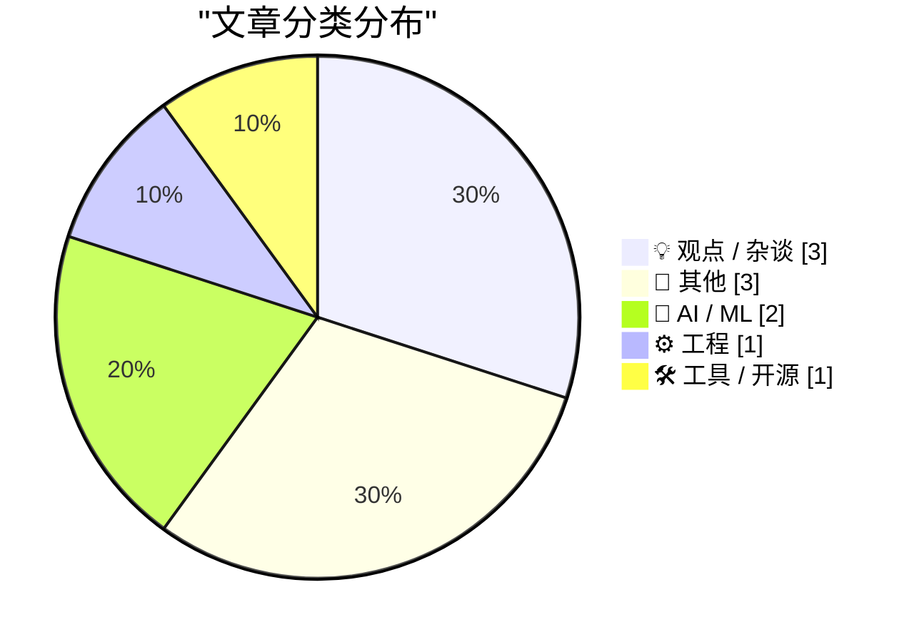
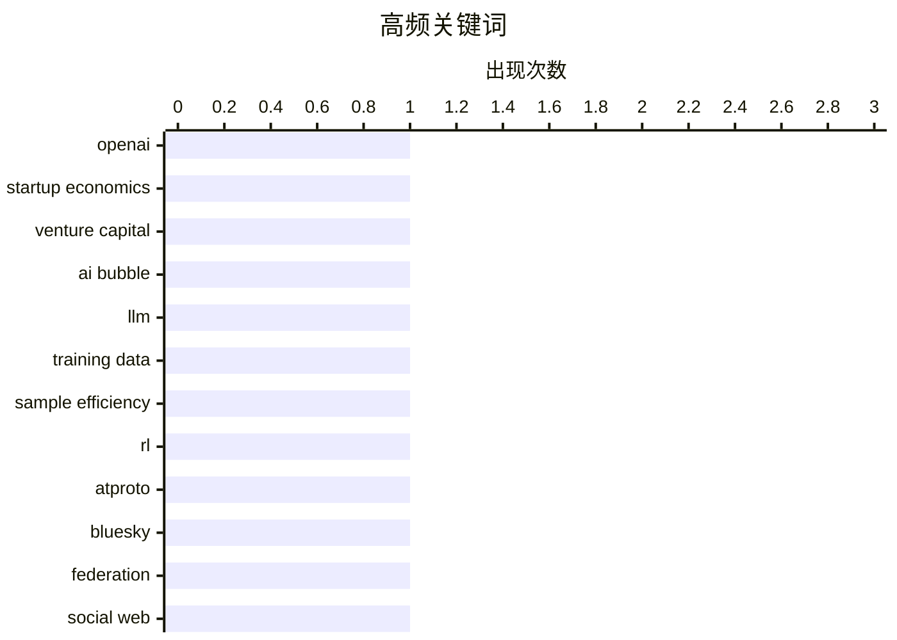

# 📰 AI 博客每日精选 — 2026-06-20

> 来自 Karpathy 推荐的 92 个顶级技术博客，AI 精选 Top 10

## 🏆 今日必读

🥇 **付费：硅谷泡沫（第二部分）**

[Premium: The Silicon Valley Bubble (Part 2)](https://www.wheresyoured.at/premium-the-silicon-valley-bubble-part-2/) — wheresyoured.at · 6 小时前 · 💡 观点 / 杂谈

> 文章围绕“硅谷泡沫”展开，借 OpenAI 2024 与 2025 年经审计财务数据质疑当前 AI 资本叙事与商业可持续性。文中给出的核心数字是：OpenAI 在 2025 年亏损 210 亿美元，花费 340 亿美元仅获得 130.7 亿美元营收，其中约 8.67 亿美元、约占营收 6.6% 来自 SoftBank。作者进一步怀疑这部分收入与“Crystal Intelligence”及 SB OAI Japan 的安排有关，并认为其在时间线上可能对收入形成了不成比例的抬升，但并未相应构成显著成本。对于财报中以“归属于非控股成员资本的净亏损”等方式处理数十亿美元成本，作者将其视为掩盖公司真实经营状况的可疑会计做法。结论上，作者认为这不是个别公司的问题，而是硅谷从务实创业转向维护资本共识、以巨额投入大模型换取未来想象的整体性泡沫表现。

💡 **为什么值得读**: 值得读在于它用具体财务数字、交易关系与会计处理质疑 AI 热潮的商业基础，能帮助读者快速理解“技术叙事”和“资本现实”之间的张力。

🏷️ OpenAI, startup economics, venture capital, AI bubble

🥈 **AI 中心的数据黑洞**

[The data black hole at the center of AI](https://www.dwarkesh.com/p/the-sample-efficiency-black-hole-2) — dwarkesh.com · 6 小时前 · 🤖 AI / ML

> 衡量智能的一个定义是样本效率，也就是模型在某个领域达到熟练能力究竟需要看多少数据，而这里真正的瓶颈并未明显改善。近几年 AI 能力提升更像是数据分布被大幅扩展和优化，再配合更多算力去生产和筛选数据，而不是训练样本效率本身取得了实质突破。文中将强化学习描述为一种合成数据生成过程：模型围绕验证器进行大规模搜索，产出“好的”轨迹后再回训；但这要求模型事先对正确解至少有一定概率，因此仍离不开各领域海量、定制化的人类专家示范数据。作者强调这些数据不仅高度垂直，还需要巨大规模支撑，每项技能背后都对应数百名专家编写示例、评分标准和思维过程，相关数据产业因此已形成每年数十亿美元、并将迈向数百亿美元的收入规模。即便开放模型只落后最先进闭源模型 4 个月，作者仍把 AI 的进步归因于一个由海量专家数据和高强度 rollout 堆叠起来的“数据黑洞”，而非更高效的学习机制。

💡 **为什么值得读**: 值得读，因为它把 AI 进步重新解释为“数据与算力密集堆砌”的结果，能帮助读者更清楚地理解强化学习、专家标注和开闭源差距背后的真实约束。

🏷️ LLM, training data, sample efficiency, RL

🥉 **在 atproto 里不存在“实例”**

[There Are No Instances in atproto](https://overreacted.io/there-are-no-instances-in-atproto/) — overreacted.io · 23 小时前 · ⚙️ 工程

> 核心争议在于，很多人用 Mastodon 的“实例”概念去理解 atproto，但这种提问本身就弄错了类别。文中先用 RSS、博客和 Google Reader 的关系说明“托管”和“聚合”是两件事：内容发布在博客或平台上，而阅读器只是对整个内容网络的聚合呈现，内容并不“住”在阅读器里。随后又用 Facebook 一类传统社交网络对比，指出中心化平台把托管、分发和唯一应用都圈进同一个封闭空间，由此带来中心化和网络效应问题。接着以 Mastodon 的实例模型说明另一条去中心化路径：每个实例像一个自托管的“小 Facebook”，用户需要选择信任哪一套管理员来管理身份和数据，不同实例之间再通过 federation 转发内容。作者的结论是，理解 atproto 不能套用“实例”这套思维框架，因为那是 Mastodon 式实现里的概念，而不是适用于 atproto 的基本单位。

💡 **为什么值得读**: 值得读的地方在于，它用 RSS、传统社交网络和 Mastodon 的并列对照，帮你快速校正对 atproto 的常见误解。

🏷️ atproto, Bluesky, federation, social web

---

## 📊 数据概览

| 扫描源 | 抓取文章 | 时间范围 | 精选 |
|:---:|:---:|:---:|:---:|
| 87/92 | 2566 篇 → 16 篇 | 24h | **10 篇** |

### 分类分布



### 高频关键词



<details>
<summary>📈 纯文本关键词图（终端友好）</summary>

```
openai            │ ████████████████████ 1
startup economics │ ████████████████████ 1
venture capital   │ ████████████████████ 1
ai bubble         │ ████████████████████ 1
llm               │ ████████████████████ 1
training data     │ ████████████████████ 1
sample efficiency │ ████████████████████ 1
rl                │ ████████████████████ 1
atproto           │ ████████████████████ 1
bluesky           │ ████████████████████ 1
```

</details>

### 🏷️ 话题标签

**openai**(1) · **startup economics**(1) · **venture capital**(1) · ai bubble(1) · llm(1) · training data(1) · sample efficiency(1) · rl(1) · atproto(1) · bluesky(1) · federation(1) · social web(1) · datasette(1) · sandbox(1) · html(1) · sql(1) · mcp(1) · authentication(1) · agents(1) · context window(1)

---

## 💡 观点 / 杂谈

### 1. 付费：硅谷泡沫（第二部分）

[Premium: The Silicon Valley Bubble (Part 2)](https://www.wheresyoured.at/premium-the-silicon-valley-bubble-part-2/) — **wheresyoured.at** · 6 小时前 · ⭐ 25/30

> 文章围绕“硅谷泡沫”展开，借 OpenAI 2024 与 2025 年经审计财务数据质疑当前 AI 资本叙事与商业可持续性。文中给出的核心数字是：OpenAI 在 2025 年亏损 210 亿美元，花费 340 亿美元仅获得 130.7 亿美元营收，其中约 8.67 亿美元、约占营收 6.6% 来自 SoftBank。作者进一步怀疑这部分收入与“Crystal Intelligence”及 SB OAI Japan 的安排有关，并认为其在时间线上可能对收入形成了不成比例的抬升，但并未相应构成显著成本。对于财报中以“归属于非控股成员资本的净亏损”等方式处理数十亿美元成本，作者将其视为掩盖公司真实经营状况的可疑会计做法。结论上，作者认为这不是个别公司的问题，而是硅谷从务实创业转向维护资本共识、以巨额投入大模型换取未来想象的整体性泡沫表现。

🏷️ OpenAI, startup economics, venture capital, AI bubble

---

### 2. Pluralistic: The Big Con (19 Jun 2026)

[Pluralistic: The Big Con (19 Jun 2026)](https://pluralistic.net/2026/06/19/too-big-to-fact-check/) — **pluralistic.net** · 2 小时前 · ⭐ 16/30

> ->->->->->->->->->->->->->->->->->->->->->->->->->->->->-> Top Sources: None --> Today's links The Big Con : Making the pile of shit bigger won't increase the number of ponies underneath it. Hey look 

🏷️ MLM, fraud, markets, book review

---

### 3. Full Page Paralysis

[Full Page Paralysis](https://blog.jim-nielsen.com/2026/full-page-paralysis/) — **blog.jim-nielsen.com** · 4 小时前 · ⭐ 14/30

> Full Page Paralysis 2026-06-19 You’ve probably heard the term. It’s meant to convey how difficult it can be to start something. “Blank page paralysis”. But for my money, beginning is easy. Finishing i

🏷️ writing, shipping, software culture, productivity

---

## 📝 其他

### 4. Converting Coal Plants to Natural Gas

[Converting Coal Plants to Natural Gas](https://www.construction-physics.com/p/converting-coal-plants-to-natural) — **construction-physics.com** · 11 小时前 · ⭐ 16/30

> Converting Coal Plants to Natural Gas Brian Potter Jun 19, 2026 112 3 6 Share For the better part of the last several hundred years, coal was the fuel of choice for generating power. Burning coal powe

🏷️ energy, coal, natural gas, power grid

---

### 5. The Goldilocks Principle in Fantasy Strategy

[The Goldilocks Principle in Fantasy Strategy](https://www.filfre.net/2026/06/the-goldilocks-principle-in-fantasy-strategy/) — **filfre.net** · 7 小时前 · ⭐ 13/30

> The Digital Antiquarian A history of computer entertainment and digital culture by Jimmy Maher Home About Me Ebooks Hall of Fame Table of Contents RSS &larr; This Week on The Analog Antiquarian The Go

🏷️ game design, fantasy strategy, Heroes of Might and Magic, gaming history

---

### 6. Jay Miner, Atari and Amiga computer designer

[Jay Miner, Atari and Amiga computer designer](https://dfarq.homeip.net/jay-miner-atari-and-amiga-computer-designer/?utm_source=rss&#038;utm_medium=rss&#038;utm_campaign=jay-miner-atari-and-amiga-computer-designer) — **dfarq.homeip.net** · 12 小时前 · ⭐ 11/30

> I’m just going to put this out there. Jay Miner is my hero. He designed the Atari 2600 game console, the Atari 8-bit computers, and the Amiga computer. But he made contributions to humanity outside of

🏷️ Jay Miner, Amiga, Atari, computer history

---

## 🤖 AI / ML

### 7. AI 中心的数据黑洞

[The data black hole at the center of AI](https://www.dwarkesh.com/p/the-sample-efficiency-black-hole-2) — **dwarkesh.com** · 6 小时前 · ⭐ 24/30

> 衡量智能的一个定义是样本效率，也就是模型在某个领域达到熟练能力究竟需要看多少数据，而这里真正的瓶颈并未明显改善。近几年 AI 能力提升更像是数据分布被大幅扩展和优化，再配合更多算力去生产和筛选数据，而不是训练样本效率本身取得了实质突破。文中将强化学习描述为一种合成数据生成过程：模型围绕验证器进行大规模搜索，产出“好的”轨迹后再回训；但这要求模型事先对正确解至少有一定概率，因此仍离不开各领域海量、定制化的人类专家示范数据。作者强调这些数据不仅高度垂直，还需要巨大规模支撑，每项技能背后都对应数百名专家编写示例、评分标准和思维过程，相关数据产业因此已形成每年数十亿美元、并将迈向数百亿美元的收入规模。即便开放模型只落后最先进闭源模型 4 个月，作者仍把 AI 的进步归因于一个由海量专家数据和高强度 rollout 堆叠起来的“数据黑洞”，而非更高效的学习机制。

🏷️ LLM, training data, sample efficiency, RL

---

### 8. Quoting Sean Lynch

[Quoting Sean Lynch](https://simonwillison.net/2026/Jun/19/sean-lynch/#atom-everything) — **simonwillison.net** · 20 分钟前 · ⭐ 16/30

> Simon Willison’s Weblog Subscribe Sponsored by: Microsoft &mdash; Agent projects stall between demo and production. Microsoft's MVP checklist closes that gap. Try it 19th June 2026 The real valuable c

🏷️ MCP, authentication, agents, context window

---

## ⚙️ 工程

### 9. 在 atproto 里不存在“实例”

[There Are No Instances in atproto](https://overreacted.io/there-are-no-instances-in-atproto/) — **overreacted.io** · 23 小时前 · ⭐ 24/30

> 核心争议在于，很多人用 Mastodon 的“实例”概念去理解 atproto，但这种提问本身就弄错了类别。文中先用 RSS、博客和 Google Reader 的关系说明“托管”和“聚合”是两件事：内容发布在博客或平台上，而阅读器只是对整个内容网络的聚合呈现，内容并不“住”在阅读器里。随后又用 Facebook 一类传统社交网络对比，指出中心化平台把托管、分发和唯一应用都圈进同一个封闭空间，由此带来中心化和网络效应问题。接着以 Mastodon 的实例模型说明另一条去中心化路径：每个实例像一个自托管的“小 Facebook”，用户需要选择信任哪一套管理员来管理身份和数据，不同实例之间再通过 federation 转发内容。作者的结论是，理解 atproto 不能套用“实例”这套思维框架，因为那是 Mastodon 式实现里的概念，而不是适用于 atproto 的基本单位。

🏷️ atproto, Bluesky, federation, social web

---

## 🛠 工具 / 开源

### 10. Datasette Apps: Host custom HTML applications inside Datasette

[Datasette Apps: Host custom HTML applications inside Datasette](https://simonwillison.net/2026/Jun/18/datasette-apps/#atom-everything) — **simonwillison.net** · 23 小时前 · ⭐ 23/30

> Simon Willison’s Weblog Subscribe Sponsored by: Microsoft &mdash; Agent projects stall between demo and production. Microsoft's MVP checklist closes that gap. Try it Datasette Apps: Host custom HTML a

🏷️ Datasette, sandbox, HTML, SQL

---

*生成于 2026-06-20 07:06 | 扫描 87 源 → 获取 2566 篇 → 精选 10 篇*
*基于 [Hacker News Popularity Contest 2025](https://refactoringenglish.com/tools/hn-popularity/) RSS 源列表*
