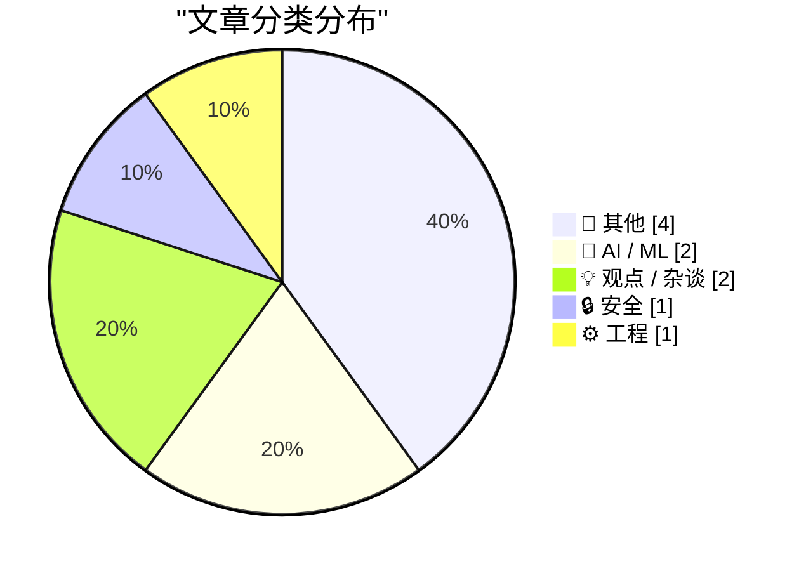
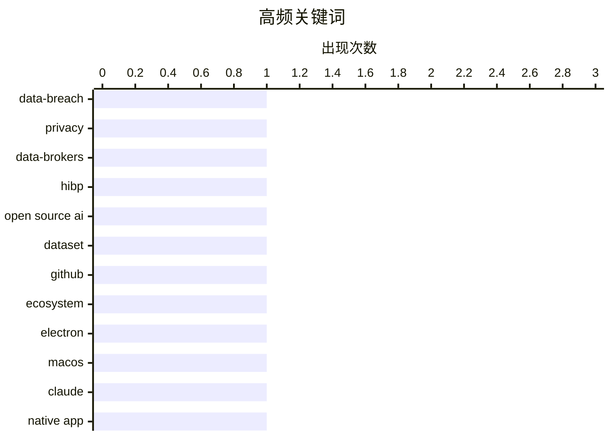

# 📰 AI 博客每日精选 — 2026-07-04

> 来自 Karpathy 推荐的 92 个顶级技术博客，AI 精选 Top 10

## 📝 今日看点

今天的技术话题，核心都指向一个问题：当系统越来越复杂、能力越来越强，人类该如何重新掌握控制权。AI 领域一边在加速补齐开源生态版图，强调“公共选项”和工具基础设施；另一边也在反思产品体验与协作方式，讨论究竟该把判断交给模型，还是交给僵硬规则与粗糙软件。与此同时，从个人数据一旦泄露几乎无法追回，到 DLL 卸载引发的底层崩溃分析，安全与工程实践再次提醒行业：真正的挑战不只是把技术做出来，更是让它可靠、可控、可理解。

---

## 🏆 今日必读

🥇 **游泳池、尿，以及试图从互联网上删除你的数据**

[Swimming Pools, Pee, and Trying to Delete Your Data From the Internet](https://www.troyhunt.com/swimming-pools-pee-and-trying-to-delete-your-data-from-the-internet/) — troyhunt.com · 16 小时前 · 🔒 安全

> 个人数据一旦在互联网上扩散，几乎不可能真正收回，这一点在数据泄露场景中尤其明显。文章把矛头对准“数据经纪人移除服务”“保护我的数据”“从互联网上删除我的信息”这类商业化服务，认为它们确实对应现实问题，但实际作用比营销表述有限得多。文中指出，数据经纪人长期通过合法或灰色方式收集并交易个人信息，Master Deeds、National Public Data、Exactis、Adapt 等机构过去都曾因数据泄露进入 Have I Been Pwned。作者同时承认数据经纪人的合法性和正当性存在很大差异，有些处于明显合规的一端，例如 Experian，但这并不改变数据已经传播后难以彻底消失的事实。结论是，删除服务并非毫无价值，但无法兑现“把你的信息从互联网抹掉”这样的强承诺。

💡 **为什么值得读**: 值得读的地方在于，它直接拆解了“付费删除互联网数据”这类服务的现实边界，能帮助读者更清醒地判断隐私保护产品的真实价值。

🏷️ data-breach, privacy, data-brokers, HIBP

🥈 **开源 AI 缺口地图**

[Open Source AI Gap Map](https://simonwillison.net/2026/Jul/3/open-source-ai-gap-map/#atom-everything) — simonwillison.net · 1 小时前 · 🤖 AI / ML

> Current AI 推出了 Gap Map v0.1，试图为开源 AI 生态建立一份系统化索引，并将其定位为“为 AI 建设公共选项”的一部分。首版深入整理了 421 个项目，涵盖 266 个软件工具与库、85 个模型、50 个数据集和 20 个硬件项目，来自 228 个组织，并按模型组件、产品/用户体验、基础设施三层栈划分为 14 个类别。除此之外，生态中还有 24,400 个未分类的长尾条目，在完成研究和引用前不会获得评分。作者认为地图本身值得探索，但更有价值的是其底层数据已在 GitHub 上以 MIT 许可证开放，包括 1,184 个 YAML 文件以及用于采集的 notebooks、schemas 和脚本。项目还跟踪了 16,185 个 GitHub 仓库，并可通过 Datasette Lite 以 CSV 方式浏览部分数据。

💡 **为什么值得读**: 它不仅给出开源 AI 生态的结构化全景，还直接开放可复用的数据和采集方法，适合想研究、比较或构建开源 AI 项目版图的人。

🏷️ open source AI, dataset, GitHub, ecosystem

🥉 **Claude 糟糕到离谱的 Electron Mac 应用是自己造成的**

[★ Claude’s Criminally Bad Electron Mac App Is an Inside Job](https://daringfireball.net/2026/07/claudes_criminally_bad_mac_app_is_an_inside_job) — daringfireball.net · 1 小时前 · 💡 观点 / 杂谈

> 焦点集中在 Anthropic 明明主打 AI 编程能力，却长期把 Claude 的 Mac 客户端做成一个被批评为缓慢、臃肿且缺乏原生体验的 Electron 应用。文中将 Claude 的 Mac 应用与 ChatGPT 的原生 Mac 应用对比，强调后者使用真正的原生框架，因此在界面和体验上更像一款正统 Mac 应用。围绕“既然 AI 编码代理已经能生成原生应用，为什么还继续用 Electron”这一问题，文中引用 Drew Breunig 的观点：编码代理擅长完成前 90% 的开发，但最后 10% 的边角处理、真实环境支持和持续维护仍然困难。作者不同意把这当作继续选择 Electron 的充分理由，并举出一些开发者已经使用 Claude Code 做出优秀原生 Mac 应用的例子，认为 Anthropic 自己没有把这项能力用在 Claude Mac 客户端上才是问题所在。

💡 **为什么值得读**: 值得读的地方在于，它把“AI 编程工具很强”与“官方产品为何仍然粗糙”之间的矛盾挑明了，适合关注 Electron 与原生应用取舍、以及 AI 代码生成真实落地边界的人。

🏷️ Electron, macOS, Claude, native app

---

## 📊 数据概览

| 扫描源 | 抓取文章 | 时间范围 | 精选 |
|:---:|:---:|:---:|:---:|
| 88/92 | 2588 篇 → 12 篇 | 24h | **10 篇** |

### 分类分布



### 高频关键词



<details>
<summary>📈 纯文本关键词图（终端友好）</summary>

```
data-breach    │ ████████████████████ 1
privacy        │ ████████████████████ 1
data-brokers   │ ████████████████████ 1
hibp           │ ████████████████████ 1
open source ai │ ████████████████████ 1
dataset        │ ████████████████████ 1
github         │ ████████████████████ 1
ecosystem      │ ████████████████████ 1
electron       │ ████████████████████ 1
macos          │ ████████████████████ 1
```

</details>

### 🏷️ 话题标签

**data-breach**(1) · **privacy**(1) · **data-brokers**(1) · hibp(1) · open source ai(1) · dataset(1) · github(1) · ecosystem(1) · electron(1) · macos(1) · claude(1) · native app(1) · windows(1) · debugging(1) · dll(1) · crash analysis(1) · claude code(1) · agents(1) · subagents(1) · token cost(1)

---

## 📝 其他

### 1. 螺旋蝇蛆的衰落与卷土重来

[The Fall and Rise of Screwworm](https://www.construction-physics.com/p/the-fall-and-rise-of-screwworm) — **construction-physics.com** · 11 小时前 · ⭐ 18/30

> 美国在 1980 年代后基本摆脱的食肉寄生虫螺旋蝇蛆，如今因防线失效再次逼近并重新出现在得州和新墨西哥。应对这一害虫的关键技术是“无菌雄蝇技术”：在疫区持续投放数以百万计的无菌雄蝇，利用雌蝇一生只交配一次的特性，让其与无菌雄蝇交配后无法产生存活后代，最终把种群压到消失。美国农业部曾用这一方法在数十年间清除了美国、墨西哥和中美洲的螺旋蝇蛆，2000 年代初起又由美巴联合机构 COPEG 在巴拿马与哥伦比亚之间的达连隘口每周投放数百万只无菌雄蝇，建立阻止其自南美北上的屏障。大约从 2023 年起，这道巴拿马屏障失效，螺旋蝇蛆连续数年向北扩散，并在 2026 年再次抵达美国；新的清除行动已经展开，但预计还需要数年。作者借这次回潮提醒读者，螺旋蝇蛆曾是被成功压制到几乎被集体遗忘的重大农业灾害，而控制一旦松懈，代价会迅速回来。

🏷️ screwworm, sterile insect technique, USDA, eradication

---

### 2. Maxis 的生平与时代，第一部分：SimEverything

[The Life and Times of Maxis, Part 1: SimEverything](https://www.filfre.net/2026/07/the-life-and-times-of-maxis-part-1-simeverything/) — **filfre.net** · 7 小时前 · ⭐ 16/30

> 文章从游戏史保存与回顾的偏差切入，指出玩家社区虽然擅长保存老游戏、模拟器、兼容层和资料站点，但这些努力也会放大一部分作品的重要性，未必反映当年的真实市场格局。像 MobyGames、Retro Gamer、Steam 和 GOG.com 这类由核心玩家主导的话语空间，更容易让人误以为最受怀旧追捧的作品就是当年卖得最好的作品。作者强调，真正的大众畅销游戏往往面向并不自我认同为“玩家”的人群，他们不会去玩《DOOM》或《Starcraft》，而只是把游戏当作消遣。以《Myst》为例，它虽常被硬核玩家轻视，却在 1990 年代成为个人电脑多媒体革命的代表，并成为那个十年里销量最高的单款游戏。贯穿全文的判断是：理解游戏产业历史，不能只看今日玩家社群保存和纪念了什么，更要看到当年真正触达大众的作品。

🏷️ Maxis, SimCity, game history, Will Wright

---

### 3. 《Compute!》旗下《Gazette》杂志，1983-1995

[Compute!’s Gazette magazine, 1983-1995](https://dfarq.homeip.net/computes-gazette-magazine-1983-1995/?utm_source=rss&#038;utm_medium=rss&#038;utm_campaign=computes-gazette-magazine-1983-1995) — **dfarq.homeip.net** · 12 小时前 · ⭐ 12/30

> 《Compute!》旗下专注于 Commodore 8 位电脑的《Compute!’s Gazette》创刊于 1983 年 7 月，其名称承袭更早的《PET Gazette》，也延续了母刊以大体量 type-in 程序吸引读者的路线。文章回顾了这本杂志与《Compute!》的渊源，包括《PET Gazette》从 1978 年面向 Commodore PET 的月刊通讯起步，后被 Small System Services 扩展为覆盖多种 6502 机型的综合电脑杂志。1983 年 ABC Publishing 以 1800 万美元收购《Compute!》后，又陆续推出面向 Commodore、Apple II、IBM PC 等平台的细分刊物，而《Gazette》因 Commodore 庞大的装机量而尤其成功。到 1985 年，Commodore 仍占据 38% 的家用和个人电脑市场，全球销量约 800 万到 900 万台，这为《Gazette》在北美与 RUN、Ahoy 等同类刊物竞争提供了基础。杂志每期都会刊登多种 type-in 程序，涵盖工具、编程辅助、生产力软件和游戏，其中有些作品一年还能出现一两次接近商业软件水准的代表作。

🏷️ Commodore, computer magazine, Compute's Gazette, retrocomputing

---

### 4. 开往斯德哥尔摩的午夜列车

[Midnight Train to Stockholm](https://matduggan.com/midnight-train-to-stockholm/) — **matduggan.com** · 10 小时前 · ⭐ 11/30

> 一次去斯德哥尔摩参加早上 9 点会议的出行选择，被放在飞机与夜间列车之间权衡。作者认为飞行虽然名义上只需一小时，但为了准时到会必须凌晨 4 点起床、经过安检并以极差状态落地，因此转而选择从马尔默到斯德哥尔摩的夜车，希望在车上睡一晚后直接去开会。瑞典这条线路虽有四小时可达的高速列车，但夜车速度更慢；订票时可选普通座位、couchette 和私人卧铺包厢，作者明确把私人包厢视为这趟行程里最明智的决定。出发前对马尔默车站的观察和为旅途准备水、湿巾、换洗衣物、坚果与红牛，也把这次夜车经历铺垫成一次并不浪漫、而是带着强烈现实感的长途移动。

🏷️ travel, night-train, Stockholm, humor

---

## 🤖 AI / ML

### 5. 开源 AI 缺口地图

[Open Source AI Gap Map](https://simonwillison.net/2026/Jul/3/open-source-ai-gap-map/#atom-everything) — **simonwillison.net** · 1 小时前 · ⭐ 21/30

> Current AI 推出了 Gap Map v0.1，试图为开源 AI 生态建立一份系统化索引，并将其定位为“为 AI 建设公共选项”的一部分。首版深入整理了 421 个项目，涵盖 266 个软件工具与库、85 个模型、50 个数据集和 20 个硬件项目，来自 228 个组织，并按模型组件、产品/用户体验、基础设施三层栈划分为 14 个类别。除此之外，生态中还有 24,400 个未分类的长尾条目，在完成研究和引用前不会获得评分。作者认为地图本身值得探索，但更有价值的是其底层数据已在 GitHub 上以 MIT 许可证开放，包括 1,184 个 YAML 文件以及用于采集的 notebooks、schemas 和脚本。项目还跟踪了 16,185 个 GitHub 仓库，并可通过 Datasette Lite 以 CSV 方式浏览部分数据。

🏷️ open source AI, dataset, GitHub, ecosystem

---

### 6. Fable 的判断力

[Fable's judgement](https://simonwillison.net/2026/Jul/3/judgement/#atom-everything) — **simonwillison.net** · 4 小时前 · ⭐ 19/30

> 重点在于使用 Claude Code 的 Fable 时，应更多依赖模型自身的判断，而不是把执行规则预先写死。文中以测试为例，认为与其规定“只有大型功能才做自动化测试、小型文案或设计改动不跑测试”，不如直接让 Fable 自行判断何时需要编写和运行测试。作者还采纳了 Jesse Vincent 的建议：把较小的编码任务委派给更低功耗的模型，以减少 Fable token 消耗，并给 Claude Code 添加了一条项目记忆，让其按任务性质自动选择 subagent、在 sonnet 与 haiku 等模型间分配实现工作。作者的实际体验是，这种做法目前效果不错，既提升了完成工作的速度，也减缓了 Fable 配额的消耗。

🏷️ Claude Code, agents, subagents, token cost

---

## 💡 观点 / 杂谈

### 7. Claude 糟糕到离谱的 Electron Mac 应用是自己造成的

[★ Claude’s Criminally Bad Electron Mac App Is an Inside Job](https://daringfireball.net/2026/07/claudes_criminally_bad_mac_app_is_an_inside_job) — **daringfireball.net** · 1 小时前 · ⭐ 21/30

> 焦点集中在 Anthropic 明明主打 AI 编程能力，却长期把 Claude 的 Mac 客户端做成一个被批评为缓慢、臃肿且缺乏原生体验的 Electron 应用。文中将 Claude 的 Mac 应用与 ChatGPT 的原生 Mac 应用对比，强调后者使用真正的原生框架，因此在界面和体验上更像一款正统 Mac 应用。围绕“既然 AI 编码代理已经能生成原生应用，为什么还继续用 Electron”这一问题，文中引用 Drew Breunig 的观点：编码代理擅长完成前 90% 的开发，但最后 10% 的边角处理、真实环境支持和持续维护仍然困难。作者不同意把这当作继续选择 Electron 的充分理由，并举出一些开发者已经使用 Claude Code 做出优秀原生 Mac 应用的例子，认为 Anthropic 自己没有把这项能力用在 Claude Mac 客户端上才是问题所在。

🏷️ Electron, macOS, Claude, native app

---

### 8. Pluralistic：CARDiac、语法高亮、查看源代码与氛围编程

[Pluralistic: CARDiac, syntax coloring, view source and vibe code (03 Jul 2026)](https://pluralistic.net/2026/07/03/rod-logic/) — **pluralistic.net** · 14 小时前 · ⭐ 18/30

> 主题围绕早期可感知的计算体验，以及这种体验如何帮助人理解计算机的工作方式。作者回忆 20 世纪 70 年代中期接触 CARDiac——Bell Labs 于 1968 年制作的纸板教学计算机“CARDboard Illustrative Aid to Computation”，它是图灵完备的，可以在纸上编写并执行程序。相比此前通过电传打字终端、声耦合器和多伦多大学的 PDP 机器运行 BASIC、与 ELIZA 交互和给其他用户发消息，CARDiac 用纸片、存储单元槽位和累加器把程序执行过程具体地呈现出来。作者认为，电子计算机本质上只是把这些机械式操作以极高速度重复执行，而 CARDiac 让原本肉眼不可见的过程变得“可读”，并带来了对计算机制的直观手感。

🏷️ abstraction, vibe coding, programming, history

---

## 🔒 安全

### 9. 游泳池、尿，以及试图从互联网上删除你的数据

[Swimming Pools, Pee, and Trying to Delete Your Data From the Internet](https://www.troyhunt.com/swimming-pools-pee-and-trying-to-delete-your-data-from-the-internet/) — **troyhunt.com** · 16 小时前 · ⭐ 23/30

> 个人数据一旦在互联网上扩散，几乎不可能真正收回，这一点在数据泄露场景中尤其明显。文章把矛头对准“数据经纪人移除服务”“保护我的数据”“从互联网上删除我的信息”这类商业化服务，认为它们确实对应现实问题，但实际作用比营销表述有限得多。文中指出，数据经纪人长期通过合法或灰色方式收集并交易个人信息，Master Deeds、National Public Data、Exactis、Adapt 等机构过去都曾因数据泄露进入 Have I Been Pwned。作者同时承认数据经纪人的合法性和正当性存在很大差异，有些处于明显合规的一端，例如 Experian，但这并不改变数据已经传播后难以彻底消失的事实。结论是，删除服务并非毫无价值，但无法兑现“把你的信息从互联网抹掉”这样的强承诺。

🏷️ data-breach, privacy, data-brokers, HIBP

---

## ⚙️ 工程

### 10. 我们是如何判断 CcNamespace.dll 是一组过早卸载 DLL 的“带头者”的？

[How did we conclude that CcNamespace.dll was the ringleader of a group of DLLs that unloaded prematurely?](https://devblogs.microsoft.com/oldnewthing/20260703-00/?p=112504) — **devblogs.microsoft.com/oldnewthing** · 9 小时前 · ⭐ 20/30

> 主题聚焦于一次由线程继续执行已卸载第三方 DLL 代码而引发的崩溃分析，以及为何将 CcNamespace.dll 判断为一组相关 DLL 中的关键角色。调试器记录的 recently-unloaded DLL 列表是一个环形历史，因此一串相邻出现的 DLL 表示它们是先后卸载的；其中 LibDB_CloudNs_3.dll、LibNet_CloudNs_3.dll、LibJson_CloudNs_3.dll、LibUtils_CloudNs_3.dll 从命名上看属于同一组。CcNamespace.dll 的名称与这组 CloudNs DLL 部分对应，但又略有不同，这种“同属一系但命名不同”的特征，被用来推断它更像是装配和驱动这些辅助 DLL 的前台模块。即使无法确定列表是正序还是倒序，CcNamespace.dll 位于这串 DLL 的首尾之一，进一步加强了它是连接整个 DLL 家族的枢纽这一判断。这个推断随后通过安装 Contoso Cloud 的 application compatibility library 副本并检查哪个 DLL 被注册为 namespace extension DLL 得到了验证。

🏷️ Windows, debugging, DLL, crash analysis

---

*生成于 2026-07-04 07:08 | 扫描 88 源 → 获取 2588 篇 → 精选 10 篇*
*基于 [Hacker News Popularity Contest 2025](https://refactoringenglish.com/tools/hn-popularity/) RSS 源列表*
