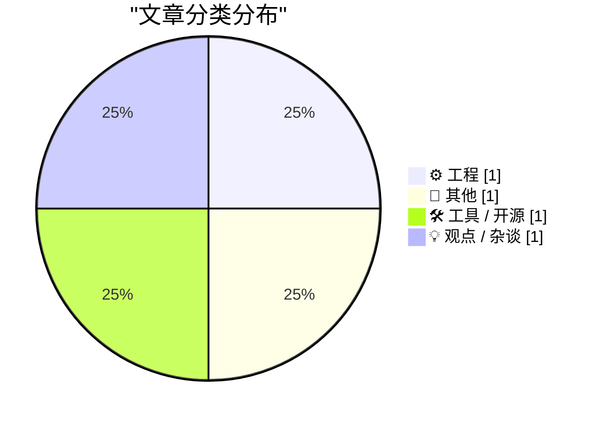
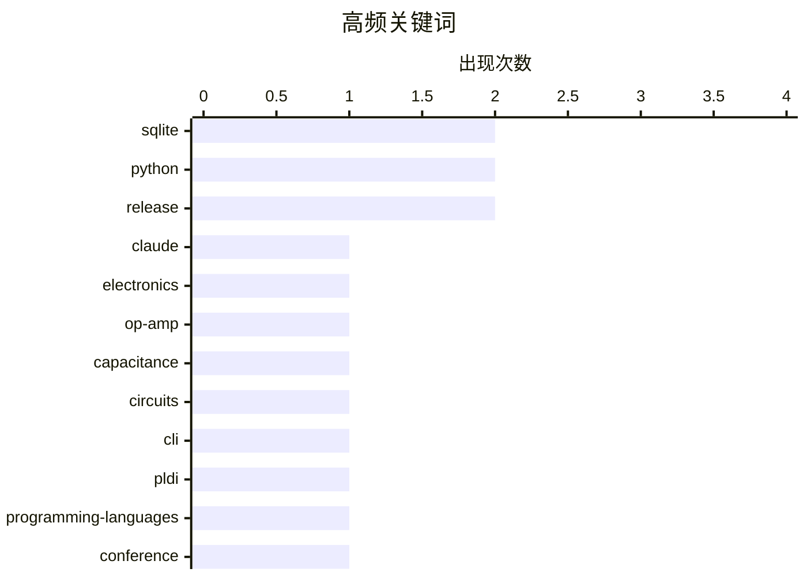

# 📰 AI 博客每日精选 — 2026-07-06

> 来自 Karpathy 推荐的 92 个顶级技术博客，AI 精选 Top 4

## 📝 今日看点

今天的技术看点集中在两个方向：一边是 AI 正在更深地进入工程生产流程，从 sqlite-utils 4.0rc2 的发布审查到问题归类，生成式工具已开始承担接近正式交付前的实务工作；另一边，开发者社区仍在回到基础，从运放、电容倍增器这类经典电路原理，到 PLDI 会议上的编程语言与程序分析讨论，底层能力依然是创新主线。整体来看，技术圈一边加速拥抱 AI 提效，一边持续夯实系统、工具链与理论根基。

---

## 🏆 今日必读

🥇 **sqlite-utils 4.0rc2：大部分由 Claude Fable 编写（花费约 149.25 美元）**

[sqlite-utils 4.0rc2, mostly written by Claude Fable (for about $149.25)](https://simonwillison.net/2026/Jul/5/sqlite-utils-fable/#atom-everything) — simonwillison.net · 22 小时前 · ⚙️ 工程

> 发布 sqlite-utils 4.0 稳定版前的最终审查，重点是找出那些如果以后再修复就可能构成破坏性变更的问题。Claude Fable 先生成了一份审查报告，指出了 5 个被归类为“release blockers”的严重问题，其中最严重的是 Table.delete_where() 未使用 atomic() 包裹事务，导致连接持续处于 in_transaction=True，后续 atomic() 调用也无法提交，最终会出现删除、插入和新建表在重开数据库后全部丢失的情况。作者随后通过 37 次提示、34 次提交，在 30 个文件中完成了 +1,321 / -190 的修改，并顺带做了一些设计改进。此次 RC 最重要的调整集中在事务处理上，而事务正是前一个 RC 的标志性新特性；新版还补充了更完整的事务模型文档。作者认为这次借助 Claude Fable 的发布前排查避免了把严重缺陷带入正式版，也让 4.0 更接近一个可以放心发布的稳定版本。

💡 **为什么值得读**: 值得读在于它具体展示了用 AI 编码代理做发布前审查的实际效果、成本和边界，而且包含一个真实且严重的事务与数据丢失缺陷案例。

🏷️ SQLite, Python, Claude, release

🥈 **诡异电路 #5：电容倍增器**

[Cursed circuits #5: capacitance multiplier](https://lcamtuf.substack.com/p/cursed-circuits-capacitance-multiplier) — lcamtuf.substack.com · 3 小时前 · 📝 其他

> 主题聚焦于一种名为“电容倍增器”的电路，并借此继续讲解运算放大器的工作方式。文章先重新定义理想运放：它只负责计算 Vin+ 与 Vin- 的电压差，将其乘以很大的开环增益 AOL（通常为 1,000,000 或更高），再相对于电源中点 Vmid 输出结果。文中用电压跟随器说明负反馈机制：把输出回接到输入端后，输出会自动调整，直到 Vin- 与 Vin+ 接近相等，从而以亚毫伏级精度跟随输入信号。作者还说明，这个电路没有被收入《The Secret Life of Circuits》，实用性不如跨阻放大器、积分器或 Sallen-Key 滤波器，但仍然“非常酷”，值得单独分享。

💡 **为什么值得读**: 值得读的地方在于，它用一个具体而少见的电路切入，把常被误解的运放基本原理重新讲清楚。

🏷️ electronics, op-amp, capacitance, circuits

🥉 **sqlite-utils 4.0rc2**

[sqlite-utils 4.0rc2](https://simonwillison.net/2026/Jul/5/sqlite-utils/#atom-everything) — simonwillison.net · 22 小时前 · 🛠 工具 / 开源

> 这条内容指向 sqlite-utils 4.0rc2，一个用于操作 SQLite 数据库的 Python 命令行工具和库。页面明确给出了版本号 4.0rc2，并将其定位为一次发布。标题信息还指出，这个版本大部分代码由 Claude Fable 完成，相关成本约为 149.25 美元。可确认的核心信息集中在项目名称、版本、技术形态以及生成方式，未提供更细的功能变更或性能细节。整体上，这是一则关于 sqlite-utils 新预发布版本及其 AI 辅助开发背景的发布信息。

💡 **为什么值得读**: 值得读的地方在于它把一个具体的 Python/SQLite 工具版本发布，与“由 Claude Fable 大量参与编写且成本约 149.25 美元”这一少见的开发过程信息放在了一起。

🏷️ SQLite, Python, CLI, release

---

## 📊 数据概览

| 扫描源 | 抓取文章 | 时间范围 | 精选 |
|:---:|:---:|:---:|:---:|
| 88/92 | 2588 篇 → 5 篇 | 24h | **4 篇** |

### 分类分布



### 高频关键词



<details>
<summary>📈 纯文本关键词图（终端友好）</summary>

```
sqlite      │ ████████████████████ 2
python      │ ████████████████████ 2
release     │ ████████████████████ 2
claude      │ ██████████░░░░░░░░░░ 1
electronics │ ██████████░░░░░░░░░░ 1
op-amp      │ ██████████░░░░░░░░░░ 1
capacitance │ ██████████░░░░░░░░░░ 1
circuits    │ ██████████░░░░░░░░░░ 1
cli         │ ██████████░░░░░░░░░░ 1
pldi        │ ██████████░░░░░░░░░░ 1
```

</details>

### 🏷️ 话题标签

**sqlite**(2) · **python**(2) · **release**(2) · claude(1) · electronics(1) · op-amp(1) · capacitance(1) · circuits(1) · cli(1) · pldi(1) · programming-languages(1) · conference(1) · research(1)

---

## ⚙️ 工程

### 1. sqlite-utils 4.0rc2：大部分由 Claude Fable 编写（花费约 149.25 美元）

[sqlite-utils 4.0rc2, mostly written by Claude Fable (for about $149.25)](https://simonwillison.net/2026/Jul/5/sqlite-utils-fable/#atom-everything) — **simonwillison.net** · 22 小时前 · ⭐ 25/30

> 发布 sqlite-utils 4.0 稳定版前的最终审查，重点是找出那些如果以后再修复就可能构成破坏性变更的问题。Claude Fable 先生成了一份审查报告，指出了 5 个被归类为“release blockers”的严重问题，其中最严重的是 Table.delete_where() 未使用 atomic() 包裹事务，导致连接持续处于 in_transaction=True，后续 atomic() 调用也无法提交，最终会出现删除、插入和新建表在重开数据库后全部丢失的情况。作者随后通过 37 次提示、34 次提交，在 30 个文件中完成了 +1,321 / -190 的修改，并顺带做了一些设计改进。此次 RC 最重要的调整集中在事务处理上，而事务正是前一个 RC 的标志性新特性；新版还补充了更完整的事务模型文档。作者认为这次借助 Claude Fable 的发布前排查避免了把严重缺陷带入正式版，也让 4.0 更接近一个可以放心发布的稳定版本。

🏷️ SQLite, Python, Claude, release

---

## 📝 其他

### 2. 诡异电路 #5：电容倍增器

[Cursed circuits #5: capacitance multiplier](https://lcamtuf.substack.com/p/cursed-circuits-capacitance-multiplier) — **lcamtuf.substack.com** · 3 小时前 · ⭐ 16/30

> 主题聚焦于一种名为“电容倍增器”的电路，并借此继续讲解运算放大器的工作方式。文章先重新定义理想运放：它只负责计算 Vin+ 与 Vin- 的电压差，将其乘以很大的开环增益 AOL（通常为 1,000,000 或更高），再相对于电源中点 Vmid 输出结果。文中用电压跟随器说明负反馈机制：把输出回接到输入端后，输出会自动调整，直到 Vin- 与 Vin+ 接近相等，从而以亚毫伏级精度跟随输入信号。作者还说明，这个电路没有被收入《The Secret Life of Circuits》，实用性不如跨阻放大器、积分器或 Sallen-Key 滤波器，但仍然“非常酷”，值得单独分享。

🏷️ electronics, op-amp, capacitance, circuits

---

## 🛠 工具 / 开源

### 3. sqlite-utils 4.0rc2

[sqlite-utils 4.0rc2](https://simonwillison.net/2026/Jul/5/sqlite-utils/#atom-everything) — **simonwillison.net** · 22 小时前 · ⭐ 16/30

> 这条内容指向 sqlite-utils 4.0rc2，一个用于操作 SQLite 数据库的 Python 命令行工具和库。页面明确给出了版本号 4.0rc2，并将其定位为一次发布。标题信息还指出，这个版本大部分代码由 Claude Fable 完成，相关成本约为 149.25 美元。可确认的核心信息集中在项目名称、版本、技术形态以及生成方式，未提供更细的功能变更或性能细节。整体上，这是一则关于 sqlite-utils 新预发布版本及其 AI 辅助开发背景的发布信息。

🏷️ SQLite, Python, CLI, release

---

## 💡 观点 / 杂谈

### 4. 旅行随记：PLDI 博尔德

[Travel notes: PLDI Boulder](https://bernsteinbear.com/blog/travel-notes-pldi-boulder/?utm_source=rss) — **bernsteinbear.com** · 23 小时前 · ⭐ 16/30

> 这篇内容记录了作者参加 2026 年 6 月在博尔德举行的 PLDI 的会议见闻，重点放在会议交流与 workshop 体验，而不是城市游览。作者在 EGRAPHS workshop 中反复听到 Knuth-Bendix，并提到终于有一次听到了能说得通的解释：它有点像 equality saturation，但作用对象是重写规则本身，而不涉及实际的表达式图。会议期间还围绕 Common Lisp、CLOS、e-graphs、Remora、multiple dispatch、ahead-of-time compilation、monoids、Factor 和 Swift 展开了多次交流，其中 Pavel 促成 Max Willsey 临时组织了一场“BYOEG”式的 e-graph 跟做教程。作者整体感受是认识了很多新朋友，也进行了不错的研究讨论，还在报告中提了问题，并带 Aaron 和 Jacob 体验了 PLDI。最后，作者表示这次 PLDI 依然很棒，也期待明年的会议。

🏷️ PLDI, programming-languages, conference, research

---

*生成于 2026-07-06 07:02 | 扫描 88 源 → 获取 2588 篇 → 精选 4 篇*
*基于 [Hacker News Popularity Contest 2025](https://refactoringenglish.com/tools/hn-popularity/) RSS 源列表*
