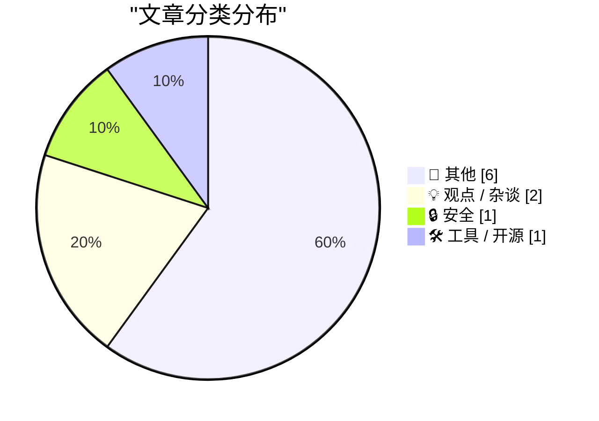
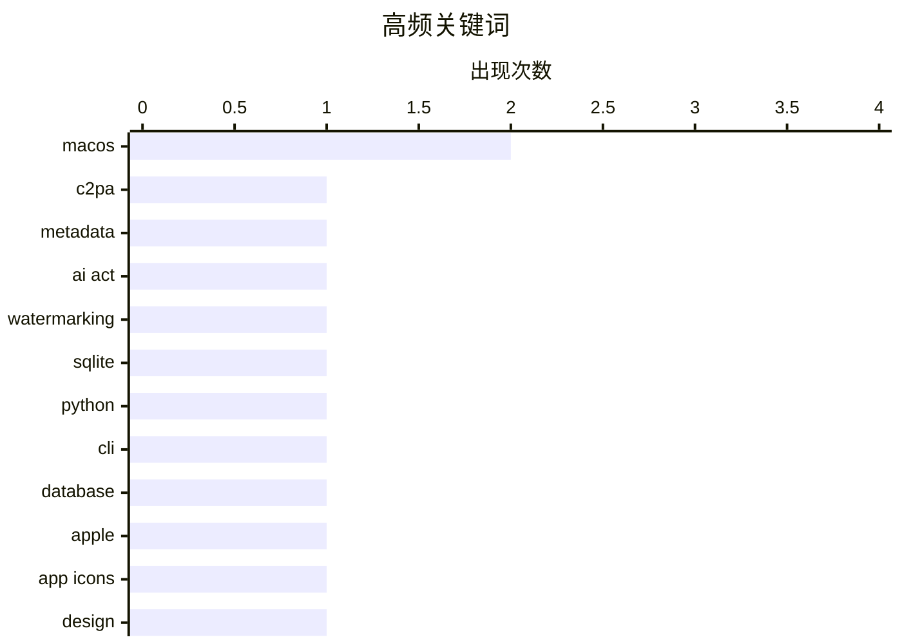

# 📰 AI 博客每日精选 — 2026-07-07

> 来自 Karpathy 推荐的 92 个顶级技术博客，AI 精选 Top 10

## 🏆 今日必读

🥇 **C2PA only works if everything is signed**

[C2PA only works if everything is signed](https://seangoedecke.com/c2pa-only-works-if-everything-is-signed/) — seangoedecke.com · 23 小时前 · 🔒 安全

> C2PA only works if everything is signed The European Union AI Act is Europe’s attempt to comprehensively regulate AI usage. A big part of that is the requirement that AI-generated content be identifia

🏷️ C2PA, metadata, AI Act, watermarking

🥈 **sqlite-utils 4.0rc3**

[sqlite-utils 4.0rc3](https://simonwillison.net/2026/Jul/6/sqlite-utils/#atom-everything) — simonwillison.net · 17 小时前 · 🛠 工具 / 开源

> Simon Willison’s Weblog Subscribe Sponsored by: Sonar &mdash; Gartner just named Sonar a Leader in the 2026 Magic Quadrant™ for Technical Debt Management Tools. Read the report and learn how to measur

🏷️ SQLite, Python, CLI, database

🥉 **★ Apple Should Eliminate the App Icon ‘Squircle Jail’**

[★ Apple Should Eliminate the App Icon ‘Squircle Jail’](https://daringfireball.net/2026/07/eliminate_app_icon_squircle_jail) — daringfireball.net · 39 分钟前 · 💡 观点 / 杂谈

> By John Gruber Archive The Talk Show Dithering Projects Contact Colophon Feeds / Social Twitter --> Sponsorship Day One — The journal you actually keep. Start with a chat, end with a journal entry. ⭐ 

🏷️ Apple, app icons, design, macOS

---

## 📊 数据概览

| 扫描源 | 抓取文章 | 时间范围 | 精选 |
|:---:|:---:|:---:|:---:|
| 87/92 | 2515 篇 → 20 篇 | 24h | **10 篇** |

### 分类分布



### 高频关键词



<details>
<summary>📈 纯文本关键词图（终端友好）</summary>

```
macos        │ ████████████████████ 2
c2pa         │ ██████████░░░░░░░░░░ 1
metadata     │ ██████████░░░░░░░░░░ 1
ai act       │ ██████████░░░░░░░░░░ 1
watermarking │ ██████████░░░░░░░░░░ 1
sqlite       │ ██████████░░░░░░░░░░ 1
python       │ ██████████░░░░░░░░░░ 1
cli          │ ██████████░░░░░░░░░░ 1
database     │ ██████████░░░░░░░░░░ 1
apple        │ ██████████░░░░░░░░░░ 1
```

</details>

### 🏷️ 话题标签

**macos**(2) · **c2pa**(1) · **metadata**(1) · ai act(1) · watermarking(1) · sqlite(1) · python(1) · cli(1) · database(1) · apple(1) · app icons(1) · design(1) · chatgpt(1) · desktop app(1) · product design(1)

---

## 📝 其他

### 1. Premium: The Hater's Guide To SoftBank

[Premium: The Hater's Guide To SoftBank](https://www.wheresyoured.at/premium-the-haters-guide-to-softbank/) — **wheresyoured.at** · 8 小时前 · ⭐ 15/30

> Premium: The Hater's Guide To SoftBank Ed Zitron Jul 6, 2026 34 min read Table of Contents Soundtrack: Ozzy Osbourne — Mr. Crowley A lot of people have been making a lot of fun of the SoftBank 46th an

---

### 2. Reproducing a geometry theorem diagram

[Reproducing a geometry theorem diagram](https://www.johndcook.com/blog/2026/07/06/arc-hypotenuse/) — **johndcook.com** · 8 小时前 · ⭐ 15/30

> I ran across a geometry theorem with the following diagram. The theorem corresponding to the diagram is interesting, but I found reproducing the diagram more interesting. The segment AB is a diameter 

---

### 3. 我用 FILE_FLAG_DELETE_ON_CLOSE 打开了文件，但现在我改主意了

[I opened a file with FILE_FLAG_DELETE_ON_CLOSE, but now I changed my mind](https://devblogs.microsoft.com/oldnewthing/20260706-00/?p=112506) — **devblogs.microsoft.com/oldnewthing** · 9 小时前 · ⭐ 15/30

> 问题聚焦于 Windows 中用 CreateFile 指定 FILE_FLAG_DELETE_ON_CLOSE 后，是否还能撤销“最后一个句柄关闭时删除文件”的行为。结论是否定的：FILE_FLAG_DELETE_ON_CLOSE 一旦在打开文件时设置，就不能反悔。若删除与否要等后续条件确定，做法是先正常打开文件，再通过 SetFileInformationByHandle 配合 FILE_DISPOSITION_INFO 和 FileDispositionInfo 动态把 DeleteFile 设为 TRUE。与 FILE_FLAG_DELETE_ON_CLOSE 不同，这种 disposition 标记之后还可以再把 DeleteFile 设为 FALSE 来撤销删除。作者给出的核心建议是：需要延后决策时，不要一开始就用 FILE_FLAG_DELETE_ON_CLOSE，而应改用可切换的 FileDispositionInfo。

---

### 4. e 的近似

[e approximation](https://www.johndcook.com/blog/2026/07/06/e-approximation/) — **johndcook.com** · 10 小时前 · ⭐ 15/30

> 一个引人注意的有理数近似是 e ≈ 2721/1001，它的特别之处在于分母很小但精度很高。把 e 截断成小数可得到 2718/1000，这个近似只有 4 位有效数字，而 2721/1001 可达到 7 位、接近 8 位有效数字。文中给出数值对比：e = 2.71828182…，2721/1001 = 2.71828171…，两者非常接近。二进制表示下，这种效果更明显：分母 1001 只需 10 位，但该近似对 e 的逼近可准确到 21 位。这个例子说明，简单的分数形式也可能以远超分母规模的精度逼近常数 e。

---

### 5. I'm just so bored of AI

[I'm just so bored of AI](https://shkspr.mobi/blog/2026/07/im-just-so-bored-of-ai/) — **shkspr.mobi** · 11 小时前 · ⭐ 15/30

> I'm just so bored of AI AI rant · 9 comments · 250 words · Viewed ~2,663 times I'm just so bored of talking about AI. It's like listening to vapers tell me how delicious their flavoured poison is. Did

---

### 6. Why IBM bought Lotus

[Why IBM bought Lotus](https://dfarq.homeip.net/why-ibm-bought-lotus/?utm_source=rss&#038;utm_medium=rss&#038;utm_campaign=why-ibm-bought-lotus) — **dfarq.homeip.net** · 12 小时前 · ⭐ 15/30

> On July 6, 1995, IBM bought Lotus Development for $3.5 billion. Lotus had once been the second largest software publisher in the world and was worth $5.5 billion at its IPO . Its flagship product, the

---

## 💡 观点 / 杂谈

### 7. ★ Apple Should Eliminate the App Icon ‘Squircle Jail’

[★ Apple Should Eliminate the App Icon ‘Squircle Jail’](https://daringfireball.net/2026/07/eliminate_app_icon_squircle_jail) — **daringfireball.net** · 39 分钟前 · ⭐ 16/30

> By John Gruber Archive The Talk Show Dithering Projects Contact Colophon Feeds / Social Twitter --> Sponsorship Day One — The journal you actually keep. Start with a chat, end with a journal entry. ⭐ 

🏷️ Apple, app icons, design, macOS

---

### 8. Allen Pike, Back in November: ‘Why Is ChatGPT for Mac So Good?’

[Allen Pike, Back in November: ‘Why Is ChatGPT for Mac So Good?’](https://allenpike.com/2025/why-is-chatgpt-so-good-claude/) — **daringfireball.net** · 5 小时前 · ⭐ 19/30

> Allen Pike Articles About Follow Why is ChatGPT for Mac So Good? Claude, Copilot, and making a good desktop app. November 30, 2025 • 5 min read This year, even as Anthropic, Google, and others have ch

🏷️ ChatGPT, macOS, desktop app, product design

---

## 🔒 安全

### 9. C2PA only works if everything is signed

[C2PA only works if everything is signed](https://seangoedecke.com/c2pa-only-works-if-everything-is-signed/) — **seangoedecke.com** · 23 小时前 · ⭐ 25/30

> C2PA only works if everything is signed The European Union AI Act is Europe’s attempt to comprehensively regulate AI usage. A big part of that is the requirement that AI-generated content be identifia

🏷️ C2PA, metadata, AI Act, watermarking

---

## 🛠 工具 / 开源

### 10. sqlite-utils 4.0rc3

[sqlite-utils 4.0rc3](https://simonwillison.net/2026/Jul/6/sqlite-utils/#atom-everything) — **simonwillison.net** · 17 小时前 · ⭐ 22/30

> Simon Willison’s Weblog Subscribe Sponsored by: Sonar &mdash; Gartner just named Sonar a Leader in the 2026 Magic Quadrant™ for Technical Debt Management Tools. Read the report and learn how to measur

🏷️ SQLite, Python, CLI, database

---

*生成于 2026-07-07 07:03 | 扫描 87 源 → 获取 2515 篇 → 精选 10 篇*
*基于 [Hacker News Popularity Contest 2025](https://refactoringenglish.com/tools/hn-popularity/) RSS 源列表*
