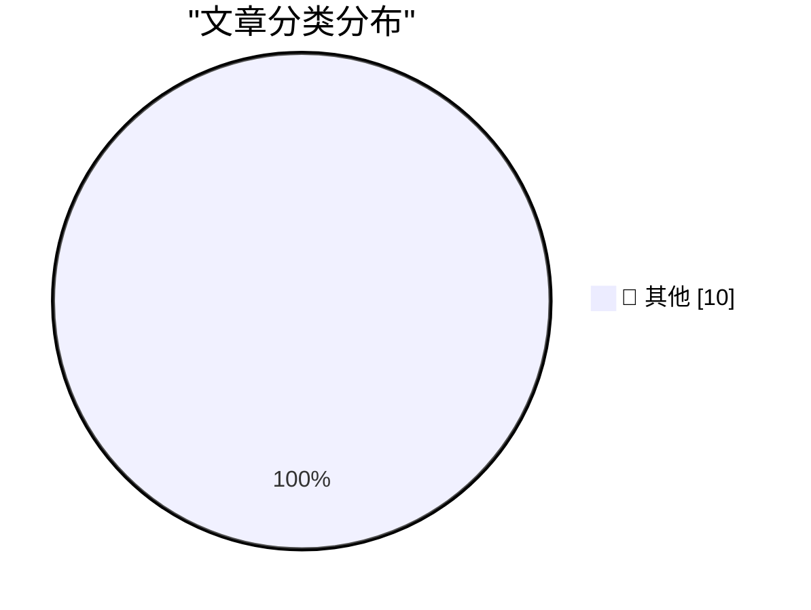

# 📰 AI 博客每日精选 — 2026-08-12

> 来自 Karpathy 推荐的 92 个顶级技术博客，AI 精选 Top 10

## 🏆 今日必读

🥇 **Books I Enjoyed In 2026H1**

[Books I Enjoyed In 2026H1](https://borretti.me/article/books-i-enjoyed-in-2026-h1) — borretti.me · 2026-08-12 · 📝 其他

> Books I Enjoyed In 2026H1 12 August, 2026 From Advanced Automation for Space Missions by Robert Freitas . Fiction Invisible Cities by Italo Calvino . Beautiful prose and imagination. By Night in Chile

🥈 **There are no lossless transformations of natural-language text**

[There are no lossless transformations of natural-language text](https://simonwillison.net/2026/Aug/11/there-are-no-lossless-transformations-of-natural-language-text/) — simonwillison.net · 刚刚 · 📝 其他

> There are no lossless transformations of natural-language text . Sophie Alpert shares her "internal policy on acceptable use of AI writing by engineers". It's a short read (supporting its own recommen

🥉 **Stealing Reasoning Traces from Proprietary LLM APIs**

[Stealing Reasoning Traces from Proprietary LLM APIs](https://simonwillison.net/2026/Aug/11/stealing-reasoning-traces/) — simonwillison.net · 19 分钟前 · 📝 其他

> Stealing Reasoning Traces from Proprietary LLM APIs ( via ) A vanity domain name ( stolen-thoughts.com ) for a neat paper : Anthropic, OpenAI, and Google return encrypted chain-of-thought blocks to cl

---

## 📊 数据概览

| 扫描源 | 抓取文章 | 时间范围 | 精选 |
|:---:|:---:|:---:|:---:|
| 87/92 | 2586 篇 → 33 篇 | 24h | **10 篇** |

### 分类分布

---

## 📝 其他

### 1. Books I Enjoyed In 2026H1

[Books I Enjoyed In 2026H1](https://borretti.me/article/books-i-enjoyed-in-2026-h1) — **borretti.me** · 2026-08-12 · ⭐ 15/30

> Books I Enjoyed In 2026H1 12 August, 2026 From Advanced Automation for Space Missions by Robert Freitas . Fiction Invisible Cities by Italo Calvino . Beautiful prose and imagination. By Night in Chile

---

### 2. There are no lossless transformations of natural-language text

[There are no lossless transformations of natural-language text](https://simonwillison.net/2026/Aug/11/there-are-no-lossless-transformations-of-natural-language-text/) — **simonwillison.net** · 刚刚 · ⭐ 15/30

> There are no lossless transformations of natural-language text . Sophie Alpert shares her "internal policy on acceptable use of AI writing by engineers". It's a short read (supporting its own recommen

---

### 3. Stealing Reasoning Traces from Proprietary LLM APIs

[Stealing Reasoning Traces from Proprietary LLM APIs](https://simonwillison.net/2026/Aug/11/stealing-reasoning-traces/) — **simonwillison.net** · 19 分钟前 · ⭐ 15/30

> Stealing Reasoning Traces from Proprietary LLM APIs ( via ) A vanity domain name ( stolen-thoughts.com ) for a neat paper : Anthropic, OpenAI, and Google return encrypted chain-of-thought blocks to cl

---

### 4. Edinburgh Fringe - Justina Seselskaite: Settled ★★★★☆

[Edinburgh Fringe - Justina Seselskaite: Settled ★★★★☆](https://shkspr.mobi/blog/2026/08/edinburgh-fringe-justina-seselskaite-settled/) — **shkspr.mobi** · 36 分钟前 · ⭐ 15/30

> Edinburgh Fringe - Justina Seselskaite: Settled ★★★★☆ comedy EdFringe review · 250 words · Viewed ~565 times Sometimes at the Edinburgh Fringe, you take a punt on a random show because it's close by a

---

### 5. Microsoft Plugs Nearly 400 Security Holes

[Microsoft Plugs Nearly 400 Security Holes](https://krebsonsecurity.com/2026/08/microsoft-plugs-nearly-400-security-holes/) — **krebsonsecurity.com** · 1 小时前 · ⭐ 15/30

> Microsoft today released updates to remedy at least 398 security vulnerabilities in its Windows operating systems and supported software, including one weakness that is already being actively exploite

---

### 6. Edinburgh Fringe: Handel Nine German Arias ★★★⯪☆

[Edinburgh Fringe: Handel Nine German Arias ★★★⯪☆](https://shkspr.mobi/blog/2026/08/edinburgh-fringe-handel-nine-german-arias/) — **shkspr.mobi** · 2 小时前 · ⭐ 15/30

> Edinburgh Fringe: Handel Nine German Arias ★★★⯪☆ EdFringe review · 150 words · Viewed ~704 times Part of going to The Fringe is to expose yourself to new ideas, different art forms, and a range of art

---

### 7. Don't Look Up

[Don't Look Up](https://www.wheresyoured.at/dont-look-up/) — **wheresyoured.at** · 3 小时前 · ⭐ 15/30

> Don't Look Up Ed Zitron Aug 11, 2026 32 min read Table of Contents If you liked this piece, you should subscribe to my premium newsletter. It’s $70 a year, or $7 a month, and in return you get a weekl

---

### 8. The Talk Show: ‘Getting the Snack Right’

[The Talk Show: ‘Getting the Snack Right’](https://daringfireball.net/thetalkshow/2026/08/10/ep-454) — **daringfireball.net** · 4 小时前 · ⭐ 15/30

> By John Gruber RSS Feed Apple Podcasts Overcast Castro Twitter Contact Sponsor the Show The Talk Show ‘Getting the Snack Right’, With Chance Miller Monday, 10 August 2026 Chance Miller returns to the 

---

### 9. The Fruits of AI

[The Fruits of AI](https://blog.jim-nielsen.com/2026/fruit-of-ai/) — **blog.jim-nielsen.com** · 4 小时前 · ⭐ 15/30

> The Fruits of AI 2026-08-11 Terry Godier has a post titled “Mea culpa” (which, given his framing, might’ve been better titled “Claude’s Culpa”). I’m not sure how much to even trust anything in his pos

---

### 10. Ryan Greenblatt – What happens once AI can automate AI research?

[Ryan Greenblatt – What happens once AI can automate AI research?](https://www.dwarkesh.com/p/ryan-greenblatt) — **dwarkesh.com** · 6 小时前 · ⭐ 15/30

> Playback speed × Share post Share post at current time Share from 0:00 0:00 / Generate transcript A transcript unlocks clips, previews, and editing. 70 8 3 Ryan Greenblatt – What happens once AI can a

---

*生成于 2026-08-12 07:00 | 扫描 87 源 → 获取 2586 篇 → 精选 10 篇*
*基于 [Hacker News Popularity Contest 2025](https://refactoringenglish.com/tools/hn-popularity/) RSS 源列表*
