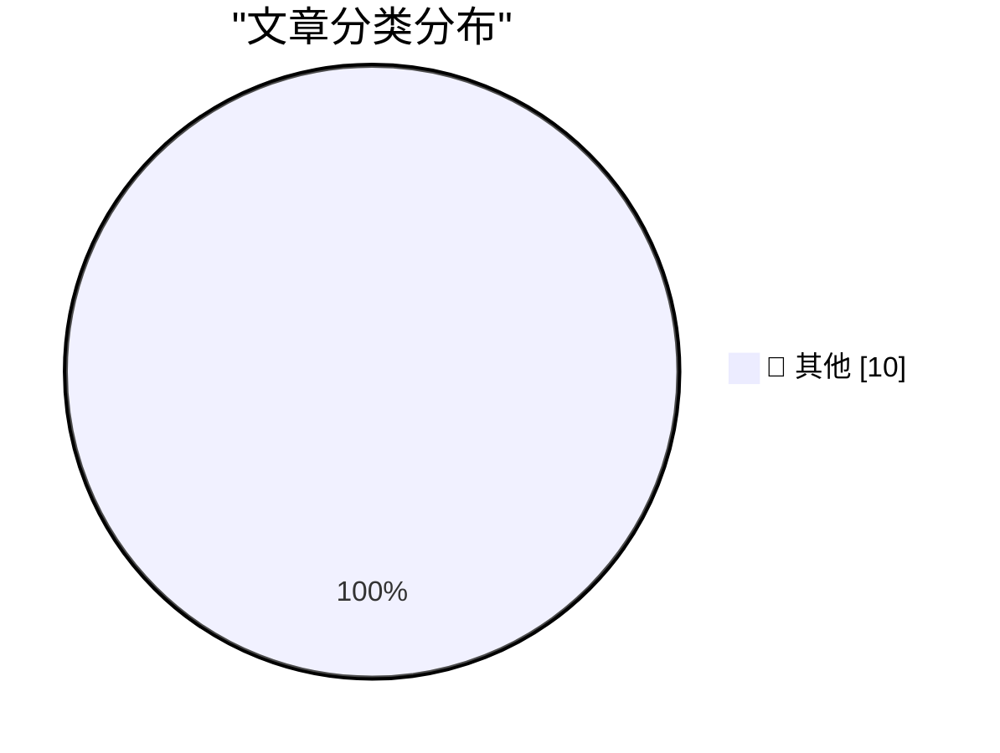

# 📰 AI 博客每日精选 — 2026-08-13

> 来自 Karpathy 推荐的 92 个顶级技术博客，AI 精选 Top 10

## 🏆 今日必读

🥇 **Another partial SSI trick with canonicalize**

[Another partial SSI trick with canonicalize](https://bernsteinbear.com/blog/more-partial-ssi/?utm_source=rss) — bernsteinbear.com · 2026-08-13 · 📝 其他

> home blog microblog favorites pl resources bread recipes rss Another partial SSI trick with canonicalize August 13, 2026 After reading Chris Fallin’s aegraph post , new ZJIT contributor dak2 landed a 

🥈 **DeepSeek V4 Pro 0813 (on OpenRouter)**

[DeepSeek V4 Pro 0813 (on OpenRouter)](https://simonwillison.net/2026/Aug/12/deepseek-v4-pro-0813/) — simonwillison.net · 刚刚 · 📝 其他

> DeepSeek V4 Pro 0813 (on OpenRouter) . The latest DeepSeek Pro model is now available, via API only. I had to link to OpenRouter because DeepSeek don't have any obvious announcement page for their new

🥉 **Edinburgh Fringe - Heated Rivalry: The Unauthorized Musical Parody ★★★★☆**

[Edinburgh Fringe - Heated Rivalry: The Unauthorized Musical Parody ★★★★☆](https://shkspr.mobi/blog/2026/08/edinburgh-fringe-heated-rivalry-the-unauthorized-musical-parody/) — shkspr.mobi · 1 小时前 · 📝 其他

> Edinburgh Fringe - Heated Rivalry: The Unauthorized Musical Parody ★★★★☆ EdFringe review · 300 words · Viewed ~482 times There are at least four different Heated Rivalry shows at the Fringe this year.

---

## 📊 数据概览

| 扫描源 | 抓取文章 | 时间范围 | 精选 |
|:---:|:---:|:---:|:---:|
| 88/92 | 2611 篇 → 27 篇 | 24h | **10 篇** |

### 分类分布

---

## 📝 其他

### 1. Another partial SSI trick with canonicalize

[Another partial SSI trick with canonicalize](https://bernsteinbear.com/blog/more-partial-ssi/?utm_source=rss) — **bernsteinbear.com** · 2026-08-13 · ⭐ 15/30

> home blog microblog favorites pl resources bread recipes rss Another partial SSI trick with canonicalize August 13, 2026 After reading Chris Fallin’s aegraph post , new ZJIT contributor dak2 landed a 

---

### 2. DeepSeek V4 Pro 0813 (on OpenRouter)

[DeepSeek V4 Pro 0813 (on OpenRouter)](https://simonwillison.net/2026/Aug/12/deepseek-v4-pro-0813/) — **simonwillison.net** · 刚刚 · ⭐ 15/30

> DeepSeek V4 Pro 0813 (on OpenRouter) . The latest DeepSeek Pro model is now available, via API only. I had to link to OpenRouter because DeepSeek don't have any obvious announcement page for their new

---

### 3. Edinburgh Fringe - Heated Rivalry: The Unauthorized Musical Parody ★★★★☆

[Edinburgh Fringe - Heated Rivalry: The Unauthorized Musical Parody ★★★★☆](https://shkspr.mobi/blog/2026/08/edinburgh-fringe-heated-rivalry-the-unauthorized-musical-parody/) — **shkspr.mobi** · 1 小时前 · ⭐ 15/30

> Edinburgh Fringe - Heated Rivalry: The Unauthorized Musical Parody ★★★★☆ EdFringe review · 300 words · Viewed ~482 times There are at least four different Heated Rivalry shows at the Fringe this year.

---

### 4. alchemy-utils 0.1a0

[alchemy-utils 0.1a0](https://simonwillison.net/2026/Aug/12/alchemy-utils/) — **simonwillison.net** · 3 小时前 · ⭐ 15/30

> Simon Willison’s Weblog Subscribe Sponsored by: Dynatrace &mdash; When agents enter the SDLC, observability becomes the enabler to move from code generation to scalable engineering. Read the blog for 

---

### 5. Edinburgh Fringe - James Rowland: Team Viking ★★⯪☆☆

[Edinburgh Fringe - James Rowland: Team Viking ★★⯪☆☆](https://shkspr.mobi/blog/2026/08/edinburgh-fringe-james-rowland-team-viking/) — **shkspr.mobi** · 3 小时前 · ⭐ 15/30

> Edinburgh Fringe - James Rowland: Team Viking ★★⯪☆☆ EdFringe review · 100 words This is a technically precise and emotionally complex show with energetic delivery from a talented performer. Sadly, it 

---

### 6. Card Sharks

[Card Sharks](https://feed.tedium.co/link/15204/17416577/greeting-cards-care-bears-cartoons-history) — **tedium.co** · 4 小时前 · ⭐ 15/30

> Card Sharks The 1980s proved surprisingly fruitful for licensed greeting card mascots. It turns out American Greetings understood the Marvel playbook before Marvel did. By Ernie Smith • August 12, 202

---

### 7. The comments that go into code versus those that go into the pull request description

[The comments that go into code versus those that go into the pull request description](https://devblogs.microsoft.com/oldnewthing/20260812-00/?p=112607) — **devblogs.microsoft.com/oldnewthing** · 9 小时前 · ⭐ 15/30

> When you submit a pull request, there are two places you can use to help explain what you are doing and why you are doing it. One is the pull request description, and another is the code you are modif

---

### 8. Cryptic but consistent

[Cryptic but consistent](https://www.johndcook.com/blog/2026/08/12/cryptic-but-consistent/) — **johndcook.com** · 9 小时前 · ⭐ 15/30

> Suppose you’ve never worked at the command line and you’re reading a book about the bash shell. You read that !$ is a shortcut to refer to the last word of the previous command. That little fact will 

---

### 9. Where Did the Productivity Gains Go?

[Where Did the Productivity Gains Go?](https://idiallo.com/blog/where-did-the-productivity-gains-go) — **idiallo.com** · 11 小时前 · ⭐ 15/30

> There is a machine called Productivity, and on this machine there is a knob and a button. The knob increases productivity, and the button is labeled "reset." My job was data entry at a non-profit. It 

---

### 10. OTel Isn't Going Well (And I Made A Spreadsheet About It)

[OTel Isn't Going Well (And I Made A Spreadsheet About It)](https://matduggan.com/otel-isnt-going-well-and-i-made-a-spreadsheet-about-it/) — **matduggan.com** · 11 小时前 · ⭐ 15/30

> For years now one of the most reliable complaints I hear when I try to drag a team off their vendor specific SDK and onto OpenTelemetry is some variation of: "why does it seem like this isn't done yet

---

*生成于 2026-08-13 07:00 | 扫描 88 源 → 获取 2611 篇 → 精选 10 篇*
*基于 [Hacker News Popularity Contest 2025](https://refactoringenglish.com/tools/hn-popularity/) RSS 源列表*
