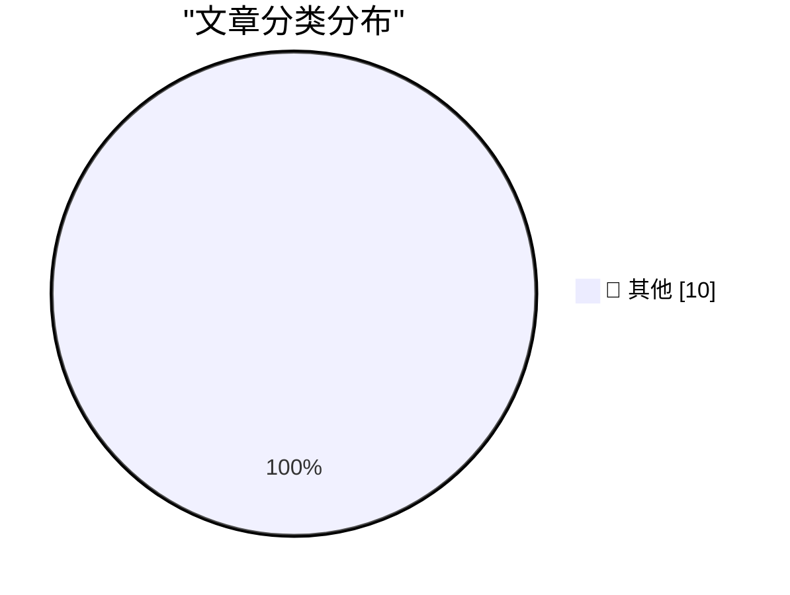

# 📰 AI 博客每日精选 — 2026-08-14

> 来自 Karpathy 推荐的 92 个顶级技术博客，AI 精选 Top 10

## 🏆 今日必读

🥇 **Printing Lists**

[Printing Lists](https://matklad.github.io/2026/08/14/printing-lists.html) — matklad.github.io · 2026-08-14 · 📝 其他

> matklad About Links Blogroll Printing Lists Aug 14, 2026 To print a comma-separated list, a concise idiom is to optionally print the comma first, before the element: for (items, 0 ..) | item, item_ind

🥈 **How NASA’s Mariner 9 probe encoded images**

[How NASA’s Mariner 9 probe encoded images](https://www.johndcook.com/blog/2026/08/13/mariner-hadamard/) — johndcook.com · 刚刚 · 📝 其他

> NASA set Mariner 9 to photograph Mars in 1971. The images had to be encoded for transmission using an error-correcting code, otherwise they would be significantly corrupted when they were received on 

🥉 **sqlite-utils 4.2.1**

[sqlite-utils 4.2.1](https://simonwillison.net/2026/Aug/13/sqlite-utils-2/) — simonwillison.net · 刚刚 · 📝 其他

> Simon Willison’s Weblog Subscribe Sponsored by: Dynatrace &mdash; When agents enter the SDLC, observability becomes the enabler to move from code generation to scalable engineering. Read the blog for 

---

## 📊 数据概览

| 扫描源 | 抓取文章 | 时间范围 | 精选 |
|:---:|:---:|:---:|:---:|
| 88/92 | 2611 篇 → 20 篇 | 24h | **10 篇** |

### 分类分布

---

## 📝 其他

### 1. Printing Lists

[Printing Lists](https://matklad.github.io/2026/08/14/printing-lists.html) — **matklad.github.io** · 2026-08-14 · ⭐ 15/30

> matklad About Links Blogroll Printing Lists Aug 14, 2026 To print a comma-separated list, a concise idiom is to optionally print the comma first, before the element: for (items, 0 ..) | item, item_ind

---

### 2. How NASA’s Mariner 9 probe encoded images

[How NASA’s Mariner 9 probe encoded images](https://www.johndcook.com/blog/2026/08/13/mariner-hadamard/) — **johndcook.com** · 刚刚 · ⭐ 15/30

> NASA set Mariner 9 to photograph Mars in 1971. The images had to be encoded for transmission using an error-correcting code, otherwise they would be significantly corrupted when they were received on 

---

### 3. sqlite-utils 4.2.1

[sqlite-utils 4.2.1](https://simonwillison.net/2026/Aug/13/sqlite-utils-2/) — **simonwillison.net** · 刚刚 · ⭐ 15/30

> Simon Willison’s Weblog Subscribe Sponsored by: Dynatrace &mdash; When agents enter the SDLC, observability becomes the enabler to move from code generation to scalable engineering. Read the blog for 

---

### 4. Edinburgh Fringe: Doris, Dolly and the Dressing Room Divas ★★★★⯪

[Edinburgh Fringe: Doris, Dolly and the Dressing Room Divas ★★★★⯪](https://shkspr.mobi/blog/2026/08/edinburgh-fringe-doris-dolly-and-the-dressing-room-divas/) — **shkspr.mobi** · 36 分钟前 · ⭐ 15/30

> Edinburgh Fringe: Doris, Dolly and the Dressing Room Divas ★★★★⯪ EdFringe review · 150 words · Viewed ~248 times Quite simply marvellous! Three Scottish divas giving us their interpretations of the gr

---

### 5. Edinburgh Fringe: The Musical Mystery Caller ★★★★★

[Edinburgh Fringe: The Musical Mystery Caller ★★★★★](https://shkspr.mobi/blog/2026/08/edinburgh-fringe-the-musical-mystery-caller/) — **shkspr.mobi** · 2 小时前 · ⭐ 15/30

> Edinburgh Fringe: The Musical Mystery Caller ★★★★★ EdFringe review · 1 comment · 150 words · Viewed ~270 times Walking down the street, I noticed a ringing phone box so, naturally, I answered it. What

---

### 6. sqlite-utils 4.2

[sqlite-utils 4.2](https://simonwillison.net/2026/Aug/13/sqlite-utils/) — **simonwillison.net** · 2 小时前 · ⭐ 15/30

> Simon Willison’s Weblog Subscribe Sponsored by: Dynatrace &mdash; When agents enter the SDLC, observability becomes the enabler to move from code generation to scalable engineering. Read the blog for 

---

### 7. Supplier Security Questionnaire

[Supplier Security Questionnaire](https://nesbitt.io/2026/08/13/supplier-security-questionnaire.html) — **nesbitt.io** · 6 小时前 · ⭐ 15/30

> From: Third-Party Risk Management To: [address extracted from package metadata] Subject: ACTION REQUIRED: Annual Supplier Security Assessment Due: 5 business days from receipt Hi, Our software invento

---

### 8. Constructing Hadamard matrices

[Constructing Hadamard matrices](https://www.johndcook.com/blog/2026/08/13/constructing-hadamard-matrices/) — **johndcook.com** · 7 小时前 · ⭐ 15/30

> A Hadamard matrix is an orthogonal matrix whose entries are all either 1 or − 1. For example is a Hadamard matrix of order 2. True to Stigler’s law of eponymy , James Joseph Sylvester investigated Had

---

### 9. A little helper class for managing LPPROC_THREAD_ATTRIBUTE_LISTs

[A little helper class for managing LPPROC_THREAD_ATTRIBUTE_LISTs](https://devblogs.microsoft.com/oldnewthing/20260813-00/?p=112611) — **devblogs.microsoft.com/oldnewthing** · 9 小时前 · ⭐ 15/30

> The LPPROC_THREAD_ATTRIBUTE_LIST is a bit annoying to manage. You have to allocate memory for it yourself, but you don’t know how much; you have to ask InitializeProcThreadAttributeList . And then whe

---

### 10. IBM 5170 PC/AT

[IBM 5170 PC/AT](https://dfarq.homeip.net/ibm-5170-pc-at/?utm_source=rss&#038;utm_medium=rss&#038;utm_campaign=ibm-5170-pc-at) — **dfarq.homeip.net** · 11 小时前 · ⭐ 15/30

> The IBM 5170 PC/AT, launched August 14, 1984, is a very popular retro PC, for several reasons. It was the last of the open architecture IBM PCs. And from 1984 to about mid-1987, it was the fastest and

---

*生成于 2026-08-14 07:00 | 扫描 88 源 → 获取 2611 篇 → 精选 10 篇*
*基于 [Hacker News Popularity Contest 2025](https://refactoringenglish.com/tools/hn-popularity/) RSS 源列表*
