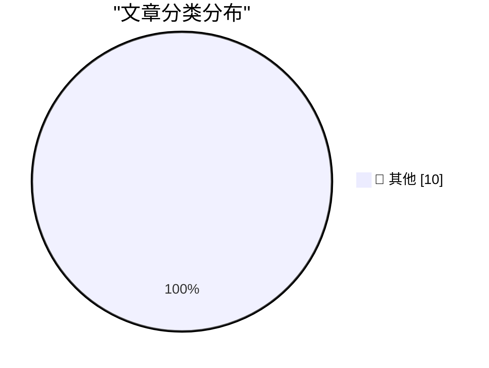

# 📰 AI 博客每日精选 — 2026-09-18

> 来自 Karpathy 推荐的 92 个顶级技术博客，AI 精选 Top 10

## 🏆 今日必读

🥇 **Self-generated prompt injections in compaction summaries**

[Self-generated prompt injections in compaction summaries](https://simonwillison.net/2026/Sep/17/compaction-summaries/) — simonwillison.net · 2 小时前 · 📝 其他

> Self-generated prompt injections in compaction summaries . In Our framework for reporting model misalignment OpenAI provide "six reports on unexpected or concerning model behavior we’ve observed in th

🥈 **Empirical fractal**

[Empirical fractal](https://www.johndcook.com/blog/2026/09/17/empirical-fractal/) — johndcook.com · 6 小时前 · 📝 其他

> There’s a common saying in discussion of fractals that the length of a coastline depends on how small a device you use to measure it. I thought this was a hypothetical, say as applied to the steps in 

🥉 **Corporate Sunset**

[Corporate Sunset](https://feed.tedium.co/link/15204/17464641/cox-charter-spectrum-brand-retirement-analysis) — tedium.co · 8 小时前 · 📝 其他

> Corporate Sunset Pondering the circumstances that led to the retirement of a 64-year-old cable brand in a merger. Turns out, brand loyalty matters less than we thought. By Ernie Smith • September 17, 

---

## 📊 数据概览

| 扫描源 | 抓取文章 | 时间范围 | 精选 |
|:---:|:---:|:---:|:---:|
| 78/92 | 2092 篇 → 12 篇 | 24h | **10 篇** |

### 分类分布

---

## 📝 其他

### 1. Self-generated prompt injections in compaction summaries

[Self-generated prompt injections in compaction summaries](https://simonwillison.net/2026/Sep/17/compaction-summaries/) — **simonwillison.net** · 2 小时前 · ⭐ 15/30

> Self-generated prompt injections in compaction summaries . In Our framework for reporting model misalignment OpenAI provide "six reports on unexpected or concerning model behavior we’ve observed in th

---

### 2. Empirical fractal

[Empirical fractal](https://www.johndcook.com/blog/2026/09/17/empirical-fractal/) — **johndcook.com** · 6 小时前 · ⭐ 15/30

> There’s a common saying in discussion of fractals that the length of a coastline depends on how small a device you use to measure it. I thought this was a hypothetical, say as applied to the steps in 

---

### 3. Corporate Sunset

[Corporate Sunset](https://feed.tedium.co/link/15204/17464641/cox-charter-spectrum-brand-retirement-analysis) — **tedium.co** · 8 小时前 · ⭐ 15/30

> Corporate Sunset Pondering the circumstances that led to the retirement of a 64-year-old cable brand in a merger. Turns out, brand loyalty matters less than we thought. By Ernie Smith • September 17, 

---

### 4. Phone words

[Phone words](https://www.johndcook.com/blog/2026/09/17/phone-words/) — **johndcook.com** · 8 小时前 · ⭐ 15/30

> I recently bought a copy of Los Alamos Rolodex, a book displaying business cards from Los Alamos Nation Labs from 1967 to 1978. You can find some examples of the cards here . One of the cards in the b

---

### 5. std::call_once vs. std::async

[std::call_once vs. std::async](https://devblogs.microsoft.com/oldnewthing/20260917-00/?p=112706) — **devblogs.microsoft.com/oldnewthing** · 9 小时前 · ⭐ 15/30

> Last time, we compared magic statics with std::call_once and concluded that std::call_once lets you construct magic statics-like behavior for non-static variables. But there is also std::async for del

---

### 6. How SpaceX Streamlined the Raptor Engine

[How SpaceX Streamlined the Raptor Engine](https://www.construction-physics.com/p/how-spacex-streamlined-the-raptor) — **construction-physics.com** · 11 小时前 · ⭐ 15/30

> How SpaceX Streamlined the Raptor Engine Brian Potter Sep 17, 2026 120 6 12 Share Via SpaceX . If you’re reading this, there’s a very good chance you’ve seen this famous image of three iterations of S

---

### 7. Computer Reset, Dallas

[Computer Reset, Dallas](https://dfarq.homeip.net/computer-reset-dallas/?utm_source=rss&#038;utm_medium=rss&#038;utm_campaign=computer-reset-dallas) — **dfarq.homeip.net** · 12 小时前 · ⭐ 15/30

> Computer Reset was a large used computer store and warehouse in northeast Dallas whose heyday was in the 1980s and 1990s, but it remained a go-to source for vintage and retro computer parts into the 2

---

### 8. Good Morning, Your Toaster Is Compromised

[Good Morning, Your Toaster Is Compromised](https://nesbitt.io/2026/09/17/good-morning-your-toaster-is-compromised.html) — **nesbitt.io** · 14 小时前 · ⭐ 15/30

> The following is a transcript of the 7am hour of Rise & Grind, a nationally syndicated breakfast news programme, first broadcast Thursday 17 September 2026. Transcription by OpenClaw-4.2. Portions of 

---

### 9. Pluralistic: On the sincerity of AI bosses (17 Sep 2026)

[Pluralistic: On the sincerity of AI bosses (17 Sep 2026)](https://pluralistic.net/2026/09/17/porque-no-los-dos/) — **pluralistic.net** · 15 小时前 · ⭐ 15/30

> ->->->->->->->->->->->->->->->->->->->->->->->->->->->->-> Top Sources: None --> Today's links On the sincerity of AI bosses : Fascism is always an incoherent bundle. Hey look at this : Delights to de

---

### 10. datasette 1.0a40

[datasette 1.0a40](https://simonwillison.net/2026/Sep/16/datasette/) — **simonwillison.net** · 23 小时前 · ⭐ 15/30

> Simon Willison’s Weblog Subscribe Sponsored by: WorkOS &mdash; auth.md by WorkOS: agents register users, no sign-up form. Try it! 16th September 2026 Release datasette 1.0a40 &mdash; An open source mu

---

*生成于 2026-09-18 07:02 | 扫描 78 源 → 获取 2092 篇 → 精选 10 篇*
*基于 [Hacker News Popularity Contest 2025](https://refactoringenglish.com/tools/hn-popularity/) RSS 源列表*
