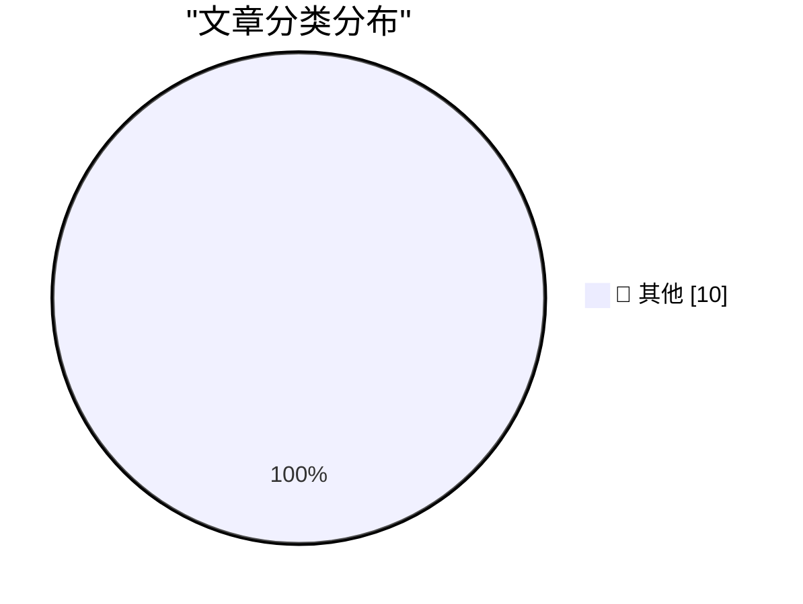

# 📰 AI 博客每日精选 — 2026-09-19

> 来自 Karpathy 推荐的 92 个顶级技术博客，AI 精选 Top 10

## 🏆 今日必读

🥇 **Note on 18th September 2026**

[Note on 18th September 2026](https://simonwillison.net/2026/Sep/18/probably-gonna-eat-you/) — simonwillison.net · 3 小时前 · 📝 其他

> Simon Willison’s Weblog Subscribe Sponsored by: Teleport &mdash; See what 13 engineers learned from “pressure washing” their codebase using LLMs for 90 days. Hint: Quality > quantity for finding secur

🥈 **Quoting Thariq Shihipar**

[Quoting Thariq Shihipar](https://simonwillison.net/2026/Sep/18/thariq-shihipar/) — simonwillison.net · 3 小时前 · 📝 其他

> Simon Willison’s Weblog Subscribe Sponsored by: Teleport &mdash; See what 13 engineers learned from “pressure washing” their codebase using LLMs for 90 days. Hint: Quality > quantity for finding secur

🥉 **Do You Prefer Artificial?**

[Do You Prefer Artificial?](https://blog.jim-nielsen.com/2026/who-wants-artificial/) — blog.jim-nielsen.com · 4 小时前 · 📝 其他

> Do You Prefer Artificial? 2026-09-18 “Artificial” things can get a bad rap next to their counterparts, but they have their place. For example, artificial light (i.e. not from the sun)? Super useful, e

---

## 📊 数据概览

| 扫描源 | 抓取文章 | 时间范围 | 精选 |
|:---:|:---:|:---:|:---:|
| 80/92 | 2477 篇 → 26 篇 | 24h | **10 篇** |

### 分类分布

---

## 📝 其他

### 1. Note on 18th September 2026

[Note on 18th September 2026](https://simonwillison.net/2026/Sep/18/probably-gonna-eat-you/) — **simonwillison.net** · 3 小时前 · ⭐ 15/30

> Simon Willison’s Weblog Subscribe Sponsored by: Teleport &mdash; See what 13 engineers learned from “pressure washing” their codebase using LLMs for 90 days. Hint: Quality > quantity for finding secur

---

### 2. Quoting Thariq Shihipar

[Quoting Thariq Shihipar](https://simonwillison.net/2026/Sep/18/thariq-shihipar/) — **simonwillison.net** · 3 小时前 · ⭐ 15/30

> Simon Willison’s Weblog Subscribe Sponsored by: Teleport &mdash; See what 13 engineers learned from “pressure washing” their codebase using LLMs for 90 days. Hint: Quality > quantity for finding secur

---

### 3. Do You Prefer Artificial?

[Do You Prefer Artificial?](https://blog.jim-nielsen.com/2026/who-wants-artificial/) — **blog.jim-nielsen.com** · 4 小时前 · ⭐ 15/30

> Do You Prefer Artificial? 2026-09-18 “Artificial” things can get a bad rap next to their counterparts, but they have their place. For example, artificial light (i.e. not from the sun)? Super useful, e

---

### 4. My design bookshelves

[My design bookshelves](https://aresluna.org/my-design-bookshelves) — **aresluna.org** · 5 小时前 · ⭐ 15/30

> Marcin Wichary 18 September 2026 / 230 books My design bookshelves I love, so much, a set of bookshelves cared for. Going through the collections of The Prelinger Library in San Francisco, The Museum 

---

### 5. ★ One More Thing About the iPhones 18 Pro: the Bigger/Smaller Dynamic Island

[★ One More Thing About the iPhones 18 Pro: the Bigger/Smaller Dynamic Island](https://daringfireball.net/2026/09/iphone_18_pro_dynamic_island) — **daringfireball.net** · 6 小时前 · ⭐ 15/30

> By John Gruber Archive The Talk Show Dithering Projects Contact Colophon Feeds / Social Twitter --> Sponsorship WorkOS : How SSO works and the fastest way to add it. One More Thing About the iPhones 1

---

### 6. Premium: The Hater's Guide To AI Debt (Part 1)

[Premium: The Hater's Guide To AI Debt (Part 1)](https://www.wheresyoured.at/premium-the-haters-guide-to-ai-debt-part-1/) — **wheresyoured.at** · 7 小时前 · ⭐ 15/30

> Premium: The Hater's Guide To AI Debt (Part 1) Ed Zitron Sep 18, 2026 30 min read Table of Contents The year is 2026, and you are a hyperscaler CEO. You zip up your Patagonia vest, type UPDATE ME ON C

---

### 7. The Lamentable Later Life of Lemmings

[The Lamentable Later Life of Lemmings](https://www.filfre.net/2026/09/the-lamentable-later-life-of-lemmings/) — **filfre.net** · 7 小时前 · ⭐ 15/30

> The Digital Antiquarian A history of computer entertainment and digital culture by Jimmy Maher Home About Me Ebooks Hall of Fame Table of Contents RSS &larr; This Week on The Analog Antiquarian The La

---

### 8. NTP, an atomic clock, and having a great time at the world's largest VCF

[NTP, an atomic clock, and having a great time at the world's largest VCF](https://www.jeffgeerling.com/blog/2026/vcf-midwest-21-ntp-time/) — **jeffgeerling.com** · 9 小时前 · ⭐ 15/30

> NTP, an atomic clock, and having a great time at the world's largest VCF Sep 18, 2026 I'm back from VCF Midwest 21 , arguably the largest vintage computer festival on the planet. After being blown awa

---

### 9. Theatre Review: The School for Wives - at Riverside Studios ★★★★★

[Theatre Review: The School for Wives - at Riverside Studios ★★★★★](https://shkspr.mobi/blog/2026/09/theatre-review-the-school-for-wives/) — **shkspr.mobi** · 11 小时前 · ⭐ 15/30

> Theatre Review: The School for Wives - at Riverside Studios ★★★★★ Theatre Review · 1 comment · 350 words · Viewed ~480 times 10.59350/r0cff-96c14 The Flywheel theatre company are reviving the rep trad

---

### 10. Retro emojis: We had ’em in the 80s and 90s

[Retro emojis: We had ’em in the 80s and 90s](https://dfarq.homeip.net/emoticons-in-the-80s-and-90s-we-had-em/?utm_source=rss&#038;utm_medium=rss&#038;utm_campaign=emoticons-in-the-80s-and-90s-we-had-em) — **dfarq.homeip.net** · 12 小时前 · ⭐ 15/30

> It might surprise you to hear we had emojis in the 1980s and 90s. We’ve had them since 1982, to be precise. The first known use was on a bulletin board by Scott Fahlman, a Carnegie Mellon computer sci

---

*生成于 2026-09-19 07:03 | 扫描 80 源 → 获取 2477 篇 → 精选 10 篇*
*基于 [Hacker News Popularity Contest 2025](https://refactoringenglish.com/tools/hn-popularity/) RSS 源列表*
