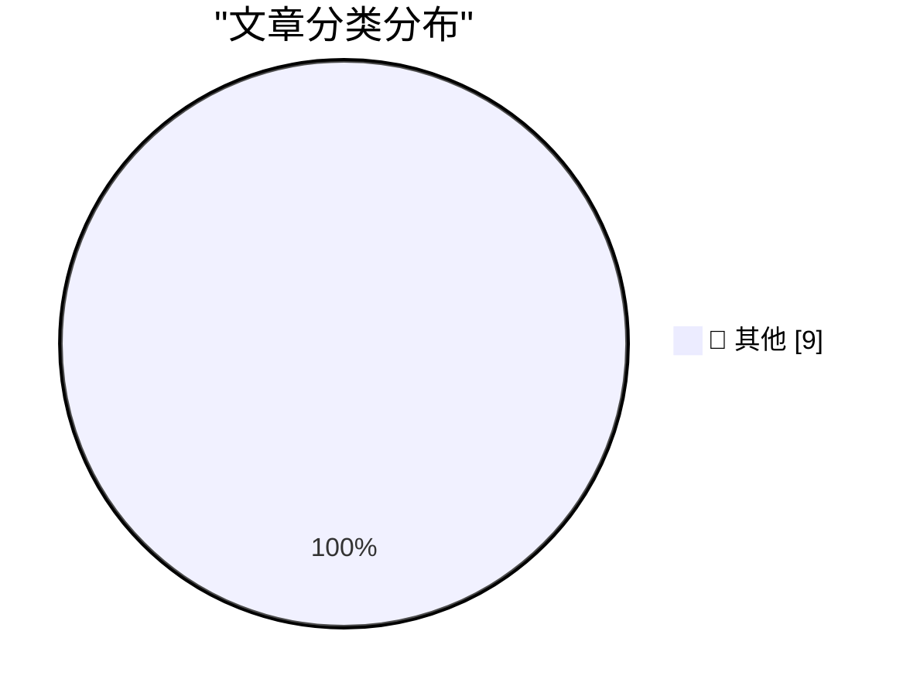

# 📰 AI 博客每日精选 — 2026-09-21

> 来自 Karpathy 推荐的 92 个顶级技术博客，AI 精选 Top 9

## 🏆 今日必读

🥇 **This is why we play**

[This is why we play](https://xeiaso.net/blog/2026/this-is-why-we-play/) — xeiaso.net · 刚刚 · 📝 其他

> This is why we play Published on 2026-09-21 , 2668 words, 10 minutes to read A meditation on gaming, community, and the purpose of negative space A miqo'te woman fishing in a cave on a suspended boat 

🥈 **Quoting voxium**

[Quoting voxium](https://simonwillison.net/2026/Sep/20/voxium/) — simonwillison.net · 1 小时前 · 📝 其他

> Simon Willison’s Weblog Subscribe Sponsored by: Teleport &mdash; See what 13 engineers learned from “pressure washing” their codebase using LLMs for 90 days. Hint: Quality > quantity for finding secur

🥉 **llm-keys-ui 0.1**

[llm-keys-ui 0.1](https://simonwillison.net/2026/Sep/20/llm-keys-ui/) — simonwillison.net · 3 小时前 · 📝 其他

> Simon Willison’s Weblog Subscribe Sponsored by: Teleport &mdash; See what 13 engineers learned from “pressure washing” their codebase using LLMs for 90 days. Hint: Quality > quantity for finding secur

---

## 📊 数据概览

| 扫描源 | 抓取文章 | 时间范围 | 精选 |
|:---:|:---:|:---:|:---:|
| 80/92 | 2477 篇 → 11 篇 | 24h | **9 篇** |

### 分类分布

---

## 📝 其他

### 1. This is why we play

[This is why we play](https://xeiaso.net/blog/2026/this-is-why-we-play/) — **xeiaso.net** · 刚刚 · ⭐ 15/30

> This is why we play Published on 2026-09-21 , 2668 words, 10 minutes to read A meditation on gaming, community, and the purpose of negative space A miqo'te woman fishing in a cave on a suspended boat 

---

### 2. Quoting voxium

[Quoting voxium](https://simonwillison.net/2026/Sep/20/voxium/) — **simonwillison.net** · 1 小时前 · ⭐ 15/30

> Simon Willison’s Weblog Subscribe Sponsored by: Teleport &mdash; See what 13 engineers learned from “pressure washing” their codebase using LLMs for 90 days. Hint: Quality > quantity for finding secur

---

### 3. llm-keys-ui 0.1

[llm-keys-ui 0.1](https://simonwillison.net/2026/Sep/20/llm-keys-ui/) — **simonwillison.net** · 3 小时前 · ⭐ 15/30

> Simon Willison’s Weblog Subscribe Sponsored by: Teleport &mdash; See what 13 engineers learned from “pressure washing” their codebase using LLMs for 90 days. Hint: Quality > quantity for finding secur

---

### 4. Book Review: How to Build a Space Station by Jonathan Morrison ★★★⯪☆

[Book Review: How to Build a Space Station by Jonathan Morrison ★★★⯪☆](https://shkspr.mobi/blog/2026/09/book-review-how-to-build-a-space-station-by-jonathan-morrison/) — **shkspr.mobi** · 11 小时前 · ⭐ 15/30

> Book Review: How to Build a Space Station by Jonathan Morrison ★★★⯪☆ Book Review NetGalley · 700 words · Viewed ~364 times 10.59350/0vqd8-3qy21 This book, by The Times' former Architecture Corresponde

---

### 5. Grit your teeth and ship it

[Grit your teeth and ship it](https://seangoedecke.com/grit-your-teeth-and-ship-it/) — **seangoedecke.com** · 23 小时前 · ⭐ 15/30

> Grit your teeth and ship it Being good at building and being good at shipping are two separate skills. In the short term, they’re actually countervailing: if you have a gift for building, you’re likel

---

### 6. System One models like Jev can train their own replacements

[System One models like Jev can train their own replacements](https://seangoedecke.com/system-one-models-can-train-their-own-replacements/) — **seangoedecke.com** · 23 小时前 · ⭐ 15/30

> System One models like Jev can train their own replacements “System One” models like Jev are fast general classifiers. Classifiers have existed since 1958 , but they have to be trained for specific ta

---

### 7. a new world airport and its baggage

[a new world airport and its baggage](https://computer.rip/2026-09-20-denver-baggage.html) — **computer.rip** · 23 小时前 · ⭐ 15/30

> a new world airport and its baggage 2026-09-20 Aviation came to Denver mainly in the form of mail. Like much of the inland West, the first airfields served a smattering of passenger flights (both expe

---

### 8. WorkOS: How SSO Works and the Fastest Way to Add It

[WorkOS: How SSO Works and the Fastest Way to Add It](https://workos.com/guide/the-developers-guide-to-sso?utm_source=daringfireball&amp;utm_medium=newsletter&amp;utm_campaign=q32026) — **daringfireball.net** · 5 小时前 · ⭐ 15/30

> Guides / Authentication & SSO Search Guides ⌘ K In this article The developer’s guide to SSO Adding SSO to your app is a common requirement for selling to enterprise customers. Here’s a guide that wil

---

### 9. GM Revives CarPlay for 2027 Trucks

[GM Revives CarPlay for 2027 Trucks](https://www.autoweek.com/news/a73761352/gm-revives-apple-carplay-for-2027-chevy-silverado-gmc-sierra/) — **daringfireball.net** · 5 小时前 · ⭐ 15/30

> General Motors is reversing course after having begun to remove Apple CarPlay from its vehicles, showing off instead a redesigned infotainment interface for the 2027 Chevrolet Silverado and GMC Sierra

---

*生成于 2026-09-21 07:02 | 扫描 80 源 → 获取 2477 篇 → 精选 9 篇*
*基于 [Hacker News Popularity Contest 2025](https://refactoringenglish.com/tools/hn-popularity/) RSS 源列表*
