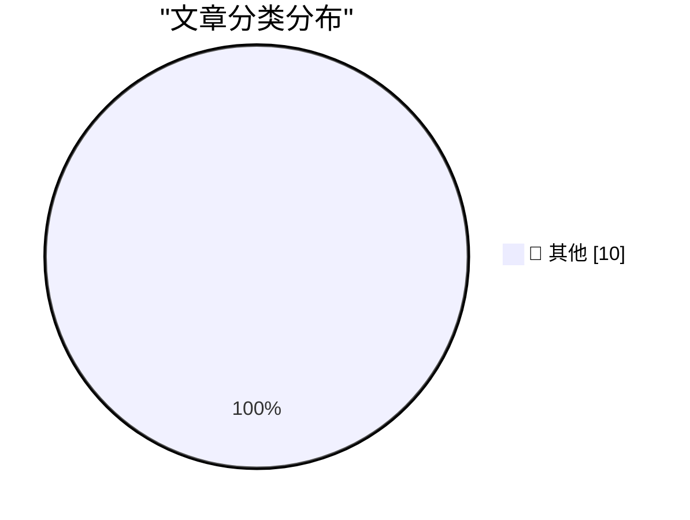

# 📰 AI 博客每日精选 — 2026-09-22

> 来自 Karpathy 推荐的 92 个顶级技术博客，AI 精选 Top 10

## 🏆 今日必读

🥇 **Cloudflare Python Workers are now generally available**

[Cloudflare Python Workers are now generally available](https://simonwillison.net/2026/Sep/21/cloudflare-python-worker/) — simonwillison.net · 37 分钟前 · 📝 其他

> Cloudflare Python Workers are now generally available ( via ) After a two year preview, Cloudflare's support for running Python code in their server-side Workers platform is now stable: "Python is now

🥈 **Raspberry Pi locks down Pi 5 RAM upgrades in firmware**

[Raspberry Pi locks down Pi 5 RAM upgrades in firmware](https://www.jeffgeerling.com/blog/2026/raspberry-pi-ram-lockdown/) — jeffgeerling.com · 6 小时前 · 📝 其他

> Raspberry Pi locks down Pi 5 RAM upgrades in firmware Sep 21, 2026 Raspberry Pi added a feature in their firmware that restricts users from swapping RAM chips , sometimes even RAM chips of the same ca

🥉 **Writing Rust code that's faster than state-of-the-art libraries by asking agents to make the code faster**

[Writing Rust code that's faster than state-of-the-art libraries by asking agents to make the code faster](https://minimaxir.com/2026/09/agentic-iteration/) — minimaxir.com · 6 小时前 · 📝 其他

> In January 2025, I had a fun hypothesis for a blog post : can LLMs write better code if you keep asking them to &ldquo;write better code&rdquo;? That was prior to the advent of robust agentic coding, 

---

## 📊 数据概览

| 扫描源 | 抓取文章 | 时间范围 | 精选 |
|:---:|:---:|:---:|:---:|
| 78/92 | 2439 篇 → 18 篇 | 24h | **10 篇** |

### 分类分布

---

## 📝 其他

### 1. Cloudflare Python Workers are now generally available

[Cloudflare Python Workers are now generally available](https://simonwillison.net/2026/Sep/21/cloudflare-python-worker/) — **simonwillison.net** · 37 分钟前 · ⭐ 15/30

> Cloudflare Python Workers are now generally available ( via ) After a two year preview, Cloudflare's support for running Python code in their server-side Workers platform is now stable: "Python is now

---

### 2. Raspberry Pi locks down Pi 5 RAM upgrades in firmware

[Raspberry Pi locks down Pi 5 RAM upgrades in firmware](https://www.jeffgeerling.com/blog/2026/raspberry-pi-ram-lockdown/) — **jeffgeerling.com** · 6 小时前 · ⭐ 15/30

> Raspberry Pi locks down Pi 5 RAM upgrades in firmware Sep 21, 2026 Raspberry Pi added a feature in their firmware that restricts users from swapping RAM chips , sometimes even RAM chips of the same ca

---

### 3. Writing Rust code that's faster than state-of-the-art libraries by asking agents to make the code faster

[Writing Rust code that's faster than state-of-the-art libraries by asking agents to make the code faster](https://minimaxir.com/2026/09/agentic-iteration/) — **minimaxir.com** · 6 小时前 · ⭐ 15/30

> In January 2025, I had a fun hypothesis for a blog post : can LLMs write better code if you keep asking them to &ldquo;write better code&rdquo;? That was prior to the advent of robust agentic coding, 

---

### 4. Cursed Napster

[Cursed Napster](https://feed.tedium.co/link/15204/17468568/napster-ai-pivot) — **tedium.co** · 8 小时前 · ⭐ 15/30

> Cursed Napster If you haven't looked at the Napster website lately, get ready for some major AI-related indigestion. The former music-sharing rebel is now peddling AI digital twins of teachers and ser

---

### 5. What’s the highest legal FILETIME? Is it safe to use?

[What’s the highest legal FILETIME? Is it safe to use?](https://devblogs.microsoft.com/oldnewthing/20260921-00/?p=112711) — **devblogs.microsoft.com/oldnewthing** · 9 小时前 · ⭐ 15/30

> A customer wanted to define a sentinel FILETIME that will be considered larger than another FILETIME . In other words, CompareFileTime should always say that the sentinel value is later. What’s a good

---

### 6. Pluralistic: The Claude Delusion (21 Sep 2026)

[Pluralistic: The Claude Delusion (21 Sep 2026)](https://pluralistic.net/2026/09/21/sunsetting/) — **pluralistic.net** · 11 小时前 · ⭐ 15/30

> ->->->->->->->->->->->->->->->->->->->->->->->->->->->->-> Top Sources: None --> Today's links The Claude Delusion : What if we're the ones having hallucinations? Hey look at this : Delights to delect

---

### 7. NEC V20 CPU: A bit of pep for an XT

[NEC V20 CPU: A bit of pep for an XT](https://dfarq.homeip.net/nec-v20-cpu-a-bit-of-pep-for-an-xt/?utm_source=rss&#038;utm_medium=rss&#038;utm_campaign=nec-v20-cpu-a-bit-of-pep-for-an-xt) — **dfarq.homeip.net** · 12 小时前 · ⭐ 15/30

> The NEC V20 was an Intel 8088-compatible CPU that ran slightly faster. It was a niche CPU in the 1980s and 1990s but had a following as a cheap upgrade for power users, especially in instances where m

---

### 8. This is why we play

[This is why we play](https://xeiaso.net/blog/2026/this-is-why-we-play/) — **xeiaso.net** · 23 小时前 · ⭐ 15/30

> This is why we play Published on 2026-09-21 , 2668 words, 10 minutes to read A meditation on gaming, community, and the purpose of negative space A miqo'te woman fishing in a cave on a suspended boat 

---

### 9. Lex Friedman Brings Back Strategery

[Lex Friedman Brings Back Strategery](https://lexontech.org/strategery-is-back-and-im-the-developer) — **daringfireball.net** · 10 分钟前 · ⭐ 15/30

> Membership Members get a full-text RSS feed, a members-only Discord, a private podcast, and more. Join now &rarr; Apps I Love &bull; Games &bull; Shameless Self-Promotion Strategery is back, and I’m t

---

### 10. GM Confirms They’re Still Smoking Crack

[GM Confirms They’re Still Smoking Crack](https://x.com/JoannaStern/status/2102105565195288859) — **daringfireball.net** · 1 小时前 · ⭐ 15/30

> Joanna Stern, on X: GM has confirmed it is NOT rolling phone projection to GM EVs. Instead this announcement is specific to JUST their new gas powered light-duty pickups, which have always supported A

---

*生成于 2026-09-22 07:03 | 扫描 78 源 → 获取 2439 篇 → 精选 10 篇*
*基于 [Hacker News Popularity Contest 2025](https://refactoringenglish.com/tools/hn-popularity/) RSS 源列表*
