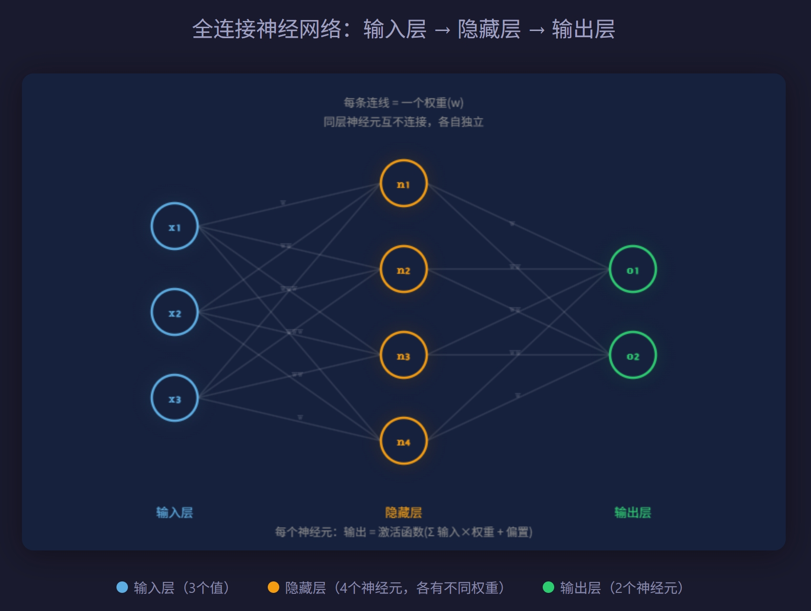

# 从零建立 LLM 知识体系

> 从"语言模型是什么"出发，沿 基础原理 → 架构 → 训练 → 对齐 → 应用 的主线展开，每个模块建立因果逻辑链。
>
> **语言是人类知识的通用载体**。学会预测语言 ≈ 被迫学会语言中编码的知识和推理。规模放大了这个效应。


## 前置知识

**LLM在更大的技术体系中的位置？**

```
人工智能 (AI)
  └── 机器学习 (ML)
        └── 深度学习 (神经网络)
              └── 自然语言处理 (NLP)
                    └── 语言模型 (LM)
                          └── 大语言模型 (LLM)
```

简要认识一下：

* 人工智能 (Artificial Intelligence)：让机器做通常需要人类智能的事。
* 机器学习 (Machine Learning)：AI的一个子集。核心区别，**不是人写规则，而是让机器从数据中自己学出规则**。
* 深度学习 (Deep Learning)：ML的一个子集。用的工具是**多层神经网络**，很多层简单计算单元叠在一起，深就是层数多。
* 自然语言处理 (Natural Language Processing)：AI里专门处理**人类语言**的分支。

LLM是深度学习在语言领域的一个特定应用。


**LLM是什么（程序员视角）？**

很多技术我们不知道它是什么，不妨先把它整体看作一个有输入和输出的黑箱。

你觉得它和传统软件或应用程序有什么区别？比如一个计算器程序，用户输入1+1，输出为2。如果你用过ChatGTP，你就会发现输入同样的问题，它每次回答的内容都不尽相同。

传统软件，是程序员根据需求严格编好的一套规则——代码，每一步行为都是人预先定义好的。

ChatGTP，没有人写过“如果用户问X就回答Y”的规则。它是吃了互联网上几万亿字的文本，然后从中学出来的，没有人能完整说清他内部到底学了什么。

我们可以确认模型内部形成了某种对语言世界的**理解结构**，不停的预测下一个输出是什么。

> LLM是一个从海量文本中学会了**”给定上下文，什么是合理的下一套token“**这套规则的模型。

## 基础概念

```
Token（输入的基本单位）
   ↓
概率分布（模型对下一个 token 的预测方式）
   ↓
上下文窗口（模型能看到多少 token 来做预测）
```

### token(BPE分词)

我们使用各家厂商的模型，经常听到花费多少token，那token究竟是什么？这个我们要回到自然语言处理，有一个专业术语叫tokenization（分词/标记化）。

人类认识文本以字或词来为最小的一个意义单元。

```
输入：ChatGPT is amazing
被拆成的 token：Chat GPT is amaz ing

输入：我喜欢编程
被拆成的 token：我 喜欢 编 程
```

机器有两个选择

```
方案 A：按字符拆
a m a z i n g → 词表很小（就几十个字母），但序列极长。模型要从一堆单个字母里学"这几个字母连在一起是什么意思"，很难。

方案 B：按整词拆
amazing ChatGPT 编程 → 直觉上最自然。但问题是：英语有几十万个词，加上中文、日文、代码、专有名词……词表爆炸，而且遇到新词（比如人名 Kuro）就完全不认识。
```

要达成用最少的分词片段，组合覆盖最多的文本表达，方案 A、B都有缺陷。所以用一个折中方案C（本质是频率驱动优化，常用的东西放在更容易拿到的位置，类比计算机的缓存设计。）

```
方案 C：按子词拆
amaz ing → amaz 出现在 amazing、amazed、amazement 里，ing 出现在无数词里。高频片段作为独立 token，低频词拆成高频片段的组合。

算总账：
• 按整词： amazing、amazed、amazement、running、jumping → 词表要 5 个位置，而且只能覆盖这 5 个词
• 按子词： amaz、ing、ed、ment、runn、jump → 词表 6 个位置，但能拼出远不止 5 个词（jumping、amazement，甚至没见过的 amazify）

词越多，这个压缩优势越大。实际 LLM 的词表大概 3-10 万个 token，就能覆盖几乎所有语言的所有文本。
```

Token 的核心就这些：文本先被拆成 token 序列，模型看到的不是文字，是 token。 这是 LLM 一切操作的起点。它最常用的算法叫BPE（Byte Pair Encording）。


### 概率分布(softmax)

早期如果模型回应慢，你可以看到它的回答内容是一个字一个字吐出来的。这是模型不断预测生成下一个token。

下一个token是从模型的**候选token**中选出来的，而候选token是模型提前用BPE算法训练好生成固定的词表。也就是说，要预测的下一个token的候选集永远是这整个词表。

假如词表里有5万个token，那下一个token，是随机从这5万个token中选一个吗？

第一步：模型计算。 神经网络算完之后，输出一个完整的**概率分布**。（softmax——它就是把一堆任意数字变成"全部为正、加起来等于1"的分布）

即模型预测下一个token的时候，它不是直接吐出一个答案，而是给词表里每一个token都打上一个分数（概率）。

比如上下文是"今天天气真"，模型的输出可能是：

```
好  → 62%
不  → 15%
的  → 8%
棒  → 5%
... 其余几万个 token 分享剩下的 10%
```

第二步：**采样**。 拿到概率分布之后，由一个独立于模型的采样策略来选一个 token。这里才有选择：

• 永远选最高的（贪心）： "今天天气真" → 永远接"好"。确定，但无聊。你问十次，十次同样的回答。
• 按概率随机抽（采样）： 62% 的概率选"好"，15% 选"不"，5% 选"棒"。同样的输入，每次可能不同。

你用 ChatGPT 时同一个问题问两次，回答不一样——就是因为第二步在随机采样，不是每次都选概率最高的。

还有个参数叫 **temperature**（温度）：

• 温度低 → 概率集中在最高的几个，输出更确定、保守

• 温度高 → 概率更均匀，输出更随机、有创意

> 注意：模型本身不做选择，它只管算概率。选谁，是采样策略决定的。


### 上下文窗口(平方复杂度)

模型预测下一个token时，需要看前面的token来判断（模型内部的神经网络计算），但它能看到的范围是有限的——这个范围就叫上下文窗口（context window）。

• GPT：40万 token（大约10万字文本）

• Gemini：100万—200万 token

• Claude：100万 token

```
测试claude code 输入/context显示：
Context Usage：
	claude-opus-4-6 · 40k/200k tokens (20%)
	Estimated usage by category
		Skills: 1.3k tokens (0.7%)
		Free space: 166k (82.8%)
		Autocompact buffer: 33k tokens (16.5%)
```

所以所有厂商都会发展自己模型的上下文容量。

标准 Transformer 的计算量跟上下文长度的平方成正比：

• 4K token → 计算量 ∝ 4K × 4K = 16M

• 128K token → 计算量 ∝ 128K × 128K = 16,384M

长度翻 32 倍，计算量翻 1024 倍。不是不想看更多，是算不起。这也是LLM **最重要的局限之一**——上下文窗口是一个硬约束：窗口外的内容，模型完全看不到，就像不存在。


**LLM 生成文字的完整流程：**

> 文本 → tokenization 拆成 token 序列 → 模型根据上下文窗口内的 token 算出概率分布 → 采样策略选一个 token → 加入上下文 → **自回归循环**，直到生成结束

## 神经网络基础

```
神经元（最小计算单元）
  ↓
层（神经元组成的一排）
  ↓
参数/权重（神经元之间的连接强度）
  ↓
训练（怎么调这些参数让预测变准）
```

这个单元要解决模型（神经网络）是怎么算出概率分布的？




**神经元**——网络最小计算单元，就是一个数学函数。

一个神经元做的事情极其简单——接收几个数字输入，各乘一个权重，加起来，过一个激活函数，输出一个数字。

**激活函数**：如果没有它，神经元就是纯线性运算（乘、加），无论你叠多少层，效果都等价于一层。激活函数引入非线性，让网络能拟合复杂的模式。你可以暂时把理解为一个"扭一下"的操作——让直线变成曲线。


**权重**就是**参数**——学到的"知识"存在这里。

一个 GPT-3 级别的模型有 1750 亿个参数。同样的输入 x，权重不同，输出就不同。所以权重决定了这个网络的"行为"。1750亿个权重的每一个具体数值，共同决定了模型对任何输入会给出什么输出


"**层与连接**"——神经元怎么组成网络

层内：同一层的神经元是并行的，互相不连接。它们各自独立处理输入。层间：上一层每个神经元的输出，会送给下一层每个神经元作为输入。

> 为什么多层？
>
> 单层神经元只能做一件事：对输入做加权求和再扭一下。这只能捕捉简单的、直接的模式。
>
> 多层做的事是组合：第一层从原始输入提取简单特征，第二层把这些简单特征再组合成更复杂的特征。层层叠加，简单模式组合成复杂模式。
>
> 类比：一层 = 你只能用直线画画。多层 = 你可以用直线拼成曲线，曲线拼成形状，形状拼成人脸。

层数越多越好吗？不是。三个现实问题：

① **信号衰减**：层太多，信息从输入传到输出的过程中会"衰减消失"（梯度消失问题）
② **过拟合**：参数太多，网络会"死记硬背"训练数据，换新数据就不行
③ **算力**：每多一层，计算量和内存都增加


从"一串 token 输入"到"一个概率分布输出"，神经网络在中间做了什么？

```
输入层的token
     ↓ ×权重 +偏置 → 激活函数
  隐藏层1的输出
     ↓ ×权重 +偏置 → 激活函数（同样的操作，不同的权重）
  隐藏层2的输出
     ↓ ×权重 +偏置 → 激活函数（同样的操作，又一组不同的权重）
     ... 重复很多层 ...
     ↓ ×权重 +偏置 → softmax
  最终输出：每个token的概率分布
```


为什么需要多层而不是一层放很多神经元？

>  - 第一层：多个神经元各自提取一个简单条件
>
>   - 第二层：把这些条件组合成复杂判断
>
>     本质就是函数嵌套
>
>     唯一的补充：每一层不是一个函数，而是一组并行函数（多个神经元），所以更准确的说法是：
>
>       第一层：[A(输入), B(输入), C(输入)] → 三个结果
>       第二层：输出([A的结果, B的结果, C的结果]) → 一个结果
>
>       外层函数操作的不是原始输入，而是内层函数的结果。这就是"组合"的数学含义。


**训练逻辑**——参数是怎么从随机变成"有用"的。

第一步：准备数据
从互联网收集大量文本。不需要人工标注——文本自身就是训练数据。"我喜欢吃饭"这句话，"我喜欢吃"是输入，"饭"是正确答案。

第二步：初始化
网络所有权重设为随机数。此时模型输出纯垃圾。

第三步：前向传播（算一次）
token → embedding 变成数字 → 经过多层神经元（每层：输入×权重+偏置→激活函数）→ 最后一层 softmax → 输出每个 token 的概率分布

第四步：算误差
看正确答案 token 在概率分布中的概率有多低，算出损失值（偏差有多大）

第五步：反向传播（调一次）
从输出层往回算，每个权重对这个误差贡献了多少，自动往"让误差变小"的方向微调

第六步：重复
换下一个样本，重复第三到第五步，几十亿次。每次微调一点点，积累起来，权重从随机变成有用。

结果： 权重中编码了语言的模式、知识、逻辑关系。这就是"学到了"。


扩展任务：

>   - ReLU 等具体激活函数的公式
>   - 反向传播的数学原理（求导/链式法则）
>   - embedding 向量的具体维度
>   - 梯度消失、过拟合等具体问题的解法


## Transformer 架构

注意力机制、位置编码


## 训练流程

预训练、微调、数据、算力


## 对齐与安全

RLHF、指令跟随、幻觉


## 能力与局限

涌现、推理、ICL、局限性


## 应用与生态

RAG、Agent、工具调用


## 问题

1、大语言模型来源于深度学习，对比其他深度学习模型，是怎么脱颖而出的？

2、神经网络与生物大脑的关系和区别？
